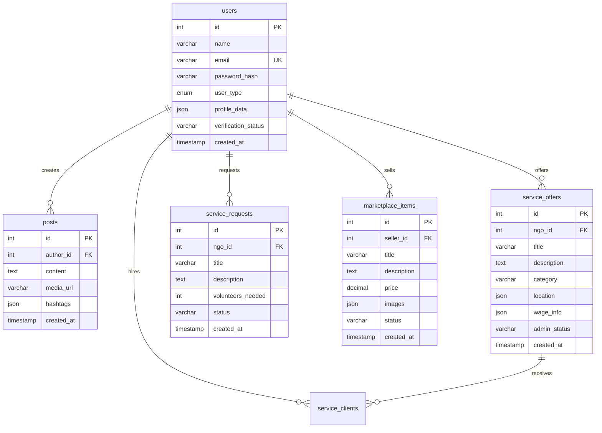

# Database Schema

## 🗄️ Database Overview

**Database**: PostgreSQL via Supabase  
**ORM/Client**: Supabase JavaScript Client  
**Connection**: Connection pooling via Supabase  
**Migrations**: Supabase Dashboard + SQL Scripts  

## 📈 Entity Relationship Overview



## 🗂️ Core Tables

### 👥 users
Central user management table for all user types.

```sql
CREATE TABLE users (
    id SERIAL PRIMARY KEY,
    name VARCHAR(255) NOT NULL,
    email VARCHAR(255) UNIQUE NOT NULL,
    password_hash VARCHAR(255) NOT NULL,
    user_type VARCHAR(20) NOT NULL CHECK (user_type IN ('individual', 'ngo', 'company', 'admin')),
    phone VARCHAR(20),
    profile_image TEXT,
    bio TEXT,
    location VARCHAR(255),
    city VARCHAR(100),
    state_province VARCHAR(100),
    country VARCHAR(100) DEFAULT 'India',
    pincode VARCHAR(10),
    profile_data JSONB, -- Flexible profile data for different user types
    verification_status VARCHAR(20) DEFAULT 'unverified',
    is_active BOOLEAN DEFAULT true,
    last_login TIMESTAMP,
    created_at TIMESTAMP DEFAULT CURRENT_TIMESTAMP,
    updated_at TIMESTAMP DEFAULT CURRENT_TIMESTAMP
);

-- Indexes
CREATE INDEX idx_users_email ON users(email);
CREATE INDEX idx_users_user_type ON users(user_type);
CREATE INDEX idx_users_verification_status ON users(verification_status);
CREATE INDEX idx_users_location ON users(city, state_province);
```

**profile_data JSONB Structure:**
```json
// For NGOs
{
  "organization_name": "Green Earth NGO",
  "registration_number": "NGO/2023/001",
  "focus_areas": ["Environment", "Education"],
  "website": "https://greenearth.org",
  "established_year": 2020,
  "team_size": "10-50"
}

// For Companies
{
  "company_name": "Tech Solutions Ltd",
  "business_type": "Technology",
  "employee_count": "100-500",
  "gst_number": "22AAAAA0000A1Z5",
  "industry": "Software Development"
}

// For Individuals
{
  "skills": ["Web Development", "Graphic Design"],
  "interests": ["Social Work", "Environment"],
  "occupation": "Software Engineer",
  "education": "Bachelor's in Computer Science"
}
```

### 📏 posts
Social feed posts with rich content support.

```sql
CREATE TABLE posts (
    id SERIAL PRIMARY KEY,
    author_id INTEGER NOT NULL REFERENCES users(id) ON DELETE CASCADE,
    content TEXT NOT NULL,
    media_url TEXT,
    media_type VARCHAR(20) CHECK (media_type IN ('image', 'video', 'document')),
    hashtags TEXT[], -- Array of hashtags
    mentions INTEGER[], -- Array of mentioned user IDs
    visibility VARCHAR(20) DEFAULT 'public' CHECK (visibility IN ('public', 'followers', 'private')),
    is_pinned BOOLEAN DEFAULT false,
    status VARCHAR(20) DEFAULT 'active' CHECK (status IN ('active', 'archived', 'deleted')),
    created_at TIMESTAMP DEFAULT CURRENT_TIMESTAMP,
    updated_at TIMESTAMP DEFAULT CURRENT_TIMESTAMP
);

-- Indexes
CREATE INDEX idx_posts_author_id ON posts(author_id);
CREATE INDEX idx_posts_created_at ON posts(created_at DESC);
CREATE INDEX idx_posts_hashtags ON posts USING GIN(hashtags);
CREATE INDEX idx_posts_visibility ON posts(visibility);
```

### 🎯 service_offers
Professional services offered by NGOs to get hired.

```sql
CREATE TABLE service_offers (
    id SERIAL PRIMARY KEY,
    ngo_id INTEGER NOT NULL REFERENCES users(id) ON DELETE CASCADE,
    title VARCHAR(255) NOT NULL,
    description TEXT NOT NULL,
    category VARCHAR(100) NOT NULL,
    
    -- Location Information
    location JSONB, -- {"state": "CA", "city": "SF", "area": "Downtown"}
    
    -- Pricing Information
    wage_info JSONB NOT NULL, -- {"type": "hourly", "min_amount": 50, "max_amount": 100, "currency": "USD"}
    
    -- Job Details
    employment_type VARCHAR(50), -- "full-time", "part-time", "contract", "freelance"
    duration JSONB, -- {"type": "fixed", "duration_months": "6"}
    working_hours JSONB, -- {"hours_per_week": "40", "flexible": true}
    
    -- Requirements
    experience_requirements JSONB, -- {"level": "Advanced expertise..."}
    skills_required TEXT[],
    
    -- Additional Info
    benefits TEXT[],
    application_deadline DATE,
    start_date DATE,
    contact_preferences JSONB, -- {"email": true, "phone": false}
    
    -- Media
    images TEXT[],
    tags TEXT[],
    
    -- Admin Moderation
    admin_status VARCHAR(20) DEFAULT 'pending' CHECK (admin_status IN ('pending', 'approved', 'rejected')),
    admin_reviewed_at TIMESTAMP,
    admin_reviewed_by INTEGER REFERENCES users(id),
    admin_comments TEXT,
    
    -- Status
    status VARCHAR(20) DEFAULT 'active' CHECK (status IN ('active', 'paused', 'completed', 'cancelled')),
    views_count INTEGER DEFAULT 0,
    applications_count INTEGER DEFAULT 0,
    
    created_at TIMESTAMP DEFAULT CURRENT_TIMESTAMP,
    updated_at TIMESTAMP DEFAULT CURRENT_TIMESTAMP
);

-- Indexes
CREATE INDEX idx_service_offers_ngo_id ON service_offers(ngo_id);
CREATE INDEX idx_service_offers_category ON service_offers(category);
CREATE INDEX idx_service_offers_admin_status ON service_offers(admin_status);
CREATE INDEX idx_service_offers_location ON service_offers USING GIN(location);
CREATE INDEX idx_service_offers_created_at ON service_offers(created_at DESC);
```

### 🙋 service_requests
Volunteer opportunities and assistance requests by NGOs.

```sql
CREATE TABLE service_requests (
    id SERIAL PRIMARY KEY,
    ngo_id INTEGER NOT NULL REFERENCES users(id) ON DELETE CASCADE,
    title VARCHAR(255) NOT NULL,
    description TEXT NOT NULL,
    category VARCHAR(100) NOT NULL,
    
    -- Location
    location VARCHAR(255),
    is_remote BOOLEAN DEFAULT false,
    
    -- Volunteer Requirements
    volunteers_needed INTEGER DEFAULT 1,
    volunteers_registered INTEGER DEFAULT 0,
    min_age INTEGER,
    max_age INTEGER,
    skills_needed TEXT[],
    
    -- Timing
    urgency_level VARCHAR(20) DEFAULT 'medium' CHECK (urgency_level IN ('low', 'medium', 'high', 'urgent')),
    start_date DATE,
    end_date DATE,
    time_commitment VARCHAR(100), -- "2 hours/week", "Full day event"
    
    -- Additional Info
    benefits TEXT[], -- What volunteers get in return
    requirements TEXT[], -- Special requirements
    contact_info JSONB,
    images TEXT[],
    
    -- Status
    status VARCHAR(20) DEFAULT 'open' CHECK (status IN ('open', 'in_progress', 'completed', 'cancelled')),
    views_count INTEGER DEFAULT 0,
    
    created_at TIMESTAMP DEFAULT CURRENT_TIMESTAMP,
    updated_at TIMESTAMP DEFAULT CURRENT_TIMESTAMP
);

-- Indexes
CREATE INDEX idx_service_requests_ngo_id ON service_requests(ngo_id);
CREATE INDEX idx_service_requests_category ON service_requests(category);
CREATE INDEX idx_service_requests_status ON service_requests(status);
CREATE INDEX idx_service_requests_urgency ON service_requests(urgency_level);
```

### 🛒 marketplace_items
Community marketplace for buying/selling products.

```sql
CREATE TABLE marketplace_items (
    id SERIAL PRIMARY KEY,
    seller_id INTEGER NOT NULL REFERENCES users(id) ON DELETE CASCADE,
    title VARCHAR(255) NOT NULL,
    description TEXT NOT NULL,
    category VARCHAR(100) NOT NULL,
    
    -- Pricing
    price DECIMAL(10,2) NOT NULL,
    original_price DECIMAL(10,2), -- For discount display
    currency VARCHAR(3) DEFAULT 'INR',
    
    -- Product Details
    condition VARCHAR(20) CHECK (condition IN ('new', 'like_new', 'good', 'fair', 'poor')),
    brand VARCHAR(100),
    model VARCHAR(100),
    specifications JSONB,
    
    -- Inventory
    stock_quantity INTEGER DEFAULT 1,
    is_unlimited_stock BOOLEAN DEFAULT false,
    
    -- Media
    images TEXT[] NOT NULL,
    videos TEXT[],
    
    -- Location & Shipping
    location VARCHAR(255),
    shipping_info JSONB, -- {"weight": 0.5, "dimensions": "10x10x5", "cost": 5.99}
    pickup_available BOOLEAN DEFAULT false,
    
    -- SEO & Discovery
    tags TEXT[],
    search_keywords TEXT[],
    
    -- Status
    status VARCHAR(20) DEFAULT 'active' CHECK (status IN ('active', 'sold', 'reserved', 'inactive')),
    featured BOOLEAN DEFAULT false,
    views_count INTEGER DEFAULT 0,
    favorites_count INTEGER DEFAULT 0,
    
    created_at TIMESTAMP DEFAULT CURRENT_TIMESTAMP,
    updated_at TIMESTAMP DEFAULT CURRENT_TIMESTAMP
);

-- Indexes
CREATE INDEX idx_marketplace_seller_id ON marketplace_items(seller_id);
CREATE INDEX idx_marketplace_category ON marketplace_items(category);
CREATE INDEX idx_marketplace_status ON marketplace_items(status);
CREATE INDEX idx_marketplace_price ON marketplace_items(price);
CREATE INDEX idx_marketplace_location ON marketplace_items(location);
```

## 🔗 Relationship Tables

### 🤝 service_clients
Tracks hiring/application relationships between clients and NGO services.

```sql
CREATE TABLE service_clients (
    id SERIAL PRIMARY KEY,
    service_offer_id INTEGER NOT NULL REFERENCES service_offers(id) ON DELETE CASCADE,
    client_id INTEGER NOT NULL REFERENCES users(id) ON DELETE CASCADE,
    client_type VARCHAR(20) NOT NULL CHECK (client_type IN ('individual', 'company')),
    
    -- Application Details
    message TEXT,
    proposed_amount DECIMAL(10,2),
    start_date DATE,
    end_date DATE,
    
    -- Status Tracking
    status VARCHAR(20) DEFAULT 'pending' CHECK (status IN ('pending', 'accepted', 'rejected', 'active', 'completed', 'cancelled')),
    
    -- Payment & Contract
    amount_paid DECIMAL(10,2) DEFAULT 0,
    contract_terms JSONB,
    
    -- Communication
    ngo_response TEXT,
    client_rating INTEGER CHECK (client_rating >= 1 AND client_rating <= 5),
    ngo_rating INTEGER CHECK (ngo_rating >= 1 AND ngo_rating <= 5),
    
    applied_at TIMESTAMP DEFAULT CURRENT_TIMESTAMP,
    responded_at TIMESTAMP,
    completed_at TIMESTAMP,
    
    UNIQUE(service_offer_id, client_id)
);

-- Indexes
CREATE INDEX idx_service_clients_offer_id ON service_clients(service_offer_id);
CREATE INDEX idx_service_clients_client_id ON service_clients(client_id);
CREATE INDEX idx_service_clients_status ON service_clients(status);
```

### 👥 service_volunteers
Tracks volunteer applications for service requests.

```sql
CREATE TABLE service_volunteers (
    id SERIAL PRIMARY KEY,
    service_request_id INTEGER NOT NULL REFERENCES service_requests(id) ON DELETE CASCADE,
    volunteer_id INTEGER NOT NULL REFERENCES users(id) ON DELETE CASCADE,
    
    -- Application Details
    message TEXT,
    availability TEXT, -- "Weekends", "Evenings", "Full-time"
    experience TEXT,
    motivation TEXT,
    
    -- Status
    status VARCHAR(20) DEFAULT 'applied' CHECK (status IN ('applied', 'accepted', 'rejected', 'active', 'completed')),
    
    -- Feedback
    volunteer_feedback TEXT,
    ngo_feedback TEXT,
    volunteer_rating INTEGER CHECK (volunteer_rating >= 1 AND volunteer_rating <= 5),
    ngo_rating INTEGER CHECK (ngo_rating >= 1 AND ngo_rating <= 5),
    
    applied_at TIMESTAMP DEFAULT CURRENT_TIMESTAMP,
    responded_at TIMESTAMP,
    completed_at TIMESTAMP,
    
    UNIQUE(service_request_id, volunteer_id)
);
```

## 🛋️ E-commerce Tables

### 🛍️ cart
```sql
CREATE TABLE cart (
    id SERIAL PRIMARY KEY,
    user_id INTEGER NOT NULL REFERENCES users(id) ON DELETE CASCADE,
    marketplace_item_id INTEGER NOT NULL REFERENCES marketplace_items(id) ON DELETE CASCADE,
    quantity INTEGER DEFAULT 1 CHECK (quantity > 0),
    variant_selection JSONB, -- Color, size, etc.
    created_at TIMESTAMP DEFAULT CURRENT_TIMESTAMP,
    updated_at TIMESTAMP DEFAULT CURRENT_TIMESTAMP,
    
    UNIQUE(user_id, marketplace_item_id)
);
```

### 📦 ecommerce_orders
```sql
CREATE TABLE ecommerce_orders (
    id SERIAL PRIMARY KEY,
    order_number VARCHAR(50) UNIQUE NOT NULL,
    buyer_id INTEGER NOT NULL REFERENCES users(id),
    seller_id INTEGER NOT NULL REFERENCES users(id),
    total_amount DECIMAL(10,2) NOT NULL,
    
    -- Address Information
    shipping_address JSONB NOT NULL,
    billing_address JSONB,
    
    -- Order Status
    status VARCHAR(20) DEFAULT 'pending' CHECK (status IN ('pending', 'confirmed', 'processing', 'shipped', 'delivered', 'cancelled', 'refunded')),
    
    -- Additional Info
    order_notes TEXT,
    
    created_at TIMESTAMP DEFAULT CURRENT_TIMESTAMP,
    updated_at TIMESTAMP DEFAULT CURRENT_TIMESTAMP
);
```

## 📱 Social Features Tables

### ❤️ post_interactions
```sql
CREATE TABLE post_interactions (
    id SERIAL PRIMARY KEY,
    post_id INTEGER NOT NULL REFERENCES posts(id) ON DELETE CASCADE,
    user_id INTEGER NOT NULL REFERENCES users(id) ON DELETE CASCADE,
    interaction_type VARCHAR(20) NOT NULL CHECK (interaction_type IN ('like', 'share', 'view', 'save')),
    created_at TIMESTAMP DEFAULT CURRENT_TIMESTAMP,
    
    UNIQUE(post_id, user_id, interaction_type)
);
```

### 💬 post_comments
```sql
CREATE TABLE post_comments (
    id SERIAL PRIMARY KEY,
    post_id INTEGER NOT NULL REFERENCES posts(id) ON DELETE CASCADE,
    author_id INTEGER NOT NULL REFERENCES users(id) ON DELETE CASCADE,
    content TEXT NOT NULL,
    parent_comment_id INTEGER REFERENCES post_comments(id), -- For nested comments
    is_edited BOOLEAN DEFAULT false,
    created_at TIMESTAMP DEFAULT CURRENT_TIMESTAMP,
    updated_at TIMESTAMP DEFAULT CURRENT_TIMESTAMP
);
```

### 🔥 hashtags
```sql
CREATE TABLE hashtags (
    id SERIAL PRIMARY KEY,
    tag VARCHAR(100) UNIQUE NOT NULL,
    total_mentions INTEGER DEFAULT 0,
    trending_score DECIMAL(10,2) DEFAULT 0,
    category VARCHAR(50),
    created_at TIMESTAMP DEFAULT CURRENT_TIMESTAMP,
    last_used_at TIMESTAMP DEFAULT CURRENT_TIMESTAMP
);
```

## 🔐 Verification Tables

### ✅ ngo_verifications
```sql
CREATE TABLE ngo_verifications (
    id SERIAL PRIMARY KEY,
    user_id INTEGER NOT NULL REFERENCES users(id) ON DELETE CASCADE,
    organization_name VARCHAR(255),
    registration_number VARCHAR(100),
    registration_document TEXT, -- File URL
    pan_number VARCHAR(10),
    address_proof TEXT, -- File URL
    verification_status VARCHAR(20) DEFAULT 'pending',
    verification_date TIMESTAMP,
    verifier_notes TEXT,
    created_at TIMESTAMP DEFAULT CURRENT_TIMESTAMP,
    updated_at TIMESTAMP DEFAULT CURRENT_TIMESTAMP
);
```

## 📊 Analytics Tables

### 📈 post_analytics
```sql
CREATE TABLE post_analytics (
    id SERIAL PRIMARY KEY,
    post_id INTEGER NOT NULL REFERENCES posts(id) ON DELETE CASCADE,
    date DATE NOT NULL,
    views_count INTEGER DEFAULT 0,
    likes_count INTEGER DEFAULT 0,
    comments_count INTEGER DEFAULT 0,
    shares_count INTEGER DEFAULT 0,
    engagement_rate DECIMAL(5,2) DEFAULT 0,
    
    UNIQUE(post_id, date)
);
```

## 🔄 Database Functions & Triggers

### Auto-update timestamps
```sql
CREATE OR REPLACE FUNCTION update_updated_at_column()
RETURNS TRIGGER AS $$
BEGIN
    NEW.updated_at = CURRENT_TIMESTAMP;
    RETURN NEW;
END;
$$ language 'plpgsql';

-- Apply to all tables with updated_at
CREATE TRIGGER update_users_updated_at BEFORE UPDATE ON users
    FOR EACH ROW EXECUTE FUNCTION update_updated_at_column();
```

### Update counter functions
```sql
-- Update hashtag mention counts
CREATE OR REPLACE FUNCTION update_hashtag_mentions()
RETURNS TRIGGER AS $$
BEGIN
    -- Update mention counts when posts are created/updated/deleted
    -- Implementation details...
END;
$$ language 'plpgsql';
```

## 🔍 Data Access Patterns

### Common Queries

**Get user feed posts:**
```sql
SELECT p.*, u.name, u.profile_image, u.user_type,
       COUNT(pi.id) FILTER (WHERE pi.interaction_type = 'like') as likes_count,
       COUNT(pc.id) as comments_count
FROM posts p
JOIN users u ON p.author_id = u.id
LEFT JOIN post_interactions pi ON p.id = pi.post_id
LEFT JOIN post_comments pc ON p.id = pc.post_id
WHERE p.visibility = 'public' AND p.status = 'active'
GROUP BY p.id, u.name, u.profile_image, u.user_type
ORDER BY p.created_at DESC
LIMIT 20;
```

**Get service offers with NGO details:**
```sql
SELECT so.*, u.name as ngo_name, u.profile_image,
       COUNT(sc.id) as application_count
FROM service_offers so
JOIN users u ON so.ngo_id = u.id
LEFT JOIN service_clients sc ON so.id = sc.service_offer_id
WHERE so.admin_status = 'approved' AND so.status = 'active'
GROUP BY so.id, u.name, u.profile_image
ORDER BY so.created_at DESC;
```

## 🛡️ Security Considerations

### Row Level Security (RLS)
```sql
-- Enable RLS on sensitive tables
ALTER TABLE users ENABLE ROW LEVEL SECURITY;
ALTER TABLE posts ENABLE ROW LEVEL SECURITY;

-- Example policy: Users can only update their own profile
CREATE POLICY users_update_own ON users
    FOR UPDATE USING (auth.uid()::int = id);
```

### Data Encryption
- Passwords: bcrypt hashing
- Sensitive fields: Application-level encryption
- File URLs: Signed URLs with expiration

### Backup Strategy
- Daily automated backups via Supabase
- Point-in-time recovery available
- Cross-region replication for disaster recovery