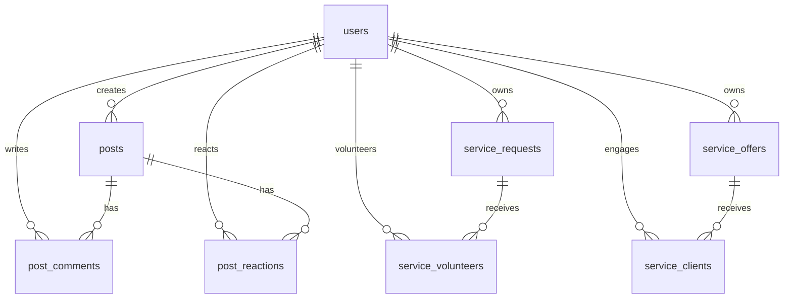

# Database Schema

## Overview

Navdrishti uses Supabase PostgreSQL as the primary datastore. The active application model is centered on users, verification, community posts, service requests, service offers, volunteering, and client engagements.

## Core Entities

### users
- Stores account identity, role, verification state, and profile metadata.
- Referenced by nearly every domain table.

### posts
- Social feed entries created by users.
- Related tables include `post_comments` and `post_reactions`.

### service_requests
- NGO- or organization-led requests for volunteer or community support.
- Connected to `service_volunteers` records.

### service_offers
- Professional or programmatic offerings published by NGOs.
- Connected to `service_clients` records.

### service_volunteers
- Applications and participation records for service requests.
- Tracks volunteer status and timestamps.

### service_clients
- Client engagement records for service offers.
- Tracks workflow state between organizations and clients.

### notifications
- In-app notification payloads for user activity.

### verification tables
- Support NGO, company, individual, and CA verification workflows.
- Store submitted documents, status updates, and review metadata.

## Relationship Summary

```mermaid
erDiagram
    users ||--o{ posts : creates
    users ||--o{ post_comments : writes
    users ||--o{ post_reactions : reacts
    users ||--o{ service_requests : owns
    users ||--o{ service_offers : owns
    users ||--o{ service_volunteers : volunteers
    users ||--o{ service_clients : engages
    posts ||--o{ post_comments : has
    posts ||--o{ post_reactions : has
    service_requests ||--o{ service_volunteers : receives
    service_offers ||--o{ service_clients : receives
```

## Notes

- The repository no longer documents marketplace, cart, order, shipping, or wishlist tables as part of the active product surface.
- Razorpay is retained as an optional future donation integration, but donation-specific data structures are not part of the current schema.
- For API-level field usage, see `docs/API_REFERENCE.md`.
