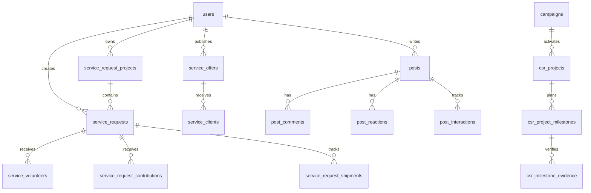

# Database Schema

## Overview

Navdrishti uses Supabase PostgreSQL as the primary datastore.

The current database has evolved feature-by-feature, so this document defines a canonical map to reduce confusion, prevent duplicate modeling, and support safe cleanup.

## Canonical Domain Model

### A) Identity and profile
- users
- user_addresses
- user_connections
- user_notifications

Notes:
- `users` is the root entity for almost every workflow.
- Use `user_notifications` as the canonical notifications table name.

### B) Verification and compliance
- individual_verifications
- ngo_verifications
- company_verifications
- company_ca_identities
- company_ca_action_log

Notes:
- Keep one verification table per actor type.
- `company_ca_*` is a dedicated CA workflow extension, not a duplicate verification system.

### C) Social and engagement
- posts
- post_comments
- post_reactions
- post_interactions
- hashtags
- activity_feed
- platform_announcements

Notes:
- Keep reaction and interaction concepts separate only if both are required by product analytics.

### D) Service marketplace and requests
- service_request_projects
- service_requests
- service_volunteers
- service_request_contributions
- service_request_shipments
- shipment_tracking_events
- service_offers
- service_clients

Notes:
- `service_request_projects` is the parent project layer.
- `service_requests` stores need-level records under an optional project.
- `service_volunteers` is currently reused for assignment and fulfillment tracking.

### D.1) Service offers canonical column policy (current)

Current owner relationship and review fields must remain stable:
- owner key: `creator_id` (legacy `provider_id` should not be reintroduced)
- review/ops fields: `admin_status`, `admin_reviewed_at`, `admin_reviewed_by`, `admin_comments`, `submitted_for_review_at`

Core columns used across product flows:
- `id`, `creator_id`, `title`, `description`, `offer_type`
- `category`, `location`, `status`
- `price_type`, `price_amount`, `price_description`
- `requirements`, `transaction_type`
- `created_at`, `updated_at`

Columns currently retained for admin/UI compatibility:
- `wage_info`, `employment_type`, `experience_requirements`, `skills_required`, `duration`

Drop-candidate columns (only after explicit code cleanup and migration validation):
- `images`, `tags`, and other legacy fields already migrated into `requirements` JSON where applicable

Safety rule for schema reductions:
- avoid dropping `service_offers` columns while endpoints still use broad selects; convert to explicit column lists first.

### E) Payments, refunds, provider webhooks
- razorpay_payment_orders
- razorpay_payments
- razorpay_refunds
- provider_webhook_events

Notes:
- Keep provider payloads in JSONB for traceability.
- Preserve idempotency keys (`provider_event_id`, Razorpay IDs) as unique constraints.

### F) CSR campaign and execution model
- campaigns
- csr_projects
- csr_project_milestones
- csr_milestone_evidence
- csr_milestone_evidence_media
- csr_milestone_evidence_documents
- csr_milestone_reviews
- csr_payment_confirmations
- csr_impact_metrics
- evidence_validation_results
- field_devices
- field_sync_receipts
- project_user_assignments
- csr_audit_log
- embeddings

Notes:
- `campaigns` is planning-level, `csr_projects` is execution-level.
- Milestones, evidence, and payments should always reference `csr_projects` and `csr_project_milestones`.

### G) Support and operations
- support_tickets
- support_ticket_messages

### H) Admin and platform governance
- admin_review_statistics
- service_offer_reviews
- service_offer_notifications
- platform_announcements

Notes:
- Keep admin-only review tables separate from end-user workflow tables.
- If a platform governance table is referenced in code but missing in the schema, it should be added or the code should be updated before cleanup.

### I) Archive and retention candidates
- older support ticket messages
- older shipment tracking events
- historical audit logs

Notes:
- These are retention-managed rows or partitions, not first-class workflow tables.

## Known Sources of Confusion

### Naming drift
- Historical docs may mention `notifications`; current table is `user_notifications`.
- Some admin analytics tables are referenced in code but may not exist in all environments.

### Modeling overlap
- `service_volunteers` currently carries volunteer applications plus assignment/fulfillment metadata.
- `post_reactions` and `post_interactions` can overlap unless their responsibilities are explicitly separated.
- `platform_announcements` is the canonical table for admin announcements; do not treat it as a duplicate of user notifications.

### Mixed key strategy
- The schema mixes `integer/bigint` and `uuid` primary keys across domains.
- This is acceptable short-term but should be standardized per domain in future migrations.

## Safe Cleanup Workflow

1. Snapshot production and staging before any structural change.
2. Run `reference/db_declutter_audit.sql` and export results.
3. Classify each table as `core`, `extension`, `archive-candidate`, or `unknown`.
4. Remove or merge only after:
   - no API/code references,
   - no foreign key dependencies,
   - no data needed for audit/compliance,
   - successful backfill/migration validation.
5. Deprecate in two releases:
   - release A: read-only or dual-write compatibility,
   - release B: drop deprecated structures.

## Immediate Priority Targets

1. Align docs with actual schema and code usage in all environments.
2. Eliminate naming drift (`notifications` vs `user_notifications`).
3. Decide whether `service_volunteers` remains a shared assignment table or is split.
4. Confirm purpose boundaries for `post_reactions` vs `post_interactions`.
5. Build missing indexes and unique constraints identified by audit queries.
6. Complete `service_offers` column reduction in batches only after explicit select migration and admin flow validation.

## Relationship Summary (high level)

```mermaid
erDiagram
    users ||--o{ service_request_projects : owns
    users ||--o{ service_requests : creates
    service_request_projects ||--o{ service_requests : contains
    service_requests ||--o{ service_volunteers : receives
    service_requests ||--o{ service_request_contributions : receives
    service_requests ||--o{ service_request_shipments : tracks
    users ||--o{ service_offers : publishes
    service_offers ||--o{ service_clients : receives

    users ||--o{ posts : writes
    posts ||--o{ post_comments : has
    posts ||--o{ post_reactions : has
    posts ||--o{ post_interactions : tracks

    campaigns ||--o{ csr_projects : activates
    csr_projects ||--o{ csr_project_milestones : plans
    csr_project_milestones ||--o{ csr_milestone_evidence : verifies
```

## References

- `reference/completeschema.txt`
- `docs/API_REFERENCE.md`
- `docs/ARCHITECTURE.md`
