# Database Schema

## 🗄️ Database Overview

**Database**: PostgreSQL via Supabase  
**ORM/Client**: Supabase JavaScript Client  
**Connection**: Connection pooling via Supabase  
**Migrations**: Supabase Dashboard + SQL Scripts  

## 📈 Entity Relationship Overview

```mermaid
erDiagram
    users {
        int id PK
        varchar name
        varchar email UK
        varchar password_hash
        enum user_type
        json profile_data
        varchar verification_status
        timestamp created_at
    }
    
    posts {
        int id PK
        int author_id FK
        text content
        varchar media_url
        json hashtags
        timestamp created_at
    }
    
    post_comments {
        int id PK
        int post_id FK
        int author_id FK
        text content
        timestamp created_at
    }
    
    post_reactions {
        int id PK
        int post_id FK
        int user_id FK
        varchar reaction_type
        timestamp created_at
    }
    
    service_offers {
        int id PK
        int ngo_id FK
        varchar title
        text description
        varchar category
        json location
        json wage_info
        varchar admin_status
        timestamp created_at
    }
    
    service_requests {
        int id PK
        int ngo_id FK
        varchar title
        text description
        int volunteers_needed
        varchar status
        timestamp created_at
    }
    
    service_clients {
        int id PK
        int service_offer_id FK
        int client_id FK
        varchar status
        timestamp applied_at
    }
    
    service_volunteers {
        int id PK
        int service_request_id FK
        int volunteer_id FK
        varchar status
        timestamp applied_at
    }
    
    marketplace_items {
        int id PK
        int seller_id FK
        varchar title
        text description
        decimal price
        json images
        varchar status
        timestamp created_at
    }
    
    marketplace_item_reviews {
        int id PK
        int marketplace_item_id FK
        int reviewer_id FK
        int rating
        text review_text
        timestamp created_at
    }
    
    ecommerce_orders {
        int id PK
        int buyer_id FK
        int seller_id FK
        varchar order_number
        decimal total_amount
        varchar status
        timestamp created_at
    }
    
    cart {
        int id PK
        int user_id FK
        int marketplace_item_id FK
        int quantity
        timestamp created_at
    }
    
    wishlist {
        int id PK
        int user_id FK
        int marketplace_item_id FK
        timestamp created_at
    }
    
    ngo_verifications {
        int id PK
        int user_id FK
        varchar ngo_name
        varchar registration_number
        varchar verification_status
    }
    
    user_notifications {
        int id PK
        int user_id FK
        varchar type
        varchar title
        boolean is_read
        timestamp created_at
    }
    
    user_connections {
        int id PK
        int follower_id FK
        int following_id FK
        varchar connection_type
        timestamp created_at
    }
    
    users ||--o{ posts : creates
    users ||--o{ post_comments : writes
    users ||--o{ post_reactions : reacts
    users ||--o{ service_offers : offers
    users ||--o{ service_requests : requests
    users ||--o{ service_clients : hires
    users ||--o{ service_volunteers : volunteers
    users ||--o{ marketplace_items : sells
    users ||--o{ marketplace_item_reviews : reviews
    users ||--o{ ecommerce_orders : buys
    users ||--o{ cart : has_cart
    users ||--o{ wishlist : has_wishlist
    users ||--o{ ngo_verifications : verified_by
    users ||--o{ user_notifications : receives
    users ||--o{ user_connections : follows
    posts ||--o{ post_comments : has_comments
    posts ||--o{ post_reactions : has_reactions
    service_offers ||--o{ service_clients : receives_applications
    service_requests ||--o{ service_volunteers : receives_volunteers
    marketplace_items ||--o{ marketplace_item_reviews : has_reviews
    marketplace_items ||--o{ cart : in_carts
    marketplace_items ||--o{ wishlist : in_wishlists
```



## 🗂️ Core Tables

### 👥 users
Central user management table for all user types.

```sql
CREATE TABLE users (
    id SERIAL PRIMARY KEY,
    name VARCHAR(255) NOT NULL,
    email VARCHAR(255) UNIQUE NOT NULL,
    password_hash VARCHAR(255) NOT NULL,
    user_type VARCHAR(20) NOT NULL CHECK (user_type IN ('individual', 'ngo', 'company', 'admin')),
    phone VARCHAR(20),
    profile_image TEXT,
    bio TEXT,
    location VARCHAR(255),
    city VARCHAR(100),
    state_province VARCHAR(100),
    country VARCHAR(100) DEFAULT 'India',
    pincode VARCHAR(10),
    profile_data JSONB, -- Flexible profile data for different user types
    verification_status VARCHAR(20) DEFAULT 'unverified',
    is_active BOOLEAN DEFAULT true,
    last_login TIMESTAMP,
    created_at TIMESTAMP DEFAULT CURRENT_TIMESTAMP,
    updated_at TIMESTAMP DEFAULT CURRENT_TIMESTAMP
);

-- Indexes
CREATE INDEX idx_users_email ON users(email);
CREATE INDEX idx_users_user_type ON users(user_type);
CREATE INDEX idx_users_verification_status ON users(verification_status);
CREATE INDEX idx_users_location ON users(city, state_province);
```

**profile_data JSONB Structure:**
```json
// For NGOs
{
  "organization_name": "Green Earth NGO",
  "registration_number": "NGO/2023/001",
  "focus_areas": ["Environment", "Education"],
  "website": "https://greenearth.org",
  "established_year": 2020,
  "team_size": "10-50"
}

// For Companies
{
  "company_name": "Tech Solutions Ltd",
  "business_type": "Technology",
  "employee_count": "100-500",
  "gst_number": "22AAAAA0000A1Z5",
  "industry": "Software Development"
}

// For Individuals
{
  "skills": ["Web Development", "Graphic Design"],
  "interests": ["Social Work", "Environment"],
  "occupation": "Software Engineer",
  "education": "Bachelor's in Computer Science"
}
```

### 📏 posts
Social feed posts with rich content support.

```sql
CREATE TABLE posts (
    id SERIAL PRIMARY KEY,
    author_id INTEGER NOT NULL REFERENCES users(id) ON DELETE CASCADE,
    content TEXT NOT NULL,
    media_url TEXT,
    media_type VARCHAR(20) CHECK (media_type IN ('image', 'video', 'document')),
    hashtags TEXT[], -- Array of hashtags
    mentions INTEGER[], -- Array of mentioned user IDs
    visibility VARCHAR(20) DEFAULT 'public' CHECK (visibility IN ('public', 'followers', 'private')),
    is_pinned BOOLEAN DEFAULT false,
    status VARCHAR(20) DEFAULT 'active' CHECK (status IN ('active', 'archived', 'deleted')),
    created_at TIMESTAMP DEFAULT CURRENT_TIMESTAMP,
    updated_at TIMESTAMP DEFAULT CURRENT_TIMESTAMP
);

-- Indexes
CREATE INDEX idx_posts_author_id ON posts(author_id);
CREATE INDEX idx_posts_created_at ON posts(created_at DESC);
CREATE INDEX idx_posts_hashtags ON posts USING GIN(hashtags);
CREATE INDEX idx_posts_visibility ON posts(visibility);
```

### 🎯 service_offers
Professional services offered by NGOs to get hired.

```sql
CREATE TABLE service_offers (
    id SERIAL PRIMARY KEY,
    ngo_id INTEGER NOT NULL REFERENCES users(id) ON DELETE CASCADE,
    title VARCHAR(255) NOT NULL,
    description TEXT NOT NULL,
    category VARCHAR(100) NOT NULL,
    
    -- Location Information
    location JSONB, -- {"state": "CA", "city": "SF", "area": "Downtown"}
    
    -- Pricing Information
    wage_info JSONB NOT NULL, -- {"type": "hourly", "min_amount": 50, "max_amount": 100, "currency": "USD"}
    
    -- Job Details
    employment_type VARCHAR(50), -- "full-time", "part-time", "contract", "freelance"
    duration JSONB, -- {"type": "fixed", "duration_months": "6"}
    working_hours JSONB, -- {"hours_per_week": "40", "flexible": true}
    
    -- Requirements
    experience_requirements JSONB, -- {"level": "Advanced expertise..."}
    skills_required TEXT[],
    
    -- Additional Info
    benefits TEXT[],
    application_deadline DATE,
    start_date DATE,
    contact_preferences JSONB, -- {"email": true, "phone": false}
    
    -- Media
    images TEXT[],
    tags TEXT[],
    
    -- Admin Moderation
    admin_status VARCHAR(20) DEFAULT 'pending' CHECK (admin_status IN ('pending', 'approved', 'rejected')),
    admin_reviewed_at TIMESTAMP,
    admin_reviewed_by INTEGER REFERENCES users(id),
    admin_comments TEXT,
    
    -- Status
    status VARCHAR(20) DEFAULT 'active' CHECK (status IN ('active', 'paused', 'completed', 'cancelled')),
    views_count INTEGER DEFAULT 0,
    applications_count INTEGER DEFAULT 0,
    
    created_at TIMESTAMP DEFAULT CURRENT_TIMESTAMP,
    updated_at TIMESTAMP DEFAULT CURRENT_TIMESTAMP
);

-- Indexes
CREATE INDEX idx_service_offers_ngo_id ON service_offers(ngo_id);
CREATE INDEX idx_service_offers_category ON service_offers(category);
CREATE INDEX idx_service_offers_admin_status ON service_offers(admin_status);
CREATE INDEX idx_service_offers_location ON service_offers USING GIN(location);
CREATE INDEX idx_service_offers_created_at ON service_offers(created_at DESC);
```

### 🙋 service_requests
Volunteer opportunities and assistance requests by NGOs.

```sql
CREATE TABLE service_requests (
    id SERIAL PRIMARY KEY,
    ngo_id INTEGER NOT NULL REFERENCES users(id) ON DELETE CASCADE,
    title VARCHAR(255) NOT NULL,
    description TEXT NOT NULL,
    category VARCHAR(100) NOT NULL,
    
    -- Location
    location VARCHAR(255),
    is_remote BOOLEAN DEFAULT false,
    
    -- Volunteer Requirements
    volunteers_needed INTEGER DEFAULT 1,
    volunteers_registered INTEGER DEFAULT 0,
    min_age INTEGER,
    max_age INTEGER,
    skills_needed TEXT[],
    
    -- Timing
    urgency_level VARCHAR(20) DEFAULT 'medium' CHECK (urgency_level IN ('low', 'medium', 'high', 'urgent')),
    start_date DATE,
    end_date DATE,
    time_commitment VARCHAR(100), -- "2 hours/week", "Full day event"
    
    -- Additional Info
    benefits TEXT[], -- What volunteers get in return
    requirements TEXT[], -- Special requirements
    contact_info JSONB,
    images TEXT[],
    
    -- Status
    status VARCHAR(20) DEFAULT 'open' CHECK (status IN ('open', 'in_progress', 'completed', 'cancelled')),
    views_count INTEGER DEFAULT 0,
    
    created_at TIMESTAMP DEFAULT CURRENT_TIMESTAMP,
    updated_at TIMESTAMP DEFAULT CURRENT_TIMESTAMP
);

-- Indexes
CREATE INDEX idx_service_requests_ngo_id ON service_requests(ngo_id);
CREATE INDEX idx_service_requests_category ON service_requests(category);
CREATE INDEX idx_service_requests_status ON service_requests(status);
CREATE INDEX idx_service_requests_urgency ON service_requests(urgency_level);
```

### 🛒 marketplace_items
Community marketplace for buying/selling products.

```sql
CREATE TABLE marketplace_items (
    id SERIAL PRIMARY KEY,
    seller_id INTEGER NOT NULL REFERENCES users(id) ON DELETE CASCADE,
    title VARCHAR(255) NOT NULL,
    description TEXT NOT NULL,
    category VARCHAR(100) NOT NULL,
    
    -- Pricing
    price DECIMAL(10,2) NOT NULL,
    original_price DECIMAL(10,2), -- For discount display
    currency VARCHAR(3) DEFAULT 'INR',
    
    -- Product Details
    condition VARCHAR(20) CHECK (condition IN ('new', 'like_new', 'good', 'fair', 'poor')),
    brand VARCHAR(100),
    model VARCHAR(100),
    specifications JSONB,
    
    -- Inventory
    stock_quantity INTEGER DEFAULT 1,
    is_unlimited_stock BOOLEAN DEFAULT false,
    
    -- Media
    images TEXT[] NOT NULL,
    videos TEXT[],
    
    -- Location & Shipping
    location VARCHAR(255),
    shipping_info JSONB, -- {"weight": 0.5, "dimensions": "10x10x5", "cost": 5.99}
    pickup_available BOOLEAN DEFAULT false,
    
    -- SEO & Discovery
    tags TEXT[],
    search_keywords TEXT[],
    
    -- Buyer Eligibility
    who_can_buy TEXT[] NOT NULL DEFAULT ARRAY['ngo', 'individual', 'company']::TEXT[], -- Which user types can purchase this item (ngo/individual/company)
    
    -- Status & Lifecycle
    status VARCHAR(20) DEFAULT 'active' CHECK (status IN ('active', 'sold', 'reserved', 'inactive')),
    sold_at TIMESTAMP, -- Timestamp when item completely sold out (quantity=0), triggers 1-hour auto-cleanup
    featured BOOLEAN DEFAULT false,
    views_count INTEGER DEFAULT 0,
    favorites_count INTEGER DEFAULT 0,
    
    created_at TIMESTAMP DEFAULT CURRENT_TIMESTAMP,
    updated_at TIMESTAMP DEFAULT CURRENT_TIMESTAMP
);

-- Indexes
CREATE INDEX idx_marketplace_seller_id ON marketplace_items(seller_id);
CREATE INDEX idx_marketplace_category ON marketplace_items(category);
CREATE INDEX idx_marketplace_status ON marketplace_items(status);
CREATE INDEX idx_marketplace_price ON marketplace_items(price);
CREATE INDEX idx_marketplace_location ON marketplace_items(location);
CREATE INDEX idx_marketplace_sold_at ON marketplace_items(sold_at) WHERE status = 'sold'; -- For efficient cleanup cron job
```

## 🔗 Relationship Tables

### 🤝 service_clients
Tracks hiring/application relationships between clients and NGO services.

```sql
CREATE TABLE service_clients (
    id SERIAL PRIMARY KEY,
    service_offer_id INTEGER NOT NULL REFERENCES service_offers(id) ON DELETE CASCADE,
    client_id INTEGER NOT NULL REFERENCES users(id) ON DELETE CASCADE,
    client_type VARCHAR(20) NOT NULL CHECK (client_type IN ('individual', 'company')),
    
    -- Application Details
    message TEXT,
    proposed_amount DECIMAL(10,2),
    start_date DATE,
    end_date DATE,
    
    -- Status Tracking
    status VARCHAR(20) DEFAULT 'pending' CHECK (status IN ('pending', 'accepted', 'rejected', 'active', 'completed', 'cancelled')),
    
    -- Payment & Contract
    amount_paid DECIMAL(10,2) DEFAULT 0,
    contract_terms JSONB,
    
    -- Communication
    ngo_response TEXT,
    client_rating INTEGER CHECK (client_rating >= 1 AND client_rating <= 5),
    ngo_rating INTEGER CHECK (ngo_rating >= 1 AND ngo_rating <= 5),
    
    applied_at TIMESTAMP DEFAULT CURRENT_TIMESTAMP,
    responded_at TIMESTAMP,
    completed_at TIMESTAMP,
    
    UNIQUE(service_offer_id, client_id)
);

-- Indexes
CREATE INDEX idx_service_clients_offer_id ON service_clients(service_offer_id);
CREATE INDEX idx_service_clients_client_id ON service_clients(client_id);
CREATE INDEX idx_service_clients_status ON service_clients(status);
```

### 👥 service_volunteers
Tracks volunteer applications for service requests.

```sql
CREATE TABLE service_volunteers (
    id SERIAL PRIMARY KEY,
    service_request_id INTEGER NOT NULL REFERENCES service_requests(id) ON DELETE CASCADE,
    volunteer_id INTEGER NOT NULL REFERENCES users(id) ON DELETE CASCADE,
    
    -- Application Details
    message TEXT,
    availability TEXT, -- "Weekends", "Evenings", "Full-time"
    experience TEXT,
    motivation TEXT,
    
    -- Status
    status VARCHAR(20) DEFAULT 'applied' CHECK (status IN ('applied', 'accepted', 'rejected', 'active', 'completed')),
    
    -- Feedback
    volunteer_feedback TEXT,
    ngo_feedback TEXT,
    volunteer_rating INTEGER CHECK (volunteer_rating >= 1 AND volunteer_rating <= 5),
    ngo_rating INTEGER CHECK (ngo_rating >= 1 AND ngo_rating <= 5),
    
    applied_at TIMESTAMP DEFAULT CURRENT_TIMESTAMP,
    responded_at TIMESTAMP,
    completed_at TIMESTAMP,
    
    UNIQUE(service_request_id, volunteer_id)
);
```

## 🛋️ E-commerce Tables

### 🛍️ cart
```sql
CREATE TABLE cart (
    id SERIAL PRIMARY KEY,
    user_id INTEGER NOT NULL REFERENCES users(id) ON DELETE CASCADE,
    marketplace_item_id INTEGER NOT NULL REFERENCES marketplace_items(id) ON DELETE CASCADE,
    quantity INTEGER DEFAULT 1 CHECK (quantity > 0),
    variant_selection JSONB, -- Color, size, etc.
    created_at TIMESTAMP DEFAULT CURRENT_TIMESTAMP,
    updated_at TIMESTAMP DEFAULT CURRENT_TIMESTAMP,
    
    UNIQUE(user_id, marketplace_item_id)
);
```

### ⭐ marketplace_item_reviews
Product reviews and ratings for marketplace items.

**Note**: When a marketplace item is deleted (including auto-cleanup after sold), all associated reviews are automatically deleted via CASCADE constraint. This is intentional - reviews are tied to the product's lifecycle.

```sql
CREATE TABLE marketplace_item_reviews (
    id SERIAL PRIMARY KEY,
    marketplace_item_id INTEGER NOT NULL REFERENCES marketplace_items(id) ON DELETE CASCADE,
    reviewer_id INTEGER NOT NULL REFERENCES users(id) ON DELETE CASCADE,
    
    -- Review Content
    rating INTEGER NOT NULL CHECK (rating >= 1 AND rating <= 5),
    title VARCHAR(200),
    review_text TEXT NOT NULL,
    images JSONB DEFAULT '[]'::jsonb,
    
    -- Purchase Verification
    verified_purchase BOOLEAN DEFAULT false,
    purchase_id INTEGER REFERENCES ecommerce_order_items(id),
    
    -- Review Status
    status VARCHAR(20) DEFAULT 'published' CHECK (status IN ('pending', 'published', 'flagged', 'removed')),
    helpful_count INTEGER DEFAULT 0,
    unhelpful_count INTEGER DEFAULT 0,
    
    -- Moderation
    flagged_reason TEXT,
    reviewed_by_admin BOOLEAN DEFAULT false,
    
    created_at TIMESTAMP DEFAULT CURRENT_TIMESTAMP,
    updated_at TIMESTAMP DEFAULT CURRENT_TIMESTAMP,
    
    -- One review per user per item
    UNIQUE(marketplace_item_id, reviewer_id)
);

-- Indexes
CREATE INDEX idx_reviews_item_id ON marketplace_item_reviews(marketplace_item_id);
CREATE INDEX idx_reviews_reviewer_id ON marketplace_item_reviews(reviewer_id);
CREATE INDEX idx_reviews_rating ON marketplace_item_reviews(rating);
CREATE INDEX idx_reviews_status ON marketplace_item_reviews(status);

-- Comments
COMMENT ON COLUMN marketplace_item_reviews.marketplace_item_id IS 
'Foreign key to marketplace_items with CASCADE delete - reviews are deleted when item is removed';
COMMENT ON COLUMN marketplace_item_reviews.verified_purchase IS 
'True if reviewer actually purchased this item through the platform';
```

### 📦 ecommerce_orders
```sql
CREATE TABLE ecommerce_orders (
    id BIGSERIAL PRIMARY KEY,
    order_number VARCHAR(50) UNIQUE NOT NULL,
    buyer_id BIGINT NOT NULL REFERENCES users(id),
    seller_id BIGINT NOT NULL REFERENCES users(id),
    total_amount NUMERIC NOT NULL,
    
    -- Address Information
    shipping_address JSONB NOT NULL,
    billing_address JSONB,
    
    -- Order Status
    status VARCHAR(20) DEFAULT 'pending' CHECK (status IN ('pending', 'confirmed', 'processing', 'shipped', 'delivered', 'cancelled', 'refunded')),
    
    -- Additional Info
    order_notes TEXT,
    
    created_at TIMESTAMP WITH TIME ZONE DEFAULT now(),
    updated_at TIMESTAMP WITH TIME ZONE DEFAULT now()
);
```

### 📝 ecommerce_order_items
```sql
CREATE TABLE ecommerce_order_items (
    id BIGSERIAL PRIMARY KEY,
    order_id BIGINT NOT NULL REFERENCES ecommerce_orders(id) ON DELETE CASCADE,
    marketplace_item_id BIGINT NOT NULL REFERENCES marketplace_items(id),
    quantity INTEGER NOT NULL CHECK (quantity > 0),
    unit_price NUMERIC NOT NULL,
    total_price NUMERIC NOT NULL,
    item_snapshot JSONB,
    created_at TIMESTAMP WITH TIME ZONE DEFAULT now()
);
```

### 💳 ecommerce_payments
```sql
CREATE TABLE ecommerce_payments (
    id BIGSERIAL PRIMARY KEY,
    order_id BIGINT NOT NULL REFERENCES ecommerce_orders(id) ON DELETE CASCADE,
    amount NUMERIC NOT NULL,
    status VARCHAR(20) NOT NULL DEFAULT 'pending' CHECK (status IN ('pending', 'processing', 'completed', 'failed', 'refunded')),
    payment_method VARCHAR(50),
    razorpay_order_id VARCHAR(100),
    razorpay_payment_id VARCHAR(100),
    razorpay_signature VARCHAR(255),
    captured_at TIMESTAMP WITH TIME ZONE,
    refunded_at TIMESTAMP WITH TIME ZONE,
    refund_amount NUMERIC,
    created_at TIMESTAMP WITH TIME ZONE DEFAULT now(),
    updated_at TIMESTAMP WITH TIME ZONE DEFAULT now()
);
```

### 🚚 ecommerce_shipping_details
```sql
CREATE TABLE ecommerce_shipping_details (
    id BIGSERIAL PRIMARY KEY,
    order_id BIGINT NOT NULL REFERENCES ecommerce_orders(id) ON DELETE CASCADE,
    tracking_status VARCHAR(30) DEFAULT 'pending' CHECK (tracking_status IN ('pending', 'picked_up', 'in_transit', 'out_for_delivery', 'delivered', 'returned')),
    courier_partner VARCHAR(100),
    delhivery_waybill VARCHAR(100),
    tracking_number VARCHAR(100),
    shipped_at TIMESTAMP WITH TIME ZONE,
    expected_delivery TIMESTAMP WITH TIME ZONE,
    actual_delivery TIMESTAMP WITH TIME ZONE,
    delivery_notes TEXT,
    created_at TIMESTAMP WITH TIME ZONE DEFAULT now(),
    updated_at TIMESTAMP WITH TIME ZONE DEFAULT now()
);
```

### ❤️ wishlist
```sql
CREATE TABLE wishlist (
    id SERIAL PRIMARY KEY,
    user_id INTEGER NOT NULL REFERENCES users(id) ON DELETE CASCADE,
    marketplace_item_id INTEGER NOT NULL REFERENCES marketplace_items(id) ON DELETE CASCADE,
    created_at TIMESTAMP WITH TIME ZONE DEFAULT now(),
    
    UNIQUE(user_id, marketplace_item_id)
);
```

## 📱 Social Features Tables

### ❤️ post_interactions
```sql
CREATE TABLE post_interactions (
    id SERIAL PRIMARY KEY,
    post_id INTEGER NOT NULL REFERENCES posts(id) ON DELETE CASCADE,
    user_id INTEGER NOT NULL REFERENCES users(id) ON DELETE CASCADE,
    interaction_type VARCHAR(20) NOT NULL CHECK (interaction_type IN ('like', 'share', 'view', 'save')),
    created_at TIMESTAMP DEFAULT CURRENT_TIMESTAMP,
    
    UNIQUE(post_id, user_id, interaction_type)
);
```

### 💬 post_comments
```sql
CREATE TABLE post_comments (
    id BIGSERIAL PRIMARY KEY,
    post_id BIGINT NOT NULL REFERENCES posts(id) ON DELETE CASCADE,
    author_id INTEGER NOT NULL REFERENCES users(id) ON DELETE CASCADE,
    parent_comment_id BIGINT REFERENCES post_comments(id),
    content TEXT NOT NULL,
    media_urls JSONB,
    mentioned_users JSONB,
    reaction_count INTEGER DEFAULT 0,
    reply_count INTEGER DEFAULT 0,
    status VARCHAR(20) DEFAULT 'active' CHECK (status IN ('active', 'deleted', 'hidden', 'flagged')),
    is_flagged BOOLEAN DEFAULT false,
    flagged_reason TEXT,
    moderated_at TIMESTAMP WITH TIME ZONE,
    moderated_by INTEGER REFERENCES users(id),
    created_at TIMESTAMP WITH TIME ZONE DEFAULT now(),
    updated_at TIMESTAMP WITH TIME ZONE DEFAULT now()
);
```

### ❤️ post_reactions
```sql
CREATE TABLE post_reactions (
    id BIGSERIAL PRIMARY KEY,
    post_id BIGINT NOT NULL REFERENCES posts(id) ON DELETE CASCADE,
    user_id INTEGER NOT NULL REFERENCES users(id) ON DELETE CASCADE,
    reaction_type VARCHAR(20) DEFAULT 'like' CHECK (reaction_type IN ('like', 'love', 'care', 'haha', 'wow', 'sad', 'angry')),
    created_at TIMESTAMP WITH TIME ZONE DEFAULT now(),
    
    UNIQUE(post_id, user_id, reaction_type)
);
```

### 💭 comment_reactions
```sql
CREATE TABLE comment_reactions (
    id BIGSERIAL PRIMARY KEY,
    comment_id BIGINT NOT NULL REFERENCES post_comments(id) ON DELETE CASCADE,
    user_id INTEGER NOT NULL REFERENCES users(id) ON DELETE CASCADE,
    reaction_type VARCHAR(20) DEFAULT 'like' CHECK (reaction_type IN ('like', 'love', 'care', 'haha', 'wow', 'sad', 'angry')),
    created_at TIMESTAMP WITH TIME ZONE DEFAULT now(),
    
    UNIQUE(comment_id, user_id, reaction_type)
);
```

### 🔄 post_shares
```sql
CREATE TABLE post_shares (
    id BIGSERIAL PRIMARY KEY,
    post_id BIGINT NOT NULL REFERENCES posts(id) ON DELETE CASCADE,
    shared_by INTEGER NOT NULL REFERENCES users(id) ON DELETE CASCADE,
    share_type VARCHAR(20) DEFAULT 'repost',
    share_message TEXT,
    platform VARCHAR(50),
    created_at TIMESTAMP WITH TIME ZONE DEFAULT now()
);
```

### 🔥 hashtags
```sql
CREATE TABLE hashtags (
    id SERIAL PRIMARY KEY,
    tag VARCHAR(100) UNIQUE NOT NULL,
    total_mentions INTEGER DEFAULT 0,
    weekly_mentions INTEGER DEFAULT 0,
    daily_mentions INTEGER DEFAULT 0,
    trending_score NUMERIC DEFAULT 0,
    category VARCHAR(50) DEFAULT 'general',
    is_trending BOOLEAN DEFAULT false,
    created_at TIMESTAMP DEFAULT CURRENT_TIMESTAMP,
    updated_at TIMESTAMP DEFAULT CURRENT_TIMESTAMP
);
```

### 🏷️ hashtag_usage
```sql
CREATE TABLE hashtag_usage (
    id SERIAL PRIMARY KEY,
    hashtag_id INTEGER NOT NULL REFERENCES hashtags(id) ON DELETE CASCADE,
    post_id INTEGER NOT NULL REFERENCES posts(id) ON DELETE CASCADE,
    user_id INTEGER NOT NULL REFERENCES users(id) ON DELETE CASCADE,
    usage_context VARCHAR(50) DEFAULT 'post',
    created_at TIMESTAMP DEFAULT CURRENT_TIMESTAMP
);
```

### 📈 trending_topics
```sql
CREATE TABLE trending_topics (
    id BIGSERIAL PRIMARY KEY,
    topic VARCHAR(200) NOT NULL UNIQUE,
    category VARCHAR(100),
    mention_count INTEGER DEFAULT 1,
    unique_users_count INTEGER DEFAULT 1,
    trend_score NUMERIC DEFAULT 0.0,
    last_mentioned_at TIMESTAMP WITH TIME ZONE DEFAULT now(),
    created_at TIMESTAMP WITH TIME ZONE DEFAULT now(),
    updated_at TIMESTAMP WITH TIME ZONE DEFAULT now()
);
```

## 🔐 Verification Tables

### ✅ ngo_verifications
```sql
CREATE TABLE ngo_verifications (
    id SERIAL PRIMARY KEY,
    user_id INTEGER NOT NULL UNIQUE REFERENCES users(id) ON DELETE CASCADE,
    ngo_name VARCHAR(255),
    registration_number VARCHAR(100),
    registration_type VARCHAR(100),
    fcra_number VARCHAR(100),
    verification_status VARCHAR(20) DEFAULT 'unverified',
    verification_date TIMESTAMP,
    created_at TIMESTAMP DEFAULT now(),
    updated_at TIMESTAMP DEFAULT now()
);
```

### 🏢 company_verifications
```sql
CREATE TABLE company_verifications (
    id SERIAL PRIMARY KEY,
    user_id INTEGER NOT NULL UNIQUE REFERENCES users(id) ON DELETE CASCADE,
    company_name VARCHAR(255),
    registration_number VARCHAR(100),
    gst_number VARCHAR(100),
    verification_status VARCHAR(20) DEFAULT 'unverified',
    verification_date TIMESTAMP,
    created_at TIMESTAMP DEFAULT now(),
    updated_at TIMESTAMP DEFAULT now()
);
```

### 👤 individual_verifications
```sql
CREATE TABLE individual_verifications (
    id SERIAL PRIMARY KEY,
    user_id INTEGER NOT NULL UNIQUE REFERENCES users(id) ON DELETE CASCADE,
    aadhaar_number VARCHAR(50),
    aadhaar_verified BOOLEAN DEFAULT false,
    aadhaar_verification_date TIMESTAMP,
    pan_number VARCHAR(20),
    pan_verified BOOLEAN DEFAULT false,
    pan_verification_date TIMESTAMP,
    verification_status VARCHAR(20) DEFAULT 'unverified',
    verification_date TIMESTAMP,
    created_at TIMESTAMP DEFAULT now(),
    updated_at TIMESTAMP DEFAULT now()
);
```

### 📧 email_verifications
```sql
CREATE TABLE email_verifications (
    id BIGSERIAL PRIMARY KEY,
    user_id BIGINT NOT NULL REFERENCES users(id) ON DELETE CASCADE,
    token VARCHAR(255) NOT NULL UNIQUE,
    expires_at TIMESTAMP WITH TIME ZONE NOT NULL,
    created_at TIMESTAMP WITH TIME ZONE DEFAULT now()
);
```

### 📱 phone_verifications
```sql
CREATE TABLE phone_verifications (
    id BIGSERIAL PRIMARY KEY,
    user_id BIGINT NOT NULL REFERENCES users(id) ON DELETE CASCADE,
    phone VARCHAR(20) NOT NULL,
    otp VARCHAR(10) NOT NULL,
    expires_at TIMESTAMP WITH TIME ZONE NOT NULL,
    created_at TIMESTAMP WITH TIME ZONE DEFAULT now()
);
```

### 🔐 otp_verifications
```sql
CREATE TABLE otp_verifications (
    id SERIAL PRIMARY KEY,
    user_id INTEGER NOT NULL REFERENCES users(id) ON DELETE CASCADE,
    contact VARCHAR(100) NOT NULL,
    otp_code VARCHAR(10) NOT NULL,
    verification_type VARCHAR(20) NOT NULL CHECK (verification_type IN ('email', 'phone')),
    is_verified BOOLEAN DEFAULT false,
    attempts INTEGER DEFAULT 0,
    expires_at TIMESTAMP NOT NULL,
    created_at TIMESTAMP DEFAULT now(),
    verified_at TIMESTAMP
);
```

## 📊 Analytics Tables

### 📈 post_analytics
```sql
CREATE TABLE post_analytics (
    id BIGSERIAL PRIMARY KEY,
    post_id BIGINT NOT NULL REFERENCES posts(id) ON DELETE CASCADE,
    date DATE NOT NULL,
    views_count INTEGER DEFAULT 0,
    unique_viewers_count INTEGER DEFAULT 0,
    reactions_count INTEGER DEFAULT 0,
    comments_count INTEGER DEFAULT 0,
    shares_count INTEGER DEFAULT 0,
    engagement_rate NUMERIC DEFAULT 0.0,
    reach_count INTEGER DEFAULT 0,
    impression_count INTEGER DEFAULT 0,
    audience_breakdown JSONB,
    geographic_breakdown JSONB,
    created_at TIMESTAMP WITH TIME ZONE DEFAULT now(),
    
    UNIQUE(post_id, date)
);
```

### 📊 activity_feed
```sql
CREATE TABLE activity_feed (
    id SERIAL PRIMARY KEY,
    user_id INTEGER NOT NULL REFERENCES users(id) ON DELETE CASCADE,
    activity_type VARCHAR(50) NOT NULL,
    entity_type VARCHAR(50),
    entity_id INTEGER,
    activity_data JSON,
    visibility VARCHAR(20) DEFAULT 'public',
    created_at TIMESTAMP DEFAULT CURRENT_TIMESTAMP
);

-- Indexes
CREATE INDEX idx_activity_feed_user_id ON activity_feed(user_id);
CREATE INDEX idx_activity_feed_created_at ON activity_feed(created_at DESC);
CREATE INDEX idx_activity_feed_visibility ON activity_feed(visibility);
```

## 👥 User Management Tables

### 🔗 user_connections
```sql
CREATE TABLE user_connections (
    id BIGSERIAL PRIMARY KEY,
    follower_id INTEGER NOT NULL REFERENCES users(id) ON DELETE CASCADE,
    following_id INTEGER NOT NULL REFERENCES users(id) ON DELETE CASCADE,
    connection_type VARCHAR(20) DEFAULT 'follow',
    status VARCHAR(20) DEFAULT 'active',
    relationship_note TEXT,
    interaction_level INTEGER DEFAULT 1,
    created_at TIMESTAMP WITH TIME ZONE DEFAULT now(),
    updated_at TIMESTAMP WITH TIME ZONE DEFAULT now(),
    
    UNIQUE(follower_id, following_id)
);

-- Indexes
CREATE INDEX idx_user_connections_follower ON user_connections(follower_id);
CREATE INDEX idx_user_connections_following ON user_connections(following_id);
```

### 📧 user_notifications
```sql
CREATE TABLE user_notifications (
    id BIGSERIAL PRIMARY KEY,
    user_id INTEGER NOT NULL REFERENCES users(id) ON DELETE CASCADE,
    type VARCHAR(50) NOT NULL,
    title VARCHAR(255) NOT NULL,
    message TEXT,
    related_user_id INTEGER REFERENCES users(id),
    related_post_id BIGINT REFERENCES posts(id),
    related_comment_id BIGINT REFERENCES post_comments(id),
    is_read BOOLEAN DEFAULT false,
    is_seen BOOLEAN DEFAULT false,
    action_url VARCHAR(500),
    created_at TIMESTAMP WITH TIME ZONE DEFAULT now(),
    read_at TIMESTAMP WITH TIME ZONE,
    seen_at TIMESTAMP WITH TIME ZONE
);

-- Indexes
CREATE INDEX idx_user_notifications_user_id ON user_notifications(user_id);
CREATE INDEX idx_user_notifications_is_read ON user_notifications(is_read);
CREATE INDEX idx_user_notifications_created_at ON user_notifications(created_at DESC);
```

### 🔐 user_sessions
```sql
CREATE TABLE user_sessions (
    id UUID PRIMARY KEY DEFAULT uuid_generate_v4(),
    user_id INTEGER NOT NULL REFERENCES users(id) ON DELETE CASCADE,
    user_type VARCHAR(20) NOT NULL,
    session_data JSONB NOT NULL,
    ip_address INET,
    user_agent TEXT,
    device_info JSONB,
    created_at TIMESTAMP WITH TIME ZONE DEFAULT now(),
    expires_at TIMESTAMP WITH TIME ZONE NOT NULL
);

-- Indexes
CREATE INDEX idx_user_sessions_user_id ON user_sessions(user_id);
CREATE INDEX idx_user_sessions_expires_at ON user_sessions(expires_at);
```

### 📍 user_addresses
```sql
CREATE TABLE user_addresses (
    id BIGSERIAL PRIMARY KEY,
    user_id BIGINT NOT NULL REFERENCES users(id) ON DELETE CASCADE,
    name VARCHAR(255) NOT NULL,
    address_line_1 TEXT NOT NULL,
    address_line_2 TEXT,
    city VARCHAR(100) NOT NULL,
    state VARCHAR(100) NOT NULL,
    pincode VARCHAR(10) NOT NULL,
    country VARCHAR(100) DEFAULT 'India',
    phone VARCHAR(20) NOT NULL,
    address_type VARCHAR(20) DEFAULT 'home' CHECK (address_type IN ('home', 'work', 'other')),
    is_default BOOLEAN DEFAULT false,
    created_at TIMESTAMP WITH TIME ZONE DEFAULT now(),
    updated_at TIMESTAMP WITH TIME ZONE DEFAULT now()
);

-- Indexes
CREATE INDEX idx_user_addresses_user_id ON user_addresses(user_id);
```

### 🎯 user_interests
```sql
CREATE TABLE user_interests (
    id SERIAL PRIMARY KEY,
    user_id INTEGER NOT NULL REFERENCES users(id) ON DELETE CASCADE,
    interest_type VARCHAR(50) NOT NULL,
    interest_value VARCHAR(255) NOT NULL,
    interest_score NUMERIC DEFAULT 1.0,
    source VARCHAR(50) DEFAULT 'implicit',
    created_at TIMESTAMP DEFAULT CURRENT_TIMESTAMP,
    updated_at TIMESTAMP DEFAULT CURRENT_TIMESTAMP
);

-- Indexes
CREATE INDEX idx_user_interests_user_id ON user_interests(user_id);
CREATE INDEX idx_user_interests_type ON user_interests(interest_type);
```

### ⚙️ user_feed_preferences
```sql
CREATE TABLE user_feed_preferences (
    id BIGSERIAL PRIMARY KEY,
    user_id INTEGER NOT NULL UNIQUE REFERENCES users(id) ON DELETE CASCADE,
    show_achievements BOOLEAN DEFAULT true,
    show_opportunities BOOLEAN DEFAULT true,
    show_updates BOOLEAN DEFAULT true,
    show_events BOOLEAN DEFAULT true,
    show_individual_posts BOOLEAN DEFAULT true,
    show_ngo_posts BOOLEAN DEFAULT true,
    show_company_posts BOOLEAN DEFAULT true,
    auto_follow_back BOOLEAN DEFAULT false,
    email_notifications BOOLEAN DEFAULT true,
    push_notifications BOOLEAN DEFAULT true,
    preferred_categories JSONB,
    muted_keywords JSONB,
    preferred_languages JSONB,
    profile_visibility VARCHAR(20) DEFAULT 'public',
    activity_visibility VARCHAR(20) DEFAULT 'public',
    created_at TIMESTAMP WITH TIME ZONE DEFAULT now(),
    updated_at TIMESTAMP WITH TIME ZONE DEFAULT now()
);
```

### 🔒 login_history
```sql
CREATE TABLE login_history (
    id SERIAL PRIMARY KEY,
    user_id INTEGER NOT NULL REFERENCES users(id) ON DELETE CASCADE,
    ip_address INET,
    user_agent TEXT,
    login_method VARCHAR(50) DEFAULT 'email',
    success BOOLEAN DEFAULT true,
    failure_reason TEXT,
    created_at TIMESTAMP WITH TIME ZONE DEFAULT now()
);

-- Indexes
CREATE INDEX idx_login_history_user_id ON login_history(user_id);
CREATE INDEX idx_login_history_created_at ON login_history(created_at DESC);
```

## 🔔 System Tables

### 📢 system_notifications
```sql
CREATE TABLE system_notifications (
    id SERIAL PRIMARY KEY,
    title VARCHAR(255) NOT NULL,
    message TEXT NOT NULL,
    type VARCHAR(20) DEFAULT 'info' CHECK (type IN ('info', 'warning', 'error', 'success')),
    target_audience VARCHAR(20) DEFAULT 'all' CHECK (target_audience IN ('all', 'users', 'companies', 'ngos', 'admins')),
    is_active BOOLEAN DEFAULT true,
    start_date TIMESTAMP WITH TIME ZONE DEFAULT now(),
    end_date TIMESTAMP WITH TIME ZONE,
    admin_user_id INTEGER,
    created_at TIMESTAMP WITH TIME ZONE DEFAULT now(),
    updated_at TIMESTAMP WITH TIME ZONE DEFAULT now()
);

-- Indexes
CREATE INDEX idx_system_notifications_active ON system_notifications(is_active);
CREATE INDEX idx_system_notifications_audience ON system_notifications(target_audience);
```

### 📣 platform_announcements
```sql
CREATE TABLE platform_announcements (
    id TEXT PRIMARY KEY,
    type TEXT NOT NULL CHECK (type IN ('announcement', 'changelog')),
    title TEXT NOT NULL,
    created_at TIMESTAMP WITH TIME ZONE DEFAULT now()
);

-- Indexes
CREATE INDEX idx_platform_announcements_type ON platform_announcements(type);
CREATE INDEX idx_platform_announcements_created_at ON platform_announcements(created_at DESC);
```

### 💡 enhanced_suggestions_cache
```sql
CREATE TABLE enhanced_suggestions_cache (
    id SERIAL PRIMARY KEY,
    user_id INTEGER NOT NULL REFERENCES users(id) ON DELETE CASCADE,
    suggestion_type VARCHAR(50) NOT NULL,
    suggestion_data JSON NOT NULL,
    generated_at TIMESTAMP DEFAULT CURRENT_TIMESTAMP,
    expires_at TIMESTAMP DEFAULT (CURRENT_TIMESTAMP + INTERVAL '2 hours'),
    cache_key VARCHAR(255)
);

-- Indexes
CREATE INDEX idx_suggestions_cache_user_id ON enhanced_suggestions_cache(user_id);
CREATE INDEX idx_suggestions_cache_expires_at ON enhanced_suggestions_cache(expires_at);
```

## 🔄 Database Functions & Triggers

### Auto-update timestamps
```sql
CREATE OR REPLACE FUNCTION update_updated_at_column()
RETURNS TRIGGER AS $$
BEGIN
    NEW.updated_at = CURRENT_TIMESTAMP;
    RETURN NEW;
END;
$$ language 'plpgsql';

-- Apply to all tables with updated_at
CREATE TRIGGER update_users_updated_at BEFORE UPDATE ON users
    FOR EACH ROW EXECUTE FUNCTION update_updated_at_column();
```

### Update counter functions
```sql
-- Update hashtag mention counts
CREATE OR REPLACE FUNCTION update_hashtag_mentions()
RETURNS TRIGGER AS $$
BEGIN
    -- Update mention counts when posts are created/updated/deleted
    -- Implementation details...
END;
$$ language 'plpgsql';
```

## 🔍 Data Access Patterns

### Common Queries

**Get user feed posts:**
```sql
SELECT p.*, u.name, u.profile_image, u.user_type,
       COUNT(pi.id) FILTER (WHERE pi.interaction_type = 'like') as likes_count,
       COUNT(pc.id) as comments_count
FROM posts p
JOIN users u ON p.author_id = u.id
LEFT JOIN post_interactions pi ON p.id = pi.post_id
LEFT JOIN post_comments pc ON p.id = pc.post_id
WHERE p.visibility = 'public' AND p.status = 'active'
GROUP BY p.id, u.name, u.profile_image, u.user_type
ORDER BY p.created_at DESC
LIMIT 20;
```

**Get service offers with NGO details:**
```sql
SELECT so.*, u.name as ngo_name, u.profile_image,
       COUNT(sc.id) as application_count
FROM service_offers so
JOIN users u ON so.ngo_id = u.id
LEFT JOIN service_clients sc ON so.id = sc.service_offer_id
WHERE so.admin_status = 'approved' AND so.status = 'active'
GROUP BY so.id, u.name, u.profile_image
ORDER BY so.created_at DESC;
```

## 🛡️ Security Considerations

### Row Level Security (RLS)
```sql
-- Enable RLS on sensitive tables
ALTER TABLE users ENABLE ROW LEVEL SECURITY;
ALTER TABLE posts ENABLE ROW LEVEL SECURITY;

-- Example policy: Users can only update their own profile
CREATE POLICY users_update_own ON users
    FOR UPDATE USING (auth.uid()::int = id);
```

### Data Encryption
- Passwords: bcrypt hashing
- Sensitive fields: Application-level encryption
- File URLs: Signed URLs with expiration

### Backup Strategy
- Daily automated backups via Supabase
- Point-in-time recovery available
- Cross-region replication for disaster recovery

---

## 📋 Schema Migrations & Change Log

### Migration: Marketplace Item Eligibility & Lifecycle (2026-01-10)

#### Overview
Enhanced marketplace functionality with buyer eligibility control and automated sold item cleanup.

#### Schema Changes

**1. Added `who_can_buy` Column**
```sql
ALTER TABLE marketplace_items 
ADD COLUMN IF NOT EXISTS who_can_buy TEXT[] NOT NULL 
DEFAULT ARRAY['ngo', 'individual', 'company']::TEXT[];

-- Add comment
COMMENT ON COLUMN marketplace_items.who_can_buy IS 
'Array of user types that are eligible to purchase this item. Valid values: ngo, individual, company';

-- Backfill existing items
UPDATE marketplace_items 
SET who_can_buy = ARRAY['ngo', 'individual', 'company']::TEXT[] 
WHERE who_can_buy IS NULL;
```

**2. Added `sold_at` Column**
```sql
ALTER TABLE marketplace_items 
ADD COLUMN IF NOT EXISTS sold_at TIMESTAMP;

-- Add index for efficient cleanup queries
CREATE INDEX IF NOT EXISTS idx_marketplace_sold_at 
ON marketplace_items(sold_at) 
WHERE status = 'sold';

-- Add comment
COMMENT ON COLUMN marketplace_items.sold_at IS 
'Timestamp when the item was completely sold out (quantity reached 0). Items are automatically deleted 1 hour after this timestamp via cron job.';

-- Backfill existing sold items
UPDATE marketplace_items 
SET sold_at = updated_at 
WHERE status = 'sold' AND sold_at IS NULL;
```

#### Feature Details

**Who Can Buy (Buyer Eligibility)**
- Sellers can restrict purchases to specific user types
- Options: NGOs, Individuals, Companies (multi-select)
- Enforced at API level during purchase
- Displayed as colored badges on product cards:
  - NGOs: Blue with heart icon
  - Individuals: Green with user icon
  - Companies: Purple with building icon
- Required field in create/edit forms

**Sold Items Auto-Cleanup**
- Items marked `sold` when quantity reaches 0
- `sold_at` timestamp recorded at sellout time
- Visual "SOLD OUT" overlay displayed:
  - Red diagonal banner (45° rotation)
  - 40% black transparent overlay
  - Disabled purchase buttons
- Automatic deletion after 1 hour via Vercel Cron
- Cron endpoint: `/api/cron/cleanup-sold-items`
- Runs hourly: `"0 * * * *"`

#### Queries

**Find items eligible for cleanup:**
```sql
SELECT id, title, seller_id, sold_at
FROM marketplace_items 
WHERE status = 'sold' 
  AND sold_at IS NOT NULL 
  AND sold_at < NOW() - INTERVAL '1 hour'
ORDER BY sold_at ASC;
```

**Check buyer eligibility:**
```sql
-- Check if user type can buy item
SELECT id, title, who_can_buy
FROM marketplace_items
WHERE id = $1 
  AND 'individual' = ANY(who_can_buy);
```

**Get recently sold items:**
```sql
SELECT id, title, price, sold_at
FROM marketplace_items 
WHERE status = 'sold' 
  AND sold_at >= NOW() - INTERVAL '1 hour'
ORDER BY sold_at DESC;
```

**Purchase flow with quantity reduction:**
```sql
-- Reduce quantity and mark as sold if depleted
UPDATE marketplace_items 
SET quantity = quantity - $purchaseQty,
    status = CASE 
      WHEN quantity - $purchaseQty <= 0 THEN 'sold'
      ELSE status 
    END,
    sold_at = CASE 
      WHEN quantity - $purchaseQty <= 0 THEN NOW()
      ELSE sold_at 
    END,
    updated_at = NOW()
WHERE id = $itemId 
  AND quantity >= $purchaseQty
RETURNING *;
```

#### API Changes

**POST /api/marketplace (Create Item)**
- New required field: `who_can_buy` (array of strings)
- Validation: Must include at least one of ['ngo', 'individual', 'company']
- Default: All three types if not specified

**POST /api/marketplace (Purchase Item)**
- Validates buyer's user_type against item's who_can_buy
- Returns 403 if user type not eligible
- Automatically reduces quantity
- Sets sold_at timestamp when quantity reaches 0

**PUT /api/marketplace/:id (Update Item)**
- Allows updating who_can_buy field
- Maintains existing behavior for other fields

**GET /api/cron/cleanup-sold-items (Cron Job)**
- Authorization: Bearer token (CRON_SECRET)
- Deletes items sold more than 1 hour ago
- Returns deleted count and item details
- Supports both GET (Vercel Cron) and POST (manual trigger)

#### Vercel Cron Configuration

**File:** `vercel.json`
```json
{
  "crons": [
    {
      "path": "/api/cron/cleanup-sold-items",
      "schedule": "0 * * * *"
    }
  ]
}
```

#### Environment Variables

Required for cron job:
```bash
CRON_SECRET=your-secure-random-token
```

#### Frontend Changes

**Product Card Component:**
- Displays buyer eligibility badges
- Shows "SOLD OUT" overlay for sold items
- Validates eligibility before "Buy Now"
- Direct add-to-cart flow (bypasses product page)

**Create/Edit Listing Form:**
- Mandatory multi-select checkboxes for who_can_buy
- Visual warning if no buyer types selected
- Quantity input field (default: 1)
- Icons for each buyer type

**Purchase Flow:**
- Client-side eligibility check
- Direct cart addition on "Buy Now"
- Redirect to /cart after successful add
- Error notifications for ineligible purchases

#### Testing

**Manual Cleanup Trigger:**
```bash
curl -X POST https://your-domain.com/api/cron/cleanup-sold-items \
  -H "Content-Type: application/json" \
  -d '{"secret": "your-cron-secret"}'
```

**Check Sold Items:**
```bash
curl https://your-domain.com/api/marketplace?status=sold
```

#### Rollback Plan

If rollback is needed:
```sql
-- Remove columns (data will be lost)
ALTER TABLE marketplace_items DROP COLUMN IF EXISTS who_can_buy;
ALTER TABLE marketplace_items DROP COLUMN IF EXISTS sold_at;

-- Drop index
DROP INDEX IF EXISTS idx_marketplace_sold_at;

-- Revert vercel.json cron configuration
-- Delete /api/cron/cleanup-sold-items route file
```

---

### Migration: Marketplace Item Reviews (2026-01-10)

#### Overview
Added product review and rating system for marketplace items. **Reviews are intentionally tied to the product lifecycle** - when an item is deleted (including auto-cleanup of sold items), all associated reviews are automatically deleted via CASCADE constraint.

#### Schema Changes

**Added `marketplace_item_reviews` Table**
```sql
CREATE TABLE marketplace_item_reviews (
    id SERIAL PRIMARY KEY,
    marketplace_item_id INTEGER NOT NULL REFERENCES marketplace_items(id) ON DELETE CASCADE,
    reviewer_id INTEGER NOT NULL REFERENCES users(id) ON DELETE CASCADE,
    
    -- Review Content
    rating INTEGER NOT NULL CHECK (rating >= 1 AND rating <= 5),
    title VARCHAR(200),
    review_text TEXT NOT NULL,
    images JSONB DEFAULT '[]'::jsonb,
    
    -- Purchase Verification
    verified_purchase BOOLEAN DEFAULT false,
    purchase_id INTEGER REFERENCES ecommerce_order_items(id),
    
    -- Review Status
    status VARCHAR(20) DEFAULT 'published' CHECK (status IN ('pending', 'published', 'flagged', 'removed')),
    helpful_count INTEGER DEFAULT 0,
    unhelpful_count INTEGER DEFAULT 0,
    
    -- Moderation
    flagged_reason TEXT,
    reviewed_by_admin BOOLEAN DEFAULT false,
    
    created_at TIMESTAMP DEFAULT CURRENT_TIMESTAMP,
    updated_at TIMESTAMP DEFAULT CURRENT_TIMESTAMP,
    
    -- One review per user per item
    UNIQUE(marketplace_item_id, reviewer_id)
);

-- Indexes for performance
CREATE INDEX idx_reviews_item_id ON marketplace_item_reviews(marketplace_item_id);
CREATE INDEX idx_reviews_reviewer_id ON marketplace_item_reviews(reviewer_id);
CREATE INDEX idx_reviews_rating ON marketplace_item_reviews(rating);
CREATE INDEX idx_reviews_status ON marketplace_item_reviews(status);

-- Documentation
COMMENT ON TABLE marketplace_item_reviews IS 
'Product reviews for marketplace items. Reviews are CASCADE deleted when item is removed.';

COMMENT ON COLUMN marketplace_item_reviews.marketplace_item_id IS 
'Foreign key to marketplace_items with ON DELETE CASCADE - reviews are deleted when item is removed';

COMMENT ON COLUMN marketplace_item_reviews.verified_purchase IS 
'True if reviewer actually purchased this item through the platform';

COMMENT ON COLUMN marketplace_item_reviews.images IS
'Array of Cloudinary image URLs uploaded with the review (max 5 images)';
```

#### Migration: Add Images Column
If the table already exists without the images column, run:
```sql
ALTER TABLE marketplace_item_reviews 
ADD COLUMN IF NOT EXISTS images JSONB DEFAULT '[]'::jsonb;

COMMENT ON COLUMN marketplace_item_reviews.images IS
'Array of Cloudinary image URLs uploaded with the review (max 5 images)';
```

#### Review Lifecycle

**Intentional CASCADE Behavior:**
- When a marketplace item is deleted (manually or via auto-cleanup), all reviews are automatically deleted
- This is by design - reviews are contextual to the product and don't exist independently
- Rating statistics (`rating_average`, `rating_count`) on marketplace_items are updated when reviews are added/removed

**Auto-Update Rating Statistics:**
- After each review submission, aggregate rating is recalculated
- `marketplace_items.rating_average` and `rating_count` are updated automatically
- Displayed on product cards and detail pages

#### API Changes

**POST /api/marketplace/product/:id (New Review Action)**
- New action: `"action": "review"`
- Required fields: `rating` (1-5), `review_text`
- Optional field: `title`
- Validates: User authentication, existing review check, rating range
- Automatically checks for verified purchase status
- Returns: Review object with verified_purchase flag

**GET /api/marketplace/product/:id (Enhanced)**
- Now fetches and returns actual reviews from database
- Includes reviewer name and avatar
- Only returns published reviews
- Sorted by creation date (newest first)

#### Database Helper Functions

Added to [lib/db.ts](lib/db.ts):
```typescript
db.marketplaceReviews.create(reviewData)
db.marketplaceReviews.getByItemId(itemId, status)
db.marketplaceReviews.getByUserId(userId)
db.marketplaceReviews.getById(id)
db.marketplaceReviews.update(id, updates)
db.marketplaceReviews.delete(id)
db.marketplaceReviews.updateHelpfulCount(id, increment)
db.marketplaceReviews.getStats(itemId) // Returns avg rating, count, distribution
```

#### Frontend Integration

**Review Form:**
- Star rating selector (1-5 stars)
- Optional title field (max 200 chars)
- Required review text (max 1000 chars)
- Real-time character counter
- Verified purchase badge displayed automatically

**Review Display:**
- Shows reviewer name and avatar
- Star rating visualization
- "Verified Purchase" badge for confirmed buyers
- Timestamp in readable format
- Review title and text

#### Testing

**Submit a Review:**
```bash
curl -X POST https://your-domain.com/api/marketplace/product/123 \
  -H "Content-Type: application/json" \
  -H "Authorization: Bearer YOUR_TOKEN" \
  -d '{
    "action": "review",
    "rating": 5,
    "title": "Great product!",
    "review_text": "Really satisfied with this purchase."
  }'
```

**Fetch Reviews:**
```bash
curl https://your-domain.com/api/marketplace/product/123
# Returns product data including reviews array
```

#### Important Notes

1. **Reviews are NOT retained when items are deleted** - this is intentional CASCADE behavior
2. One review per user per item (enforced by UNIQUE constraint)
3. Reviews can be in different statuses: pending, published, flagged, removed
4. Verified purchase status is automatically determined by checking order history
5. Rating statistics are kept in sync with actual reviews

#### Rollback Plan

If rollback is needed:
```sql
-- Drop reviews table (all reviews will be lost)
DROP TABLE IF EXISTS marketplace_item_reviews CASCADE;

-- Remove rating fields from marketplace_items if desired
ALTER TABLE marketplace_items DROP COLUMN IF EXISTS rating_average;
ALTER TABLE marketplace_items DROP COLUMN IF EXISTS rating_count;
```

---
