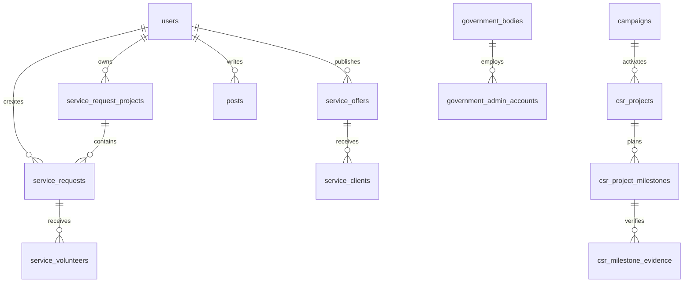

# Navadrishti — Technical Knowledge Dump

> Exhaustive structured technical documentation for developers, interns, AI engineers, architects, auditors, and technical stakeholders.
>
> Generated from full codebase analysis. Last updated: June 2026.

---

## Table of Contents

1. [Project Overview](#section-1-project-overview)
2. [Complete Role Matrix](#section-2-complete-role-matrix)
3. [Complete Feature Inventory](#section-3-complete-feature-inventory)
4. [Complete Workflow Documentation](#section-4-complete-workflow-documentation)
5. [Frontend Architecture](#section-5-frontend-architecture)
6. [Backend Architecture](#section-6-backend-architecture)
7. [Database Architecture](#section-7-database-architecture)
8. [AI/ML Architecture](#section-8-aiml-architecture)
9. [Infrastructure & Deployment](#section-9-infrastructure--deployment)
10. [API Inventory](#section-10-api-inventory)
11. [Page Inventory](#section-11-page-inventory)
12. [Technical Debt & Future Features](#section-12-technical-debt--future-features)

---

# SECTION 1: PROJECT OVERVIEW

## Project Name
**Navadrishti** (also spelled Navdrishti in internal docs)

## Purpose
Full-stack social-impact platform connecting NGOs, individuals, and companies for CSR execution, volunteer coordination, capability exchange, identity verification, and government oversight of development projects.

## Problem Solved
- Fragmented CSR planning and NGO matching
- Lack of verified identities for NGOs, companies, and individuals
- No unified marketplace for NGO needs (service requests) and capabilities (service offers)
- Manual CSR campaign design and milestone/evidence tracking
- Absence of payment, shipment, and attendance-based fulfillment rails for diverse need types
- Limited auditability for CA/government stakeholders

## Primary Stakeholders

| Stakeholder | Role in System |
|-------------|----------------|
| Individual volunteers | Apply to NGO needs; publish capability offers |
| NGOs | Create projects/needs; manage volunteers; execute CSR; publish offers |
| Companies | Run CSR campaigns; fund projects; manage Company CAs |
| Lead NGO (designation) | Selected NGO lead for a CSR campaign or service request project |
| Navadrishti Platform Admin | Moderates users, offers, posts, tickets, campaigns |
| Navadrishti CA (ICAI) | Reviews NGO/company verification documents |
| Company CA | Reviews CSR milestone evidence and payment confirmations |
| Government Admin | Creates/monitors government projects; manages subordinate officers |
| State Officer | State-level analytics dashboard |
| District Officer | District-level analytics dashboard |
| Field Officer | Project-scoped government access |
| AI Engineers / Architects | Navadrishti AI Suite (Atlas, Catalyst, Pulse), embeddings, OCR pipeline |
| Auditors | CSR audit logs, evidence chains, payment confirmations |

## High-Level System Overview

```
┌─────────────────────────────────────────────────────────────────────────┐
│                         CLIENT LAYER (Browser)                          │
│  Next.js 16 App Router │ React 19 │ Tailwind │ shadcn/ui │ 59 pages     │
└───────────────────────────────────┬─────────────────────────────────────┘
                                    │ HTTPS
┌───────────────────────────────────▼─────────────────────────────────────┐
│                    APPLICATION LAYER (Next.js Monolith)                   │
│  app/api/** (181 route handlers) │ lib/** (business logic)                │
│  6 parallel auth domains: Platform JWT, Admin, CA, Company CA, Govt     │
└───────┬─────────────┬──────────────┬──────────────┬───────────────────────┘
        │             │              │              │
        ▼             ▼              ▼              ▼
┌──────────────┐ ┌──────────┐ ┌─────────────┐ ┌──────────────────────────┐
│  Supabase    │ │Cloudinary│ │  Razorpay   │ │ External AI / Logistics  │
│  PostgreSQL  │ │  CDN     │ │  Payments   │ │ Gemini, Delhivery, MSG91 │
│  + Edge Fn   │ │          │ │  Webhooks   │ │ SMTP, Supabase embed RPC │
│  "embed"     │ │          │ │             │ │                          │
└──────────────┘ └──────────┘ └─────────────┘ └──────────────────────────┘
        │
        ▼
┌──────────────────────────────────────────────────────────────────────────┐
│              OCR Microservice (Python, standalone, not wired)              │
│  PaddleOCR │ Sentence Transformers │ Rule Engine │ Accuracy Checker      │
└──────────────────────────────────────────────────────────────────────────┘
```

## Major Product Modules

| Module | Path Prefix | Status |
|--------|-------------|--------|
| Authentication & Sessions | `/login`, `/api/auth/*` | Implemented |
| Profiles & Addresses | `/profile/*`, `/api/profile/*` | Implemented |
| Verification (Individual/NGO/Company) | `/verification`, `/api/verification/*` | Partial (OCR not integrated) |
| NGO Management & Network | `/ngo-network`, `/api/ngos/*` | Implemented |
| Service Request Projects & Needs | `/service-requests/*`, `/api/service-request-*` | Implemented |
| Capability Offers | `/service-offers/*`, `/api/service-offers/*` | Implemented |
| CSR Campaigns | `/csr-campaigns/*`, `/api/campaigns/*` | Implemented |
| CSR Agent (AI) — **Catalyst** | `/companies/csr-agent`, `/api/csr-agent/*`, `/api/ai-agent/*` (agent=csr) | Implemented |
| NGO AI Agent — **Atlas** | `/ngos/ai-agent`, `/api/ai-agent/*` (agent=ngo) | Implemented |
| Matching — **Pulse** (embedded) | `/api/service-requests/recommend`, `/api/csr-agent/get-recommendations`, `/api/ngos/score` | Implemented |
| CSR Project Execution | `/api/csr-projects/*`, `/api/milestones/*` | Implemented |
| Volunteer Management | `/service-requests/applicants/*`, `/api/service-volunteers/*` | Implemented |
| Donations / Payments | Razorpay routes, `/api/webhooks/razorpay` | Implemented |
| Government Monitoring | `/government-admin/*` | Partial (mock analytics) |
| Evidence Management | `/api/milestones/[id]/evidence`, Company CA review | Partial |
| Social Feed | `/home`, `/posts/*`, `/api/posts/*` | Implemented |
| Reporting | `/companies/impact-reports`, `/companies/csr-health` | Partial |
| Notifications | `user_notifications` table | Implemented |
| Settings | `/settings`, `/api/auth/change-password` | Implemented |
| Platform Admin | `/admin/*`, `/api/admin/*` | Implemented |
| CA Console | `/ca/*`, `/api/ca/*` | Partial (mock cases) |
| Company CA Console | `/companies/ca/*`, `/api/companies/ca/*` | Partial (mock toggle) |
| Support | `/help-support`, `/api/help-support` | Implemented |
| Cron / Maintenance | `/api/cron/daily-cleanup` | Implemented |

---

# SECTION 2: COMPLETE ROLE MATRIX

## Platform User Roles

### Role Name: Individual

**Purpose:** Volunteer for NGO needs; publish and respond to capability offers; participate in social feed.

**Permissions:**

| Permission | Value |
|------------|-------|
| canCreatePosts | true (authenticated) |
| canCommentOnPosts | true |
| canLikePosts | true |
| canCreateServiceRequests | false |
| canApplyToServiceRequests | true (if verified) |
| canCreateServiceOffers | true (if verified) |
| canApplyToServiceOffers | true (if verified) |
| canSendMessages | true (if email OR phone verified) |
| canReceiveMessages | true |
| canViewFullProfiles | true |
| canAccessVerificationPage | true |
| canAccessDashboard | true |

**Accessible Pages:** `/`, `/home`, `/login`, `/register`, `/individuals/register`, `/individuals/dashboard`, `/profile`, `/profile/[id]`, `/settings`, `/verification`, `/help-support`, `/service-requests`, `/service-requests/[id]`, `/service-offers/*`, `/csr-campaigns/*`, `/ngo-network`, `/posts/[postId]`

**Actions Allowed:** Sign up/login; individual verification; apply to service requests; create/edit capability offers; social feed interactions; CSR campaign volunteering; support tickets

**Actions Restricted:** Create service requests; create CSR campaigns; admin/CA/government consoles; evidence review; Lead NGO invitation

---

### Role Name: NGO

**Purpose:** Create service request projects and needs; manage volunteers; publish capabilities; execute CSR projects; accept Lead NGO invitations.

**Permissions:**

| Permission | Value |
|------------|-------|
| canCreateServiceRequests | true (if verified) |
| canApplyToServiceRequests | false |
| canCreateServiceOffers | true (if verified) |
| canApplyToServiceOffers | true (if verified) |
| (Social permissions) | Same as Individual |

**Accessible Pages:** All public pages; `/ngos/register`, `/ngos/dashboard`, `/ngos/ai-agent`; `/service-requests/create`, `/edit/[id]`, `/applicants/[id]`; `/service-requests/projects/[id]`, `/edit`; all service-offer pages; CSR campaign browse + volunteer

**Actions Allowed:** Create projects/needs; manage applicants; publish offers; **Atlas** (AI need drafting); accept Lead NGO invites; submit milestone evidence; lead NGO assignment workflows

**Actions Restricted:** Apply to service requests as volunteer; create CSR campaigns; CA/government/admin consoles

---

### Role Name: Lead NGO (Functional Designation)

**Purpose:** NGO designated as execution lead for a CSR campaign or service request project (`impact_metrics.selected_lead_ngo_id` or `service_request_projects.selected_lead_ngo_id`).

**Permissions:** Same as NGO plus campaign/project-scoped lead actions when selected.

**Accessible Pages:** Same as NGO; additional context in `/ngos/dashboard?tab=csr-projects`, `/csr-campaigns/[id]`, `/companies/dashboard`

**Actions Allowed:** Accept lead invitation; co-manage assignments; publish CSR campaign after acceptance

**Actions Restricted:** Cannot self-assign; must be invited by company

---

### Role Name: Company

**Purpose:** Plan CSR campaigns; fund projects; invite Lead NGOs; manage Company CA accounts.

**Permissions:**

| Permission | Value |
|------------|-------|
| canCreateServiceRequests | false |
| canApplyToServiceRequests | false |
| canCreateServiceOffers | true (if verified) |
| canApplyToServiceOffers | true (if verified) |

**Accessible Pages:** `/companies/register`, `/companies/dashboard`, `/companies/csr-agent`, `/companies/csr-budget`, `/companies/csr-health`, `/companies/impact-reports`, `/companies/ca/*` (management), public marketplace pages

**Actions Allowed:** **Catalyst** (CSR campaign AI); campaign CRUD; Lead NGO invites; capability offers; Company CA account management; CSR evidence viewing

**Actions Restricted:** Volunteer for service requests; apply to CSR campaigns as volunteer; CA/government consoles

---

### Role Name: Company CA

**Purpose:** Per-company chartered accountant for CSR milestone evidence review and payment confirmation.

**Auth:** `company-ca-token` cookie; table `company_ca_identities`

**Default Permissions:**
```json
{ "can_view_audit": true, "can_review_evidence": true, "can_confirm_payments": true }
```

**Accessible Pages:** `/companies/ca/login`, `/companies/ca`, `/change-password`, `/settings`, `/history`, `/review/[milestoneId]`

**Actions Allowed:** Session verify; evidence review; payment confirmation; audit history; password change

**Actions Restricted:** Platform dashboards; campaign/request creation; other companies' data

---

### Role Name: Navadrishti CA (Platform CA)

**Purpose:** ICAI-empanelled CA reviewing NGO and company identity verification.

**Auth:** `navadrishti-ca-token`; table `navadrishti_ca_accounts`

**Accessible Pages:** `/ca/login`, `/ca`, `/ca/change-password`, `/ca/cases`, `/ca/cases/[id]`, `/ca/companies`, `/ca/ngos`, `/ca/individuals`

**Actions Allowed:** Login/logout; view cases (mock); approve/reject/clarify (mock); entity lists; NGO agent confirm

**Actions Restricted:** Platform admin; CSR evidence (Company CA domain)

---

### Role Name: Platform Super Admin

**Purpose:** Full platform governance.

**Auth:** `admin-token`; JWT `id: -1`; env `ADMIN_USERNAME` / `ADMIN_PASSWORD`

**Accessible Pages:** `/admin/login`, `/admin`, `/admin/announcements`

**Actions Allowed:** User CRUD; content moderation; support tickets; government admin provisioning; CA credentials; announcements; payments; delivery tracking; audit

**Actions Restricted:** None within platform scope

---

### Role Name: Government Admin (`government_admin`)

**Purpose:** Department-level administrator for government projects and officer credentials.

**Accessible Pages:** `/government-admin/login`, `/government-admin`, `/government-admin/change-password`

**Actions Allowed:** Government project CRUD; create state/district/field officer credentials

---

### Role Name: Government Super Admin (`super_admin`)

Same auth system as Government Admin; top-level government portal account.

---

### Role Name: State Officer

**Accessible Pages:** `/government-admin/login`, `/government-admin/state-dashboard`, `/change-password`

**Actions Allowed:** `GET /api/government-admin/state-analytics` (API-enforced)

---

### Role Name: District Officer

**Accessible Pages:** `/government-admin/login`, `/government-admin/district-dashboard`, `/change-password`

**Actions Allowed:** `GET /api/government-admin/district-analytics` (API-enforced)

---

### Role Name: Field Officer

**Accessible Pages:** `/government-admin/login`, `/government-admin`

**Actions Allowed:** Authenticate; project-scoped operations (partially implemented)

---

### Role Name: Guest (Unauthenticated)

**Permissions:** All `can*` flags false.

**Accessible Pages:** Public browse routes and portal login pages.

**Actions Restricted:** All write operations; dashboards; verification; Atlas / Catalyst consoles.

---

# SECTION 3: COMPLETE FEATURE INVENTORY

| Module | Purpose | Actors | Status |
|--------|---------|--------|--------|
| Authentication | Multi-domain JWT auth (6 consoles) | All | Implemented |
| Profiles | Profile view/edit, addresses, search | Individual, NGO, Company | Implemented |
| Verification | Email/phone/document + CA review | Individual, NGO, Company, CA | Partial |
| NGO Management | Registration, network, AI agent, lead NGO | NGO, Company, Admin | Implemented |
| Projects | Parent NGO initiative containers | NGO, Company, Admin | Implemented |
| Needs | Individual NGO needs with fulfillment routing | NGO, Individual, Admin | Implemented |
| Capabilities | Marketplace offers with admin review | All verified users, Admin | Implemented |
| Service Engagement | Invitations, assignments, attendance | Context-dependent | Partial |
| CSR Campaigns | Company-planned CSR with Lead NGO | Company, NGO, Admin | Implemented |
| CSR Projects | Execution, milestones, evidence, payments | NGO, Company, CAs | Partial |
| Volunteer Management | Applications, allocation, receipts | Individual, NGO | Implemented |
| Donations/Payments | Razorpay orders, webhooks, refunds | All payment actors | Implemented |
| Government Monitoring | Projects, officer dashboards | Govt roles | Partial |
| Evidence Management | GPS/device evidence, CA review | NGO, Company CA | Partial |
| Reporting | Impact reports, analytics | Company, Govt, Admin | Partial |
| Notifications | In-app notifications | Platform users | Implemented |
| Social Feed | Posts, reactions, hashtags | Authenticated users | Implemented |
| Settings | Password, account deletion, theme | Platform users | Implemented |
| Admin Functions | Platform moderation | Super Admin | Implemented |
| AI Agents | Atlas + Catalyst conversational wizards; Pulse matching embedded | Company, NGO | Implemented |

### Key API Domains per Module

- **Auth:** `/api/auth/*`, console auth routes
- **Profiles:** `/api/profile/*`, `/api/addresses/*`, `/api/search/profiles`
- **Verification:** `/api/verification/*`, `/api/ca/*`
- **Needs:** `/api/service-requests/*`, `/api/service-request-projects/*`
- **Offers:** `/api/service-offers/*`, `/api/service-clients`
- **CSR:** `/api/campaigns/*`, `/api/csr-projects/*`, `/api/csr-agent/*`, `/api/milestones/*`
- **Engagement:** `/api/service-invitations/*`, `/api/service-assignments/*`
- **Payments:** Razorpay routes, `/api/webhooks/razorpay`
- **Social:** `/api/posts/*`, `/api/social-feed/*`, `/api/hashtags/*`
- **Admin:** `/api/admin/*`
- **Government:** `/api/government-admin/*`

### Key Database Entities per Module

See [Section 7](#section-7-database-architecture) for complete entity reference.

---

# SECTION 4: COMPLETE WORKFLOW DOCUMENTATION

## Authentication Flow (Platform User)

```
Start → /register or type-specific register
  ↓ POST /api/auth/signup
  ↓ JWT → localStorage + sessionStorage + cookie `token`
  ↓ Redirect dashboard OR /verification
  ↓ ProtectedRoute: auth → userTypes → verification → permission → canAccessRoute
  ↓ Outcome: Access OR redirect
```

## Verification Flow

```
Start → Email OTP → Phone OTP (MSG91)
  ↓ [NGO/Company] document upload → /api/verification/upload
  ↓ POST /api/verification/{type}
  ↓ Status: pending_submission → pending_ca_assignment → under_ca_review
  ↓ [Planned] OCR pre-check
  ↓ CA approve/reject/clarification
  ↓ Outcome: verification_status = verified
```

## CSR Flow (End-to-End)

```
Start → /companies/csr-agent wizard
  ↓ POST /api/csr-agent/generate-campaigns (Gemini)
  ↓ POST get-recommendations, check-ngo-service
  ↓ POST save-campaign → lead-ngo-invites
  ↓ NGO POST /api/campaigns/accept-lead
  ↓ POST publish-campaign (requires lead accepted)
  ↓ csr_projects + milestones created
  ↓ NGO POST /api/milestones/[id]/evidence
  ↓ Company CA POST /api/milestones/[id]/review
  ↓ POST /api/milestones/[id]/payment
  ↓ Outcome: Milestone completed
```

## NGO Project / Need Creation Flow

```
Start → /ngos/ai-agent OR /service-requests/create
  ↓ POST /api/service-request-projects
  ↓ POST /api/service-requests (linked via project_id)
  ↓ [Optional] POST /api/service-requests/recommend
  ↓ Outcome: Active needs listed publicly
```

## Need Fulfillment Flow

```
[Financial] → Razorpay create-order → verify/webhook → is_fulfilled
[Material]    → Volunteer assigned → Delhivery sync → shipment events
[Skill/Infra] → Volunteer apply → accept → attendance → settle
```

## Capability Offer Flow

```
Create → admin_status=pending → Admin review OR auto-reject (5d cron)
  ↓ Listed (view=all filters expired, used, and inactive from public browse)
  ↓ NGO applies from offer detail (service_clients) — individuals/companies cannot apply here
  ↓ Owner manages in dashboard Active/Past tabs (usage_records on accept)
  ↓ [Paid] Razorpay where applicable
```

## Lead NGO Selection Flow

```
Company invites → lead_ngo_invites[] status=invited
  ↓ NGO accept-lead → selected_lead_ngo_id set
  ↓ publish-campaign gate requires lead_ngo_accepted
```

## Evidence Submission Flow

```
NGO POST /api/milestones/[id]/evidence (device_id, GPS, media, documents)
  ↓ csr_milestone_evidence + audit log
  ↓ [Planned] evidence_validation_results
  ↓ Company CA review → payment confirmation
```

## ML Validation Flow (OCR — Python, not wired)

```
PaddleOCR → extractors → rule_engine (format, expiry, name similarity ≥85%)
  ↓ output_formatter: FLAGGED | INCOMPLETE | PENDING_REVIEW
```

## ML Validation Flow (Embeddings — Implemented)

```
embedText() → Supabase "embed" function → RPC match_ngo_services
  ↓ Hybrid vector + lexical scoring → ranked matches
```

---

# SECTION 5: FRONTEND ARCHITECTURE

## Frameworks

| Technology | Version |
|------------|---------|
| Next.js | ^16.2.2 |
| React | ^19.2.0 |
| TypeScript | ^5.9.3 |
| Tailwind CSS | ^3.4.17 |
| shadcn/ui + Radix UI | default/neutral |
| react-hook-form + zod | — |
| framer-motion, recharts, sonner, lucide-react | — |

## Folder Structure

```
app/                    # 59 page routes + 181 API routes
components/ui/          # 35 shadcn components
components/             # 40+ feature components
hooks/                  # use-toast, use-mobile, use-otp-sender, use-realtime-hashtags
lib/                    # ~56 business logic modules
public/                 # robots.txt, sitemap.xml, photos/
docs/                   # Documentation
ocr-service/            # Python OCR (standalone)
```

## Route Structure

59 `page.tsx` routes — see [Section 11](#section-11-page-inventory).

## State Management

| Mechanism | Location |
|-----------|----------|
| AuthProvider / useAuth | `lib/auth-context.tsx` |
| ThemeProvider | `components/theme-provider.tsx` |
| URL `?tab=` | Dashboard pages |
| localStorage | AI agent sessions |
| sessionStorage | Console `*_tab_session` flags |

**Not used:** Redux, Zustand, TanStack Query, next-auth (installed but unused)

## UI Libraries

- shadcn/ui (35 components in `components/ui/`)
- Udaan brand palette: `udaan.blue` (#0067b9), `udaan.orange` (#F47B20)
- `cn()` helper: `lib/utils.ts`

## Reusable Components

`Header` (incl. `AuthBackButton`), `StickyFooter`, `PageTransition`, `ProtectedRoute`, `PostCreator`, `PostsFeed`, `ServiceCard` (incl. `YourCapabilitiesPanel`), `detail-fields.tsx`, `ProfileCard`, `VerificationBadge`, `AIAgentCTA` (Atlas/Catalyst launcher), `CSRAgentOutputCard`, `PlatformActivityFeed`, `ImpactReportsPanel`, `GovernmentAdminManagement`, `NavadrishtCAManagement`, and more in `components/`.

**Removed / inlined (2026):** standalone `offer-capability-details.tsx`, `service-details.tsx`, and several small lib splits — logic moved into pages or consolidated modules (see Backend key modules).

## Layout Structure

```
RootLayout → ThemeProvider → AuthProvider → PageTransition → children → Toaster → AIAgentCTA → Analytics
Nested: ca/layout, companies/ca/layout, government-admin/layout, admin/layout
```

## Authentication Guards

| Guard | File |
|-------|------|
| ProtectedRoute | `components/protected-route.tsx` |
| CA layout | `app/ca/layout.tsx` |
| Company CA layout | `app/companies/ca/layout.tsx` |
| Govt layout | `app/government-admin/layout.tsx` |

**No `middleware.ts`** — no edge-level route protection.

## PWA / Offline Features

| Feature | Status |
|---------|--------|
| manifest.json / service worker | Not present |
| AI agent offline indicator | Implemented (`cloudSaveStatus: 'offline'`) |
| PWA attendance mode | Schema only |

---

# SECTION 6: BACKEND ARCHITECTURE

## Framework

Next.js 16 App Router monolith — 181 API route files, no separate Express server.

## Folder Structure

```
app/api/**/route.ts     # HTTP handlers
lib/*.ts                # Business logic
lib/csr-agent/          # LLM campaign generation
lib/embeddings/         # Vector embedding
ocr-service/            # Python OCR microservice
```

## API Structure

- REST JSON under `/api`
- Per-handler auth (no global middleware)
- Standard: `{ success, data }` or `{ error, details }`

## Key Service Modules

| Module | File |
|--------|------|
| Database | `lib/db.ts` |
| Auth (tokens) | `lib/auth.ts` |
| Auth (request helpers) | `lib/server-auth.ts` — platform JWT, Navadrishti CA, Company CA |
| AI Suite labels | `lib/ai-suite.ts` |
| AI agent sessions | `lib/ai-agent-sessions.ts` |
| CSR LLM | `lib/csr-agent/llm.ts` |
| Pulse capability search | `lib/csr-agent/find-service-offers.ts` |
| Offer dashboard helpers | `lib/service-offers.ts` — classify, usage records, listing filters |
| Allocation + funding + fulfillment | `lib/service-request-allocation.ts` |
| Engagement | `lib/service-engagement.ts` |
| Payments | Razorpay routes + `lib/engagement-settlement.ts` |
| Delhivery | `lib/delhivery.ts` |
| Cloudinary | `lib/cloudinary.ts` |
| Social feed | `lib/social-feed-db.ts` |
| Date display | `lib/format-date.ts` |

## Middleware Pattern

| Function | File |
|----------|------|
| withAuth | `lib/auth.ts` |
| withPermission | `lib/server-access-control.ts` |
| getAuthUserFromRequest / getCAFromRequest / getCompanyCAFromRequest | `lib/server-auth.ts` |
| getAdminUser | `lib/admin-auth.ts` |
| getGovernmentAdminFromRequest | `lib/government-admin-auth.ts` |

## Authentication Mechanisms

| Domain | Cookie/Token | Expiry |
|--------|--------------|--------|
| Platform | `token` / Bearer | 7d default |
| Admin | `admin-token` | Session |
| Navadrishti CA | `navadrishti-ca-token` | 12h |
| Company CA | `company-ca-token` | 7d |
| Govt Admin | `govt-admin-token` | 12h |

## Authorization

- `user_type` + `verification_status` matrix (`lib/access-control.ts`)
- 11 boolean `AccessPermissions`
- Government role API scoping
- Resource ownership checks inline

## Business Logic Layers

```
HTTP Request → Auth → Authorization → Zod Validation → lib/*.ts → Supabase → External APIs → JSON Response
```

---

# SECTION 7: DATABASE ARCHITECTURE

## Engine

Supabase PostgreSQL with pgvector for embeddings.

## Entity Relationship Overview



## Core Entities

### users
**Purpose:** Root identity. **PK:** integer. **Key fields:** email, password, user_type (individual|ngo|company), verification_status, profile_data (jsonb), email_verified, phone_verified. **Referenced by:** virtually all tables.

### service_request_projects
**Purpose:** Parent NGO initiative. **PK:** uuid. **Key fields:** ngo_id, title, valid_until, selected_lead_ngo_id, assigned_company_user_id, assignment_status.

### service_requests
**Purpose:** Individual NGO needs. **PK:** integer. **Key fields:** ngo_id, project_id, request_type, target_amount, current_amount, fulfillment_mode, is_fulfilled, requirements (jsonb).

### service_volunteers
**Purpose:** Applications + fulfillment (overloaded). **Key fields:** service_request_id, volunteer_id, status, fulfillment_amount/quantity, response_meta (jsonb), attendance_mode.

### service_offers / service_clients
**Purpose:** Capability marketplace. **Key fields:** creator_id, offer_type, transaction_type, admin_status, price_type, valid_until.

### campaigns
**Purpose:** CSR planning. **PK:** uuid. **Key fields:** company_id, budget_inr, impact_metrics (jsonb — stores Lead NGO data), status.

### csr_projects / csr_project_milestones
**Purpose:** CSR execution. Milestones have evidence_requirements, amount, status, due_date.

### csr_milestone_evidence (+ _media, _documents)
**Purpose:** Field proof. **Key fields:** device_id, gps_lat, gps_long, gps_accuracy_meters, immutable_hash.

### evidence_validation_results
**Purpose:** Automated validation outcomes. **Fields:** geo_within_region_ok, gps_accuracy_ok, device_assignment_ok, min_evidence_count_ok. **Status:** Schema exists; runtime population partial.

### reference_points
**Purpose:** Geo-fence locations. **Fields:** project_id, latitude, longitude, radius_meters.

### razorpay_payment_orders / razorpay_payments / razorpay_refunds
**Purpose:** Payment ledger with webhook idempotency.

### service_engagement_invitations / assignments / attendance_entries
**Purpose:** Unified engagement lifecycle.

### government_bodies / government_admin_accounts / government_projects
**Purpose:** Government monitoring domain.

### embeddings / capability_embeddings
**Purpose:** Vector store for RAG. RPC: `match_ngo_services`, `match_ngo_service`.

### Verification tables
`individual_verifications`, `ngo_verifications`, `company_verifications`, `navadrishti_ca_accounts`, `company_ca_identities`, `company_ca_action_log`

### AI Agent tables
`ngo_ai_agent_sessions`, `ngo_ai_agent_messages`, `ngo_ai_agent_session_state`, `csr_ai_agent_sessions`, `csr_ai_agent_messages`, `csr_ai_agent_session_state`

### Social tables
`posts`, `post_comments`, `post_reactions`, `post_interactions`, `hashtags`, `user_notifications`, `user_connections`, `activity_feed`, `platform_announcements`

### Support tables
`support_tickets`, `support_ticket_messages`

### Audit tables
`csr_audit_log`, `provider_webhook_events`, `events` (hash chain)

---

# SECTION 8: AI/ML ARCHITECTURE

## Implemented

### Google Gemini
- **Client:** `lib/geminiClient.ts`
- **Models:** `gemini-2.5-flash` (primary), `gemini-2.5-flash-lite` (fallback)
- **Uses:** Catalyst campaign generation (Gemini), Pulse/NGO matching, listing recommendations
- **Validation:** Zod schemas + `buildFallbackCampaigns()` deterministic fallback

### Vector Embeddings
- **Invocation:** Supabase Edge Function `"embed"`
- **Storage:** `embeddings`, `capability_embeddings`
- **RPC:** `match_ngo_services`, `match_ngo_service`
- **Hybrid search:** `lib/csr-agent/find-service-offers.ts`
- **Thresholds:** MATCH_THRESHOLD=0.7, recommend route 0.72

### Navadrishti AI Suite

Product codenames (UI only). Source of truth: `lib/ai-suite.ts`, `reference/agentnamingscheme.txt`.

| Codename | User | Route | Backend |
|----------|------|-------|---------|
| **Atlas** | NGO | `/ngos/ai-agent` | `/api/ai-agent/*?agent=ngo` |
| **Catalyst** | Company | `/companies/csr-agent` | `/api/csr-agent/*`, `/api/ai-agent/*?agent=csr` |
| **Pulse** | Embedded | — | `/api/service-requests/recommend`, `/api/csr-agent/get-recommendations`, `/api/ngos/score` |
| **Sentinel** | — | — | Reserved (monitoring) |
| **Insight** | — | — | Reserved (analytics) |

**Atlas workflow:** conversational project + need capture → draft → **Pulse** recommends capability offers per need → publish service request project/needs.

**Catalyst workflow:** campaign intake → **Pulse** suggests capability offers + scored lead NGOs → Gemini generates campaign drafts → publish to `campaigns` after lead NGO acceptance.

**Session persistence:** DB tables (`*_ai_agent_sessions`, `*_messages`, `*_session_state`) + localStorage; cloud sync via `POST /api/ai-agent/progress`.

**UI entry points:** floating `AIAgentCTA`, CSR campaigns CTA, company/NGO dashboards.

**Limits & offline:** daily rate limits (`lib/ai-agent-project-limits.ts`); offline cloud-save indicator in UI.

## Partially Implemented

| Component | Gap |
|-----------|-----|
| Sentinel / Insight | Named in suite; no dedicated agent UI yet |
| OCR microservice | Built in Python; not connected to verification API |
| evidence_validation_results | Schema exists; not populated on evidence submit |
| reference_points geo validation | No runtime distance check |
| CA verification OCR | Mock results in CA routes |
| Government analytics ML | Mock evidence in analytics APIs |

## Planned

- OCR async integration into verification flow
- ICAI membership verification, UDIN certificate generation
- Government database cross-reference
- Re-verification workflow (30-day grace)
- Mobile React Native field PWA
- Full geo-fencing validation pipeline
- Sentry / performance monitoring

## Model Inputs / Outputs

| Model | Input | Output |
|-------|-------|--------|
| Gemini CSR | budget, category, city, milestones, dates | 3 campaign JSON objects |
| Gemini NGO recommend | offer + need context | should_list + reason |
| embed function | text string | float[] vector |
| PaddleOCR | document image/PDF | extracted text blocks |
| all-MiniLM-L6-v2 | name strings | similarity score 0-100 |

---

# SECTION 9: INFRASTRUCTURE & DEPLOYMENT

## Hosting

| Environment | Platform | Status |
|-------------|----------|--------|
| Development | Vercel | Active |
| Production | Railway | Planned |
| Database | Supabase PostgreSQL | Active |
| CDN | Cloudinary | Active |

## Environment Variables

See `.env.example` for committed variables. Key groups:

- **Supabase:** `NEXT_PUBLIC_SUPABASE_URL`, `NEXT_PUBLIC_SUPABASE_PUBLISHABLE_KEY`, `SUPABASE_SECRET_KEY`
- **Auth:** `JWT_SECRET`, `JWT_EXPIRES_IN`, `BCRYPT_SALT_ROUNDS`
- **Admin/CA:** `ADMIN_USERNAME`, `ADMIN_PASSWORD`, `CA_USERNAME`, `CA_PASSWORD`
- **Payments:** `NEXT_PUBLIC_RAZORPAY_KEY_ID`, `RAZORPAY_KEY_SECRET`, `RAZORPAY_WEBHOOK_SECRET`
- **Logistics:** `DELHIVERY_API_TOKEN`, `DELHIVERY_API_BASE_URL`
- **AI:** `GEMINI_API_KEY`, `GEMINI_MODEL`, `GEMINI_FALLBACK_MODEL`
- **Cron:** `CRON_SECRET`
- **SMS:** `MSG91_API_KEY`, `MSG91_TEMPLATE_ID` (code only, not in .env.example)
- **Email:** `SMTP_HOST`, `SMTP_PORT`, `SMTP_USER`, `SMTP_PASS` (code only)

## Storage Services

| Service | Use |
|---------|-----|
| Cloudinary | Images, documents, receipts |
| Supabase PostgreSQL | All relational data |
| Supabase Edge Functions | Text embedding |

## Deployment Process

```
Git push → Vercel build (pnpm, ignoreBuildErrors: true) → Deploy
Cron: /api/cron/daily-cleanup at 0 12 * * * UTC (vercel.json)
Health: GET /api/health
```

## CI/CD

- **GitHub Actions:** Not present (no `.github/workflows/`)
- **Vercel Git integration:** Implicit push-to-deploy
- **Tests in CI:** Not configured

## Build

- Package manager: pnpm 10.6.5
- `typescript.ignoreBuildErrors: true` in next.config.mjs
- Both `package-lock.json` and `pnpm-lock.yaml` present

## Security Measures

- JWT auth (5 domains), bcrypt passwords
- Razorpay webhook HMAC verification
- Cron CRON_SECRET + x-vercel-cron header
- File upload MIME whitelist, 10MB max
- Zod input validation
- Production devtools blocking script in layout
- Idempotent webhook processing

## Backup Strategy

- Supabase platform-managed backups
- Pre-migration snapshots required per DATABASE_SCHEMA.md
- Audit retention: csr_audit_log, company_ca_action_log, provider_webhook_events

---

# SECTION 10: API INVENTORY

**Base URL:** `/api` (plus 4 routes under `/ngos/`)

**Total:** ~250+ HTTP method+path combinations across 181 route files + 4 ngo routes.

## Standard Formats

**Success:** `{ "success": true, "data": {}, "message": "optional" }`

**Error:** `{ "error": "message", "details": "optional" }`

**Auth:** `Authorization: Bearer <jwt_token>` or role-specific cookies.

## Endpoint Groups

### Health & Maintenance
| Method | Endpoint | Auth |
|--------|----------|------|
| GET | `/api/health` | No |
| GET/POST | `/api/cron/daily-cleanup` | CRON_SECRET |
| POST | `/api/auto-update-statuses` | Internal |

### Authentication (14 endpoints)
`POST /api/auth/signup`, `login`, `logout`, `forgot-password`, `reset-password`, `verify-reset-token`, `change-password`, `send-phone-otp`, `verify-phone-otp`, `verify-phone`, `prepare-email-otp`, `start-verification` | `GET /api/auth/me` | `DELETE /api/auth/delete-account`

### Profile & Users (19 endpoints)
`/api/profile/[userId]`, `update`, `company`, `organization`, `portfolio`, `skills` | `/api/users`, `verified`, `suggestions` | `/api/search/profiles` | `/api/addresses`, `/api/addresses/[addressId]`

### Verification (9 endpoints)
`/api/verification/status`, `upload`, `individual`, `ngo`, `company` | `/api/recent-verifications`

### Social Feed (25+ endpoints)
`/api/posts`, `/api/posts/[postId]`, `comments`, `interact`, `share` | `/api/social-feed/comments`, `reactions`, `connections`, `suggestions`, `trending`, `users/[userId]/stats` | `/api/activity-feed`, `/api/platform-activities`, `/api/dashboard/stats`, `activity`

### Hashtags (9 endpoints)
`/api/hashtags/trending`, `fix`, `maintenance`, `refresh`, `reset-daily`, `setup-triggers`

### Service Requests & Projects (20+ endpoints)
`/api/service-requests`, `[id]`, `recommend`, `refresh-status`, `[id]/volunteers`, `[id]/volunteers/[volunteerId]`, `delivery/sync`, `payments/create-order`, `verify` | `/api/service-request-projects`, `[id]` | `/api/service-volunteers`, `/api/service-request-assignments`

### Service Offers (12+ endpoints)
`/api/service-offers`, `[id]`, `[id]/clients`, `payments/create-order`, `verify` | `/api/service-offers/requests`, `[requestId]` | `/api/service-clients`

### Engagement (7 endpoints)
`/api/service-invitations`, `[id]/respond` | `/api/service-assignments`, `[id]/attendance`, `settle`

### CSR Campaigns & Projects (15+ endpoints)
`/api/campaigns`, `[id]`, `[id]/volunteer`, `accept-lead`, `lead-assignments`, `lead-invitations`, `volunteer-assignments` | `/api/csr-projects`, `[id]/milestones`, `invite`, `evidence`, `audit` | `/api/milestones/[id]/evidence`, `review`, `payment`

### Catalyst / Atlas AI Agent APIs (13 endpoints)
`/api/csr-agent/generate-campaigns`, `save-campaign`, `update-campaign`, `publish-campaign`, `get-recommendations`, `check-ngo-service`, `search-capabilities`, `lead-ngo-invites` | `/api/ai-agent/progress`, `/api/ai-agent/sessions/[id]` (agent=`csr`|`ngo`)

### Pulse matching (3 endpoints)
`POST /api/service-requests/recommend` | `POST /api/csr-agent/get-recommendations` | `POST /api/ngos/score`

### NGO Routes (non-/api)
`POST /ngos/ngo-matching`, `/ngos/ngo-agent/recommend`, `confirm`, `sturcture`

### NGOs (3 endpoints)
`/api/ngos/list`, `network`, `score`

### Payments (4 endpoints)
`/api/payments/pending`, `/api/webhooks/razorpay`, `/api/uploads/receipt`

### Platform Admin (40+ endpoints)
`/api/admin/auth`, `logout`, `verify`, `overview`, `analytics`, `audit`, `settings`, `users`, `[id]`, `posts`, `[postId]`, `campaigns`, `[id]`, `service-offers`, `[offerId]/review`, `auto-reject`, `service-requests`, `[id]`, `service-request-projects`, `[id]`, `support-tickets`, `[ticketId]`, `announcements`, `payments/discover`, `delivery/track`, `ca-credentials`, `government-admins`, `[id]`

### Navadrishti CA (16 endpoints)
`/api/ca/auth`, `login`, `verify`, `logout`, `change-password`, `dashboard`, `cases`, `[id]`, `[id]/approve`, `reject`, `clarification`, `individuals`, `companies`, `ngos`, `verification-action`, `ngo-agent/confirm`

### Company CA (12 endpoints)
`/api/companies/ca/auth`, `verify`, `logout`, `change-password`, `mark-password-changed`, `accounts`, `[identityId]`, `payments/create-order`, `confirm`, `verify`

### Government Admin (10 endpoints)
`/api/government-admin/auth`, `verify`, `logout`, `change-password`, `credentials`, `projects`, `state-analytics`, `district-analytics`

### Upload & Debug (7 endpoints)
`/api/upload`, `/api/help-support`, `/api/debug/database`, `token`, `upload`, `my-contributions`

---

# SECTION 11: PAGE INVENTORY

## Public Pages (7)

| Route | File | Roles |
|-------|------|-------|
| `/` | `app/page.tsx` | Guest, all |
| `/home` | `app/home/page.tsx` | Guest, all |
| `/register` | `app/register/page.tsx` | Guest |
| `/login` | `app/login/page.tsx` | Guest |
| `/forgot-password` | `app/forgot-password/page.tsx` | Guest |
| `/reset-password` | `app/reset-password/page.tsx` | Guest |
| `/ngo-network` | `app/ngo-network/page.tsx` | Guest |

## Registration (3)

| Route | Roles |
|-------|-------|
| `/individuals/register` | Guest |
| `/ngos/register` | Guest |
| `/companies/register` | Guest |

## Dashboards (3)

| Route | Roles | Tabs |
|-------|-------|------|
| `/individuals/dashboard` | Individual | profile, capability-offers (Active/Past), ngo-requests, csr-campaigns |
| `/ngos/dashboard` | NGO | profile, capability-offers, service-requests, csr-projects, tracking |
| `/companies/dashboard` | Company | profile, capability-offers (Active/Past), csr-projects, company-ca, impact-reports |

## Profile & Account (5)

| Route | Roles |
|-------|-------|
| `/profile` | Authenticated |
| `/profile/[id]` | Guest (basic), Authenticated (full) |
| `/settings` | Authenticated |
| `/verification` | Authenticated (all types) |
| `/help-support` | Authenticated |

## Service Requests (7)

| Route | Roles |
|-------|-------|
| `/service-requests` | Guest (browse), all (actions) |
| `/service-requests/create` | NGO verified |
| `/service-requests/[id]` | Guest view; Individual apply; NGO manage |
| `/service-requests/edit/[id]` | NGO owner |
| `/service-requests/applicants/[id]` | NGO owner |
| `/service-requests/projects/[id]` | Guest/authenticated |
| `/service-requests/projects/[id]/edit` | NGO owner |

## Service Offers (4)

| Route | Roles |
|-------|-------|
| `/service-offers` | Guest browse |
| `/service-offers/create` | Verified (all types) |
| `/service-offers/edit/[id]` | Verified creator |
| `/service-offers/[id]` | Guest view; **NGO only** may apply (verified) |

## CSR (2)

| Route | Roles |
|-------|-------|
| `/csr-campaigns` | Guest |
| `/csr-campaigns/[id]` | Guest; NGO/Individual volunteer; Company owner |

## Company CSR Tools (4)

| Route | Roles | UI name |
|-------|-------|---------|
| `/companies/csr-agent` | Company | **Catalyst** |
| `/companies/csr-budget` | Company | — |
| `/companies/csr-health` | Company | — |
| `/companies/impact-reports` | Company | — |

## Atlas — NGO agent (1)

| Route | Roles | UI name |
|-------|-------|---------|
| `/ngos/ai-agent` | NGO | **Atlas** |

## Social (1)

| Route | Roles |
|-------|-------|
| `/posts/[postId]` | Guest read; Authenticated interact |

## Platform Admin (3)

| Route | Roles |
|-------|-------|
| `/admin/login` | Guest |
| `/admin` | Super Admin |
| `/admin/announcements` | Super Admin |

## Navadrishti CA (8)

| Route | Roles |
|-------|-------|
| `/ca/login` | Guest |
| `/ca` | Navadrishti CA |
| `/ca/change-password` | Navadrishti CA |
| `/ca/cases` | Navadrishti CA |
| `/ca/cases/[id]` | Navadrishti CA |
| `/ca/companies` | Navadrishti CA |
| `/ca/ngos` | Navadrishti CA |
| `/ca/individuals` | Navadrishti CA |

## Company CA (6)

| Route | Roles |
|-------|-------|
| `/companies/ca/login` | Guest |
| `/companies/ca` | Company CA |
| `/companies/ca/change-password` | Company CA |
| `/companies/ca/settings` | Company CA |
| `/companies/ca/history` | Company CA |
| `/companies/ca/review/[milestoneId]` | Company CA |

## Government Admin (5)

| Route | Roles |
|-------|-------|
| `/government-admin/login` | Guest |
| `/government-admin` | Govt admin (any role) |
| `/government-admin/change-password` | Govt admin |
| `/government-admin/state-dashboard` | state_officer (API) |
| `/government-admin/district-dashboard` | district_officer (API) |

## Broken / Missing Routes

| Route | Status |
|-------|--------|
| `/about` | Linked from landing; page does not exist |
| `/dashboard` | Referenced in settings; page does not exist |

---

# SECTION 12: TECHNICAL DEBT & FUTURE FEATURES

## Placeholder Features

| Feature | Location |
|---------|----------|
| CA case management | `/api/ca/cases/*` — mock data |
| Government analytics | state/district analytics routes — mock evidence |
| Company CA review mock | `review/[milestoneId]/page.tsx` — default ON |
| Evidence geo validation | Schema only |
| PWA attendance | Schema only |
| `/about` link | Broken |

## Mock Data Sources

- `lib/mock-ca-data.ts` — central mock module
- CA API routes — mock cases VC-2026-*
- Government analytics — hardcoded arrays
- OCR ground truth — `ocr-service/validation/ground_truth/dataset.json`

## Incomplete Modules

| Module | Gap |
|--------|-----|
| OCR verification | Python built; not wired to API |
| CA workflow | DB operations mocked |
| Evidence ML validation | Not populated on submit |
| CI/CD | No GitHub Actions workflows |
| Test suite | No tests/ directory |
| Migration scripts | Referenced but missing |

## Missing Integrations

- OCR → verification API
- Supabase Realtime (documented, limited use)
- next-auth (installed, unused)
- Sentry, SendGrid, Twilio (documented, not wired)
- Railway production deploy (planned, no Dockerfile)
- ICAI API verification (planned)

## Scalability Concerns

- Monolithic API (some routes >1000 lines)
- Phone OTP in-memory (breaks multi-instance)
- Mixed PK types (integer + uuid)
- service_volunteers overloaded table
- No Redis/cache layer
- TypeScript errors ignored in build
- Duplicate ProtectedRoute and embed helpers

## Security Concerns

- Admin auth via env credentials only
- JWT dev fallback secret
- No Next.js middleware (client-side guards only)
- CSRF not explicitly implemented
- Debug endpoints present
- Mock CA review default ON

## Future Planned Features

**Verification:** ICAI verification, UDIN generation, OCR integration, re-verification workflow, government DB cross-reference

**Service Exchange:** Split service_volunteers, attendance entries table, validity windows, standardized billing fields

**Database:** PK standardization, naming drift cleanup, drop legacy service_offers columns

**Infrastructure:** React Native field app, Docker build, GitHub Actions CI, Sentry monitoring, Railway production

## Documentation vs Reality Gaps

| Claim | Reality |
|-------|---------|
| Next.js 15 (README) | Next.js 16.2.2 |
| Supabase Storage | Cloudinary used |
| GitHub Actions CI/CD | No workflows |
| npm test | Not in package.json |
| /api/auth/register | Actual: /api/auth/signup |
| reference/completeschema.txt | Gitignored |
| `lib/ngo-need-fulfillment.ts` | Merged into `lib/service-request-allocation.ts` |
| `lib/server-company-ca-auth.ts` | Merged into `lib/server-auth.ts` |
| CSR / NGO “AI Agent” UI labels | Renamed to Catalyst / Atlas (June 2026) |

## Cleanup Priority

1. Fix `requester_id` → `ngo_id` in platform-activities route
2. Reduce JSONB overload in service_volunteers route
3. Resolve missing `service_offer_notifications` table reference
4. Replace CA mock with DB-backed workflow
5. Integrate OCR async pipeline
6. Wire evidence_validation_results on evidence POST
7. Add GitHub Actions CI
8. Add test suite
9. Add Next.js middleware
10. Move phone OTP to Redis/DB

---

## Related Documentation

| File | Purpose |
|------|---------|
| `docs/ARCHITECTURE.md` | System architecture overview |
| `docs/API_REFERENCE.md` | REST API with request/response examples |
| `docs/DATABASE_SCHEMA.md` | Canonical domain model |
| `docs/VERIFICATION_FLOW.md` | Verification workflow detail |
| `docs/DEPLOYMENT.md` | Deployment guides |
| `docs/ENVIRONMENT.md` | Environment variable reference |
| `docs/SERVICE_EXCHANGE_MODEL.md` | Service lifecycle schema |
| `docs/TABLE_ORDER_AND_MERGE_GUIDE.md` | DB cleanup guide |
| `reference/agentnamingscheme.txt` | AI Suite codename reference |
| `lib/ai-suite.ts` | Runtime AI Suite labels and routes |

---

*Building bridges between compassion and action.*
