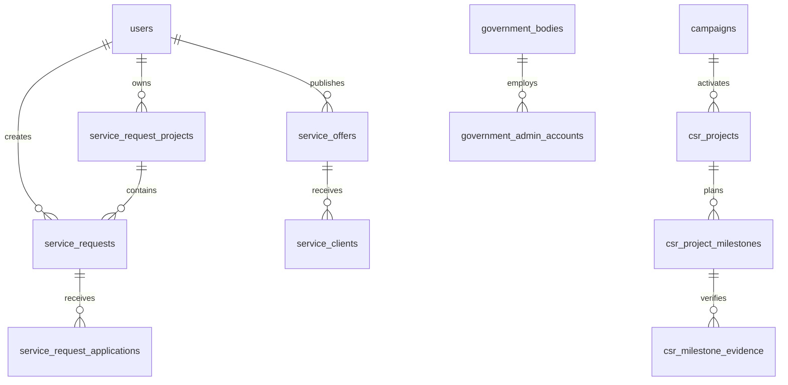

# Navadrishti — Technical README

Internal notes for developers working on this repository.

Last reviewed: September 2026.

---

## Contents

1. [Overview](#overview)
2. [Roles](#roles)
3. [Features](#features)
4. [Workflows](#workflows)
5. [Frontend](#frontend)
6. [Backend](#backend)
7. [Database](#database)
8. [AI and matching](#ai-and-matching)
9. [Infrastructure](#infrastructure)
10. [API inventory](#api-inventory)
11. [Pages](#pages)
12. [Known gaps](#known-gaps)

---

# Overview

## Project Name
**Navadrishti**

## Purpose
Full-stack social-impact platform connecting NGOs, individuals, and companies for CSR execution, volunteer coordination, capability exchange, identity verification, and government oversight of development projects.

## Problem Solved
- Fragmented CSR planning and NGO matching
- Lack of verified identities for NGOs, companies, and individuals
- No unified marketplace for NGO needs (service requests) and capabilities (service offers)
- Manual CSR campaign design and milestone/evidence tracking
- Absence of payment, shipment, and attendance-based fulfillment rails for diverse need types
- Limited auditability for CA/government stakeholders

## Primary Stakeholders

| Stakeholder | Role in System |
|-------------|----------------|
| Individual volunteers | Apply to NGO needs; publish capability offers |
| NGOs | Create projects/needs; manage volunteers; execute CSR; publish offers |
| Companies | Run CSR campaigns; fund projects; manage Company CAs |
| Lead NGO (designation) | Selected NGO lead for a CSR campaign or service request project |
| Navadrishti Platform Admin | Moderates users, offers, posts, tickets, campaigns |
| Navadrishti CA (ICAI) | Reviews NGO/company verification documents |
| Company CA | Reviews CSR milestone evidence and payment confirmations |
| Government Admin | Creates/monitors government projects; manages subordinate officers |
| State Officer | State-level analytics dashboard |
| District Officer | District-level analytics dashboard |
| Field Officer | Project-scoped government access |
| AI Engineers / Architects | Navadrishti AI Suite (Atlas, Catalyst, Pulse), embeddings, OCR pipeline |
| Auditors | CSR audit logs, evidence chains, payment confirmations |

## High-Level System Overview

```
┌─────────────────────────────────────────────────────────────────────────┐
│                         CLIENT LAYER (Browser)                          │
│  Next.js 16 App Router │ React 19 │ Tailwind │ shadcn/ui │ 55 pages     │
└───────────────────────────────────┬─────────────────────────────────────┘
                                    │ HTTPS
┌───────────────────────────────────▼─────────────────────────────────────┐
│                    APPLICATION LAYER (Next.js Monolith)                   │
│  app/api/** (140 route handlers) │ lib/** (business logic)                │
│  5 auth domains: Platform JWT, Admin, Platform CA, Company CA, Govt     │
└───────┬─────────────┬──────────────┬──────────────┬───────────────────────┘
        │             │              │              │
        ▼             ▼              ▼              ▼
┌──────────────┐ ┌──────────┐ ┌─────────────┐ ┌──────────────────────────┐
│  Supabase    │ │Cloudinary│ │  Razorpay   │ │ External AI / Logistics  │
│  PostgreSQL  │ │  CDN     │ │  Payments   │ │ Gemini, Delhivery, MSG91 │
│  + Edge Fn   │ │          │ │  Webhooks   │ │ SMTP, Supabase embed RPC │
│  "embed"     │ │          │ │             │ │                          │
└──────────────┘ └──────────┘ └─────────────┘ └──────────────────────────┘
        │
        ▼
┌──────────────────────────────────────────────────────────────────────────┐
│              OCR Microservice (Python, standalone, not wired)              │
│  PaddleOCR │ Sentence Transformers │ Rule Engine │ Accuracy Checker      │
└──────────────────────────────────────────────────────────────────────────┘
```

## Major Product Modules

| Module | Path Prefix | Status |
|--------|-------------|--------|
| Authentication & Sessions | `/login`, `/api/auth/*` | Implemented |
| Profiles & Addresses | `/profile/*`, `/api/profile/*` | Implemented |
| Verification (Individual/NGO/Company) | `/verification`, `/api/verification/*` | Live (Gemini OCR during CA review) |
| NGO Management & Network | `/ngo-network`, `/api/ngos/*` | Implemented |
| Service Request Projects & Needs | `/service-requests/*`, `/api/service-request-*` | Implemented |
| Capability Offers | `/service-offers/*`, `/api/service-offers/*` | Implemented |
| CSR Campaigns | `/csr-campaigns/*`, `/api/campaigns/*` | Implemented |
| CSR Agent (AI) — **Catalyst** | `/companies/csr-agent`, `/api/csr-agent/*`, `/api/ai-agent/*` (agent=csr) | Implemented |
| NGO AI Agent — **Atlas** | `/ngos/ai-agent`, `/api/ai-agent/*` (agent=ngo) | Implemented |
| Matching — **Pulse** (embedded) | `/api/service-requests/recommend`, `/api/csr-agent/get-recommendations`, `/api/ngos/score` | Implemented |
| CSR Project Execution | `/api/csr-projects/*`, `/api/milestones/*` | Implemented |
| Volunteer Management | `/service-requests/applicants/*`, `/api/service-requests/[id]/volunteers` | Implemented |
| Donations / Payments | Razorpay routes, `/api/webhooks/razorpay` | Implemented |
| Government Monitoring | `/government-admin/*` | Paused (redirected to `/` by `proxy.ts`) |
| Evidence Management | `/api/milestones/[id]/evidence`, Company CA review | Partial |
| Platform newsletter | `/`, `/api/platform-newsletter` | Implemented |
| Reporting | `/companies/impact-reports`, `/companies/csr-health` | Partial |
| Notifications | `user_notifications` table | Implemented |
| Settings | `/settings`, `/api/auth/change-password` | Implemented |
| Platform Admin | `/admin/*`, `/api/admin/*` | Implemented |
| CA Console | `/ca/*`, `/api/ca/*` | Implemented |
| Company CA Console | `/evidence-verification/*`, `/api/evidence-verification/*` (legacy `/companies/ca` redirects) | Implemented |
| Support | `/help-support`, `/api/help-support` | Implemented |
| Cron / Maintenance | `/api/cron/daily-cleanup` | Implemented |

---

# Roles

## Platform User Roles

### Role Name: Individual

**Purpose:** Volunteer for NGO needs; publish and respond to capability offers.

**Permissions:**

| Permission | Value |
|------------|-------|
| canCreateServiceRequests | false |
| canApplyToServiceRequests | true (if verified) |
| canCreateServiceOffers | true (if verified) |
| canApplyToServiceOffers | true (if verified) |
| canSendMessages | true (if email OR phone verified) |
| canReceiveMessages | true |
| canViewFullProfiles | true |
| canAccessVerificationPage | true |
| canAccessDashboard | true |

**Accessible Pages:** `/`, `/login`, `/register`, `/individuals/register`, `/individuals/dashboard`, `/profile`, `/profile/[id]`, `/settings`, `/verification`, `/help-support`, `/service-requests`, `/service-requests/[id]`, `/service-offers/*`, `/csr-campaigns/*`, `/ngo-network`

**Actions Allowed:** Sign up/login; individual verification; apply to service requests; create/edit capability offers; CSR campaign volunteering; support tickets

**Actions Restricted:** Create service requests; create CSR campaigns; admin/CA/government consoles; evidence review; Lead NGO invitation

---

### Role Name: NGO

**Purpose:** Create service request projects and needs; manage volunteers; publish capabilities; execute CSR projects; accept Lead NGO invitations.

**Permissions:**

| Permission | Value |
|------------|-------|
| canCreateServiceRequests | true (if verified) |
| canApplyToServiceRequests | false |
| canCreateServiceOffers | true (if verified) |
| canApplyToServiceOffers | true (if verified) |
| (Messaging, profile, dashboard permissions) | Same as Individual |

**Accessible Pages:** All public pages; `/ngos/register`, `/ngos/dashboard`, `/ngos/ai-agent`; `/service-requests/create`, `/edit/[id]`, `/applicants/[id]`; `/service-requests/projects/[id]`, `/edit`; all service-offer pages; CSR campaign browse + volunteer

**Actions Allowed:** Create projects/needs; manage applicants; publish offers; **Atlas** (AI need drafting); accept Lead NGO invites; submit milestone evidence; lead NGO assignment workflows

**Actions Restricted:** Apply to service requests as volunteer; create CSR campaigns; CA/government/admin consoles

---

### Role Name: Lead NGO (Functional Designation)

**Purpose:** NGO designated as execution lead for a CSR campaign or service request project (`campaigns.lead_ngo_user_id` or `service_request_projects.lead_ngo_user_id`).

**Permissions:** Same as NGO plus campaign/project-scoped lead actions when selected.

**Accessible Pages:** Same as NGO; additional context in `/ngos/dashboard?tab=csr-projects`, `/csr-campaigns/[id]`, `/companies/dashboard`

**Actions Allowed:** Accept lead invitation; co-manage assignments; publish CSR campaign after acceptance

**Actions Restricted:** Cannot self-assign; must be invited by company

---

### Role Name: Company

**Purpose:** Plan CSR campaigns; fund projects; invite Lead NGOs; manage Company CA accounts.

**Permissions:**

| Permission | Value |
|------------|-------|
| canCreateServiceRequests | false |
| canApplyToServiceRequests | false |
| canCreateServiceOffers | true (if verified) |
| canApplyToServiceOffers | true (if verified) |

**Accessible Pages:** `/companies/register`, `/companies/dashboard`, `/companies/csr-agent`, `/companies/csr-budget`, `/companies/csr-health`, `/companies/impact-reports`, evidence reviewer management, public marketplace pages

**Actions Allowed:** **Catalyst** (CSR campaign AI); campaign CRUD; Lead NGO invites; capability offers; Company CA account management; CSR evidence viewing

**Actions Restricted:** Volunteer for service requests; apply to CSR campaigns as volunteer; CA/government consoles

---

### Role Name: Company CA

**Purpose:** Per-company chartered accountant for CSR milestone evidence review and payment confirmation.

**Auth:** `evidence-verification-token` cookie (the legacy `company-ca-token` is still accepted); table `company_ca_identities`

**Default Permissions:**
```json
{ "can_view_audit": true, "can_review_evidence": true, "can_confirm_payments": true }
```

**Accessible Pages:** `/evidence-verification/login`, `/evidence-verification`, `/change-password`, `/settings`, `/history`, `/review/[milestoneId]`

**Actions Allowed:** Session verify; evidence review; payment confirmation; audit history; password change

**Actions Restricted:** Platform dashboards; campaign/request creation; other companies' data

---

### Role Name: Navadrishti CA (Platform CA)

**Purpose:** ICAI-empanelled CA reviewing NGO and company identity verification.

**Auth:** `navadrishti-ca-token`; table `platform_ca_accounts`

**Accessible Pages:** `/ca/login`, `/ca`, `/ca/change-password`, `/ca/[type]` (`companies`, `ngos`, `individuals`)

**Actions Allowed:** Login/logout; review queue (`/api/ca/queue`, `/api/ca/review`); approve / reject / request clarification (`/api/ca/verification-action`), with a Gemini document read to assist

**Actions Restricted:** Platform admin; CSR evidence (Company CA domain)

---

### Role Name: Platform Super Admin

**Purpose:** Full platform governance.

**Auth:** `admin-token`; JWT `id: -1`; env `ADMIN_USERNAME` / `ADMIN_PASSWORD`

**Accessible Pages:** `/admin/login`, `/admin`, `/admin/announcements`

**Actions Allowed:** User CRUD; content moderation; support tickets; government admin provisioning; CA credentials; announcements; payments; delivery tracking; audit

**Actions Restricted:** None within platform scope

---

### Role Name: Government Admin (`government_admin`)

**Purpose:** Department-level administrator for government projects and officer credentials.

**Status:** All `/government-admin` pages are currently paused: `proxy.ts` and `isLaunchBlockedPath()` in `lib/access-control.ts` redirect them to `/`. The API routes remain in place.

**Accessible Pages:** `/government-admin/login`, `/government-admin`, `/government-admin/change-password`

**Actions Allowed:** Government project CRUD; create state/district/field officer credentials

---

### Role Name: Government Super Admin (`super_admin`)

Same auth system as Government Admin; top-level government portal account.

---

### Role Name: State Officer

**Accessible Pages:** `/government-admin/login`, `/government-admin/state-dashboard`, `/change-password`

**Actions Allowed:** `GET /api/government-admin/state-analytics` (API-enforced)

---

### Role Name: District Officer

**Accessible Pages:** `/government-admin/login`, `/government-admin/district-dashboard`, `/change-password`

**Actions Allowed:** `GET /api/government-admin/district-analytics` (API-enforced)

---

### Role Name: Field Officer

**Accessible Pages:** `/government-admin/login`, `/government-admin`

**Actions Allowed:** Authenticate; project-scoped operations (partially implemented)

---

### Role Name: Guest (Unauthenticated)

**Permissions:** All `can*` flags false.

**Accessible Pages:** Public browse routes and portal login pages.

**Actions Restricted:** All write operations; dashboards; verification; Atlas / Catalyst consoles.

---

# Features

| Module | Purpose | Actors | Status |
|--------|---------|--------|--------|
| Authentication | Multi-domain JWT auth (5 domains) | All | Implemented |
| Profiles | Profile view/edit, search | Individual, NGO, Company | Implemented |
| Verification | Email/document + CA review (phone OTP disabled via `PHONE_VERIFICATION_ENABLED`) | Individual, NGO, Company, CA | Partial |
| NGO Management | Registration, network, AI agent, lead NGO | NGO, Company, Admin | Implemented |
| Projects | Parent NGO initiative containers | NGO, Company, Admin | Implemented |
| Needs | Individual NGO needs with fulfillment routing | NGO, Individual, Admin | Implemented |
| Capabilities | Marketplace offers with admin review | All verified users, Admin | Implemented |
| Service Engagement | Invitations, assignments, attendance | Context-dependent | Partial |
| CSR Campaigns | Company-planned CSR with Lead NGO | Company, NGO, Admin | Implemented |
| CSR Projects | Execution, milestones, evidence, payments | NGO, Company, CAs | Partial |
| Volunteer Management | Applications, allocation, receipts | Individual, NGO | Implemented |
| Donations/Payments | Razorpay orders, webhooks, refunds | All payment actors | Implemented |
| Government Monitoring | Projects, officer dashboards | Govt roles | Paused |
| Evidence Management | GPS/device evidence, CA review | NGO, Company CA | Partial |
| Reporting | Impact reports, analytics | Company, Govt, Admin | Partial |
| Notifications | In-app notifications | Platform users | Implemented |
| Settings | Password, account deletion, theme | Platform users | Implemented |
| Admin Functions | Platform moderation | Super Admin | Implemented |
| AI Agents | Atlas + Catalyst conversational wizards; Pulse matching embedded | Company, NGO | Implemented |

### Key API Domains per Module

- **Auth:** `/api/auth/*`, console auth routes
- **Profiles:** `/api/profile/*`, `/api/search/profiles`
- **Verification:** `/api/verification/*`, `/api/ca/*`
- **Needs:** `/api/service-requests/*`, `/api/service-request-projects/*`
- **Offers:** `/api/service-offers/*`
- **CSR:** `/api/campaigns/*`, `/api/csr-projects/*`, `/api/csr-agent/*`, `/api/milestones/*`
- **Engagement:** `/api/service-assignments/*`
- **Payments:** Razorpay routes, `/api/webhooks/razorpay`
- **Newsletter:** `/api/platform-newsletter`
- **Admin:** `/api/admin/*`
- **Government:** `/api/government-admin/*`

### Key Database Entities per Module

See [Database](#database) for the entity reference.

---

# Workflows

## Authentication Flow (Platform User)

```
Start → /register or type-specific register
  ↓ POST /api/auth/signup
  ↓ JWT → localStorage + sessionStorage + cookie `token`
  ↓ Redirect dashboard OR /verification
  ↓ ProtectedRoute: auth → userTypes → verification → permission → canAccessRoute
  ↓ Outcome: Access OR redirect
```

## Verification Flow

```
Start → Email OTP → Phone OTP (MSG91; currently disabled)
  ↓ [NGO/Company] document upload → /api/verification/upload
  ↓ POST /api/verification/{type}
  ↓ Status: pending_submission → pending_ca_assignment → under_ca_review
  ↓ CA opens the case; Gemini reads the documents to assist
  ↓ CA approve/reject/clarification (POST /api/ca/verification-action)
  ↓ Outcome: verification_status = verified
```

## CSR Flow (End-to-End)

```
Start → /companies/csr-agent wizard
  ↓ POST /api/csr-agent/generate-campaigns (Gemini)
  ↓ POST get-recommendations (capability offers), /api/ngos/score (lead NGOs)
  ↓ POST ai-agent/progress + update-campaign → lead-ngo-invites
  ↓ NGO POST /api/campaigns/accept-lead
  ↓ POST publish-campaign (requires lead accepted)
  ↓ csr_projects + milestones created
  ↓ NGO POST /api/milestones/[id]/evidence
  ↓ Company CA POST /api/milestones/[id]/review
  ↓ POST /api/milestones/[id]/payments/create-order → Razorpay checkout → payments/verify
  ↓ Outcome: Milestone completed
```

## NGO Project / Need Creation Flow

```
Need path  → /service-requests/create OR Atlas (Need)
  ↓ POST /api/service-requests (project_id omitted)
  ↓ Outcome: Standalone need for individuals

Project path → /service-requests/projects/create OR Atlas (Project)
  ↓ POST /api/service-request-projects
  ↓ Outcome: Standalone CSR package for companies
```

## Need Fulfillment Flow

```
[Financial] → Razorpay create-order → verify/webhook → is_fulfilled
[Material]    → Volunteer assigned → Delhivery sync → shipment events
[Skill/Infra] → Volunteer apply → accept → attendance → settle
```

## Capability Offer Flow

```
Create → admin_status=pending → Admin review OR auto-reject (5d cron)
  ↓ Listed (view=all filters expired, used, and inactive from public browse)
  ↓ NGO applies from offer detail (service_clients) — individuals/companies cannot apply here
  ↓ Owner manages in dashboard Active/Past tabs (usage_records on accept)
  ↓ [Paid] Razorpay where applicable
```

## Lead NGO Selection Flow

```
Company invites → lead_ngo_invites[] status=invited
  ↓ NGO accept-lead → campaigns.lead_ngo_user_id set
  ↓ publish-campaign gate requires lead_ngo_accepted
```

## Evidence Submission Flow

```
NGO POST /api/milestones/[id]/evidence (device_id, GPS, media, documents)
  ↓ csr_milestone_evidence + audit log
  ↓ [Planned] evidence_validation_results
  ↓ Company CA review → payment confirmation
```

## ML Validation Flow (OCR — Python, not wired)

```
PaddleOCR → extractors → rule_engine (format, expiry, name similarity ≥85%)
  ↓ output_formatter: FLAGGED | INCOMPLETE | PENDING_REVIEW
```

## ML Validation Flow (Embeddings — Implemented)

```
Offer create / edit (after response) + daily cron backfill
  ↓ Supabase "embed" function → service_offer_embeddings
Need recommend: embed need text → RPC match_service_offers
  ↓ Semantic boost + keyword / phrase / capacity scoring → ranked matches
```

---

# Frontend

## Frameworks

| Technology | Version |
|------------|---------|
| Next.js | ^16.2.2 |
| React | ^19.2.0 |
| TypeScript | ^5.9.3 |
| Tailwind CSS | ^3.4.18 |
| shadcn/ui + Radix UI | default/neutral |
| sonner, lucide-react, cmdk | — |
| @vercel/analytics, @vercel/speed-insights | — |

## Folder Structure

```
app/                    # 55 page routes + 140 API routes
components/ui/          # 25 shadcn components
components/             # ~25 feature components (+ companies/, evidence-verification/)
hooks/                  # use-toast, use-otp-sender, use-payout-connection
lib/                    # ~58 business logic modules
public/                 # robots.txt, sitemap.xml, llm.txt, ai.txt, photos/
tests/                  # Vitest unit tests
docs/                   # Documentation
ocr-service/            # Python OCR (standalone)
proxy.ts                # Next.js proxy (redirects paused routes)
```

## Route Structure

55 `page.tsx` routes — see [Pages](#pages).

## State Management

| Mechanism | Location |
|-----------|----------|
| AuthProvider / useAuth | `lib/auth-context.tsx` |
| ThemeProvider | `components/theme-provider.tsx` |
| URL `?tab=` | Dashboard pages |
| localStorage | AI agent sessions |
| sessionStorage | Console `*_tab_session` flags |

**Not used:** Redux, Zustand, TanStack Query

## UI Libraries

- shadcn/ui (25 components in `components/ui/`)
- Udaan brand palette: `udaan.blue` (#0067b9), `udaan.orange` (#F47B20)
- `cn()` helper: `lib/utils.ts`

## Reusable Components

`Header` (incl. `AuthBackButton`), `PageTransition`, `ProtectedRoute`, `ServiceCard` (incl. `YourCapabilitiesPanel`), `detail-fields.tsx`, `ProfileCoverMedia`, `VerificationBadge` / `VerifiedAccountName`, `AIAgentCTA` (Atlas/Catalyst launcher), `ImpactReportsPanel`, `PlatformCAManagement`, `ProfileDashboardTab`, and the payment pieces it composes (`PayoutAccountPanel`, `PaymentHistoryPanel`, `PlatformPaymentSummary`, `NgoPayDialog`).

Large pages keep their sub-components next to them, e.g. `app/companies/csr-agent/` holds `session.ts` (types and helpers), `session-sidebar.tsx` and `preview-sections.tsx`.

## Layout Structure

```
RootLayout → ThemeProvider → AuthProvider → PageTransition → children → Toaster → AIAgentCTA → Analytics → SpeedInsights
Nested: ca/layout, evidence-verification/layout, government-admin/layout, admin/layout
```

## Authentication Guards

| Guard | File |
|-------|------|
| ProtectedRoute | `components/protected-route.tsx` |
| CA layout | `app/ca/layout.tsx` |
| Company CA layout | `app/evidence-verification/layout.tsx` |
| Govt layout | `app/government-admin/layout.tsx` |

`proxy.ts` (the Next.js 16 replacement for `middleware.ts`) only redirects paused routes; it does no auth. Auth is enforced per page by the guards above and per API handler.

## PWA / Offline Features

| Feature | Status |
|---------|--------|
| manifest.json / service worker | Not present |
| AI agent offline indicator | Implemented (`cloudSaveStatus: 'offline'`) |
| PWA attendance mode | Schema only |

---

# Backend

## Framework

Next.js 16 App Router monolith — 140 API route files, no separate Express server.

## Folder Structure

```
app/api/**/route.ts                # HTTP handlers
lib/*.ts                           # Business logic
lib/csr-agent/                     # Catalyst: LLM campaign generation, NGO/offer matching
lib/service-request-assignments/   # Handlers behind /api/service-request-assignments (one file per mode/action)
lib/document-generation/           # Company CSR document templates
lib/database.types.ts              # Supabase types for the typed client
ocr-service/                       # Python OCR microservice
```

## API Structure

- REST JSON under `/api`
- Per-handler auth (no global middleware)
- Standard: `{ success, data }` or `{ error, details }`

## Key Service Modules

| Module | File |
|--------|------|
| Database | `lib/db.ts` (typed client, `createClient<Database>`) |
| Auth (tokens) | `lib/auth.ts` |
| Auth (request helpers) | `lib/server-auth.ts` — platform JWT, Navadrishti CA, Company CA |
| AI Suite labels and sessions | `lib/ai-agent-sessions.ts` |
| CSR LLM | `lib/csr-agent/llm.ts` |
| Pulse capability search | `lib/csr-agent/find-service-offers.ts` |
| Offer dashboard helpers | `lib/service-offers.ts` — classify, usage records, listing filters |
| Allocation + funding + fulfillment | `lib/service-request-allocation.ts` |
| Project applications, lead NGO, CSR tracking | `lib/service-request-assignments/*` |
| CA review queue and actions | `lib/ca-review.ts` |
| Post-verification profile re-review | `lib/reverification.ts` |
| CSR documents | `lib/document-generation/*` |
| Engagement | `lib/service-engagement.ts` |
| Payments | Razorpay routes + `lib/engagement-settlement.ts` |
| Delhivery | `lib/delhivery.ts` |
| Cloudinary | `lib/cloudinary.ts` |
| Date display | `lib/format-date.ts` |

## Middleware Pattern

| Function | File |
|----------|------|
| withAuth | `lib/auth.ts` |
| getAuthUserFromRequest / getCAFromRequest / getCompanyCAFromRequest | `lib/server-auth.ts` |
| getPlatformCAFromRequest | `lib/platform-ca-auth.ts` |
| getAdminUser | `lib/server-auth.ts` |
| getGovernmentAdminFromRequest | `lib/government-admin-auth.ts` |

## Authentication Mechanisms

| Domain | Cookie/Token | Expiry |
|--------|--------------|--------|
| Platform | `token` / Bearer | 7d (`JWT_EXPIRES_IN`) |
| Admin | `admin-token` | Session cookie; JWT 7d |
| Navadrishti CA | `navadrishti-ca-token` | 12h (`CA_JWT_EXPIRES_IN`) |
| Company CA | `evidence-verification-token` | Session cookie; JWT 7d |
| Govt Admin | `govt-admin-token` | 12h (`GOVT_ADMIN_JWT_EXPIRES_IN`) |

## Authorization

- `user_type` + `verification_status` matrix (`lib/access-control.ts`)
- 9 boolean `AccessPermissions`
- Government role API scoping
- Resource ownership checks inline

## Business Logic Layers

```
HTTP Request → Auth → Authorization → Zod Validation → lib/*.ts → Supabase → External APIs → JSON Response
```

---

# Database

## Engine

Supabase PostgreSQL with pgvector for embeddings.

## Entity Relationship Overview


```mermaid
erDiagram
    users ||--o{ service_request_projects : owns
    users ||--o{ service_requests : creates
    service_request_projects ||--o{ service_requests : contains
    service_requests ||--o{ service_request_applications : receives
    users ||--o{ service_offers : publishes
    service_offers ||--o{ service_clients : receives
    campaigns ||--o{ csr_projects : activates
    csr_projects ||--o{ csr_project_milestones : plans
    csr_project_milestones ||--o{ csr_milestone_evidence : verifies
    government_bodies ||--o{ government_admin_accounts : employs
```

## Core Entities

### users
**Purpose:** Root identity. **PK:** integer. **Key fields:** email, password, user_type (individual|ngo|company), verification_status, profile_data (jsonb), email_verified, phone_verified. **Referenced by:** virtually all tables.

### service_request_projects
**Purpose:** Standalone CSR package for company takeover. **PK:** uuid. **Key fields:** ngo_id, title, valid_until, lead_ngo_user_id, assigned_company_user_id, assignment_status, volunteers_needed. Package extras (category/budget/impact/contact) may live in description meta.

### service_requests
**Purpose:** Standalone NGO needs for individuals. **PK:** integer. **Key fields:** ngo_id, project_id (legacy/nullable; new creates leave null), request_type, target_amount, current_amount, fulfillment_mode, is_fulfilled, requirements (jsonb).

### service_request_applications
**Purpose:** Need applications. **Key fields:** service_request_id, applicant_user_id, status, applied_at. Fulfillment rows live in `service_request_fulfillments`.

### service_offers / service_clients
**Purpose:** Capability marketplace. **Key fields:** creator_id, offer_type, transaction_type, admin_status, price_type, valid_until.

### campaigns
**Purpose:** CSR planning. **PK:** uuid. **Key fields:** company_id, budget_inr, impact_metrics (jsonb — stores Lead NGO data), status.

### csr_projects / csr_project_milestones
**Purpose:** CSR execution. Milestones have evidence_requirements, amount, status, due_date.

### csr_milestone_evidence (+ _media, _documents)
**Purpose:** Field proof. **Key fields:** device_id, gps_lat, gps_long, gps_accuracy_meters, immutable_hash.

### evidence_validation_results
**Purpose:** Automated validation outcomes. **Fields:** geo_within_region_ok, gps_accuracy_ok, device_assignment_ok, min_evidence_count_ok. **Status:** Schema exists; no route writes to it yet.

### csr_reference_points / awc_reference_points
**Purpose:** Geo-fence locations. **Fields:** latitude, longitude, radius_meters.

### field_devices / field_events / field_sync_receipts
**Purpose:** Field app device registry and event log (hash chain).

### razorpay_payment_orders / razorpay_payments / razorpay_refunds
**Purpose:** Payment ledger with webhook idempotency.

### service_engagement_invitations / assignments / attendance_entries
**Purpose:** Unified engagement lifecycle.

### government_bodies / government_admin_accounts / government_projects
**Purpose:** Government monitoring domain.

### service_offer_embeddings
**Purpose:** One vector per service offer (`service_offer_id` PK, cascades on offer delete) with a `content_hash` so unchanged offers are not re-embedded. RPC: `match_service_offers`.

`embeddings` and `capability_embeddings` are older tables with no reader or writer: `embeddings.entity_id` is a uuid and cannot reference integer offer IDs, and `capability_embeddings.capability_id` is an identity column so it cannot mirror `offer_capabilities.id`.

### Verification tables
`individual_verifications`, `ngo_verifications`, `company_verifications`, `verification_documents`, `platform_ca_accounts`, `company_ca_identities`, `company_ca_action_log`

### AI Agent tables
`ngo_ai_agent_sessions`, `ngo_ai_agent_messages`, `ngo_ai_agent_session_state`, `csr_ai_agent_sessions`, `csr_ai_agent_messages`, `csr_ai_agent_session_state`

### Platform ops
`user_notifications`, `platform_announcements`

### Support tables
`support_tickets`, `support_ticket_messages`

### Audit tables
`csr_audit_log`, `provider_webhook_events`, `field_events` (hash chain)

---

# AI and matching

## Implemented

### Google Gemini
- **Client:** `lib/geminiClient.ts`
- **Models:** `gemini-2.5-flash` (primary), `gemini-2.5-flash-lite` (fallback)
- **Uses:** Catalyst campaign generation (Gemini), Pulse/NGO matching, listing recommendations
- **Validation:** Zod schemas + `buildFallbackCampaigns()` deterministic fallback

### Vector Embeddings
- **Invocation:** Supabase Edge Function `"embed"` (built-in `gte-small`, 384 dimensions; source kept locally in `reference/supabase/functions/embed/index.ts`; to deploy, run from `reference/` `supabase functions deploy embed --project-ref <ref> --use-api`)
- **Storage:** `service_offer_embeddings`
- **RPC:** `match_service_offers` (active offers only, same vector length as the query); `match_ngo_service` / `match_ngo_services` are unused
- **Writes:** `syncServiceOfferEmbedding()` runs after an offer is created or edited; the daily cron embeds up to 50 active offers that are still missing one
- **Reads:** `/api/service-requests/recommend` boosts offers by similarity; if the embed function fails, scoring falls back to keywords and capacity
- **Catalyst offer search** (`lib/csr-agent/find-service-offers.ts`) is lexical and does not use embeddings

### Navadrishti AI Suite

Product codenames (UI only). Source of truth: `lib/ai-agent-sessions.ts`.

| Codename | User | Route | Backend |
|----------|------|-------|---------|
| **Atlas** | NGO | `/ngos/ai-agent` | `/api/ai-agent/*?agent=ngo` |
| **Catalyst** | Company | `/companies/csr-agent` | `/api/csr-agent/*`, `/api/ai-agent/*?agent=csr` |
| **Pulse** | Embedded | — | `/api/service-requests/recommend`, `/api/csr-agent/get-recommendations`, `/api/ngos/score` |

**Atlas workflow:** entry choice Need | Project → collect package or need fields → draft → (Need path) **Pulse** may recommend offers → publish standalone need or project (no child needs).

**Catalyst workflow:** campaign intake → **Pulse** suggests capability offers + scored lead NGOs → Gemini generates campaign drafts → publish to `campaigns` after lead NGO acceptance.

**Session persistence:** DB tables (`*_ai_agent_sessions`, `*_messages`, `*_session_state`) + localStorage; cloud sync via `POST /api/ai-agent/progress`.

**UI entry points:** floating `AIAgentCTA`, CSR campaigns CTA, company/NGO dashboards.

**Offline:** the UI shows a cloud-save indicator when sessions cannot sync.

## Partially Implemented

| Component | Gap |
|-----------|-----|
| OCR microservice | Built in Python; not connected to verification API |
| evidence_validation_results | Schema exists; not populated on evidence submit |
| Reference-point geo validation | No runtime distance check |
| Government project evidence | Not modelled; analytics report zero evidence (portal paused) |

## Planned

- OCR async integration into verification flow
- ICAI membership verification, UDIN certificate generation
- Government database cross-reference
- Mobile React Native field PWA (the web app already proxies it through `/api/pwa/*`)
- Full geo-fencing validation pipeline
- Sentry / performance monitoring

## Model Inputs / Outputs

| Model | Input | Output |
|-------|-------|--------|
| Gemini CSR | budget, category, city, milestones, dates | 3 campaign JSON objects |
| Gemini NGO recommend | offer + need context | should_list + reason |
| embed function | text string | float[] vector |
| PaddleOCR | document image/PDF | extracted text blocks |
| all-MiniLM-L6-v2 | name strings | similarity score 0-100 |

---

# Infrastructure

## Hosting

| Environment | Platform | Status |
|-------------|----------|--------|
| Development | Vercel | Active |
| Production | Railway | Planned |
| Database | Supabase PostgreSQL | Active |
| CDN | Cloudinary | Active |

## Environment Variables

See `.env.example` for committed variables. Key groups:

- **Supabase:** `NEXT_PUBLIC_SUPABASE_URL`, `NEXT_PUBLIC_SUPABASE_PUBLISHABLE_KEY`, `SUPABASE_SECRET_KEY`
- **Auth:** `JWT_SECRET` (required; tokens are rejected when empty), `JWT_EXPIRES_IN`, `CA_JWT_EXPIRES_IN`, `GOVT_ADMIN_JWT_EXPIRES_IN`
- **Admin:** `ADMIN_USERNAME`, `ADMIN_PASSWORD`
- **Cloudinary:** `CLOUDINARY_CLOUD_NAME`, `CLOUDINARY_API_KEY`, `CLOUDINARY_API_SECRET`
- **Payments:** `NEXT_PUBLIC_RAZORPAY_KEY_ID`, `RAZORPAY_KEY_SECRET`, `RAZORPAY_WEBHOOK_SECRET`, `RAZORPAY_ROUTE_ENABLED`, `NEXT_PUBLIC_PLATFORM_FEE_PERCENT`, `NEXT_PUBLIC_PLATFORM_FEE_MIN_INR`, `NEXT_PUBLIC_PLATFORM_GST_PERCENT`
- **Logistics:** `DELHIVERY_API_TOKEN`, `DELHIVERY_API_BASE_URL`, `DELHIVERY_API_TIMEOUT_MS`, `DELHIVERY_PICKUP_LOCATION_NAME`
- **AI:** `GEMINI_API_KEY`, `GEMINI_MODEL`, `GEMINI_FALLBACK_MODEL`
- **Cron:** `CRON_SECRET`
- **Field app:** `PWA_UPSTREAM_URL`, `PWA_APP_URL`, `NEXT_PUBLIC_PWA_URL`, `PWA_CORS_ORIGIN` (code only)
- **SMS:** `MSG91_API_KEY`, `MSG91_TEMPLATE_ID` (code only, not in .env.example)
- **Email:** `SMTP_HOST`, `SMTP_PORT`, `SMTP_USER`, `SMTP_PASS`, `SMTP_FROM`, `SMTP_REPLY_TO`, `SUPPORT_EMAIL` (code only)

## Storage Services

| Service | Use |
|---------|-----|
| Cloudinary | Images, documents, receipts |
| Supabase PostgreSQL | All relational data |
| Supabase Edge Functions | Text embedding |

## Deployment Process

```
Git push → Vercel build (pnpm; TypeScript checked) → Deploy
Cron: /api/cron/daily-cleanup at 0 12 * * * UTC (vercel.json)
Health: GET /api/health
```

## CI/CD

- **GitHub Actions:** Not present (`.github/` only holds issue templates)
- **Vercel Git integration:** Implicit push-to-deploy
- **Tests in CI:** Not configured

## Build

- Package manager: pnpm 10.6.5
- `typescript.ignoreBuildErrors: false` in next.config.mjs
- Lockfile: `pnpm-lock.yaml`

## Security Measures

- JWT auth (5 domains), bcrypt passwords
- Razorpay webhook HMAC verification
- Cron CRON_SECRET + x-vercel-cron header
- File upload MIME whitelist, 10MB max
- Zod input validation
- Security headers and CSP set in `next.config.mjs`
- Idempotent webhook processing

## Backup Strategy

- Supabase platform-managed backups
- Take a snapshot before applying schema changes
- Audit retention: csr_audit_log, company_ca_action_log, provider_webhook_events

---

# API inventory

**Base URL:** `/api`

**Total:** 140 route files under `app/api`.

## Standard Formats

**Success:** `{ "success": true, "data": {}, "message": "optional" }`

**Error:** `{ "error": "message", "details": "optional" }`

**Auth:** `Authorization: Bearer <jwt_token>` or role-specific cookies.

## Endpoint Groups

### Health & Maintenance
| Method | Endpoint | Auth |
|--------|----------|------|
| GET | `/api/health` | No |
| GET/POST | `/api/cron/daily-cleanup` | CRON_SECRET |
| POST | `/api/auto-update-statuses` | Internal |

### Authentication (13 route files)
`POST /api/auth/signup`, `login`, `logout`, `forgot-password`, `reset-password`, `verify-reset-token`, `change-password`, `send-phone-otp`, `verify-phone-otp`, `prepare-email-otp`, `verify-email-otp` | `GET /api/auth/me` | `DELETE /api/auth/delete-account`

### Profile & Users
`/api/profile/[userId]`, `update` | `/api/users` | `/api/search/profiles`

### Verification
`/api/verification/status`, `upload`, `individual`, `ngo`, `company`

### Platform newsletter
`GET /api/platform-newsletter`

### Service Requests & Projects
`/api/service-requests`, `[id]`, `recommend`, `[id]/refresh-status`, `[id]/volunteers`, `[id]/volunteers/[volunteerId]`, `.../delivery/sync`, `[id]/payments/create-order`, `[id]/payments/verify` | `/api/service-request-projects`, `[id]` | `/api/service-request-assignments` (thin dispatcher; handlers live in `lib/service-request-assignments/`)

### Service Offers
`/api/service-offers`, `[id]`, `[id]/clients`, `[id]/clients/[clientId]/payments/create-order`, `verify` | `/api/service-offers/requests`, `[requestId]`

### Engagement (7 endpoints)
`/api/service-assignments`, `[id]/attendance`, `settle`

### CSR Campaigns & Projects
`/api/campaigns`, `[id]`, `[id]/volunteer`, `accept-lead`, `lead-assignments`, `lead-invitations`, `volunteer-assignments` | `/api/csr-projects`, `[id]/milestones`, `invite`, `evidence`, `audit` | `/api/milestones/[id]` (detail for CA review), `[id]/evidence`, `review`, `payment`, `payments/create-order`, `payments/verify` | `POST /api/documents/generate`

### Catalyst / Atlas AI Agent APIs (7 route files)
`/api/csr-agent/generate-campaigns`, `update-campaign`, `publish-campaign`, `get-recommendations`, `lead-ngo-invites` | `/api/ai-agent/progress`, `/api/ai-agent/sessions/[id]` (agent=`csr`|`ngo`)

### Pulse matching (3 endpoints)
`POST /api/service-requests/recommend` | `POST /api/csr-agent/get-recommendations` | `POST /api/ngos/score`

### NGOs (3 endpoints)
`/api/ngos/list`, `network`, `score`

### Payments
`/api/payments/pending`, `/api/webhooks/razorpay`, `/api/uploads/receipt`

### Platform Admin (30 route files)
`/api/admin/auth`, `logout`, `verify`, `overview`, `analytics`, `audit`, `settings`, `users`, `users/[id]`, `users/[id]/reverification`, `reverifications`, `campaigns`, `[id]`, `service-offers`, `[offerId]/review`, `auto-reject`, `service-requests`, `[id]`, `service-request-projects`, `[id]`, `support-tickets`, `[ticketId]`, `announcements`, `payments`, `payments/discover`, `payments/refund`, `delivery/track`, `ca-credentials`, `government-admins`, `[id]`

### Navadrishti CA (7 route files)
`/api/ca/auth`, `auth/verify`, `auth/logout`, `auth/change-password`, `queue`, `review`, `verification-action`

### Company CA (evidence review)
`/api/evidence-verification/auth`, `verify`, `logout`, `change-password`, `accounts`, `[identityId]`, `payments/create-order`, `payments/verify`, `volunteer-attendance` (legacy `/api/companies/ca/*` redirects here)

### Government Admin (8 route files; portal paused)
`/api/government-admin/auth`, `verify`, `logout`, `change-password`, `credentials`, `projects`, `state-analytics`, `district-analytics`

### Upload, Support & Gateway
`/api/upload` | `/api/help-support`, `help-support/tickets`, `tickets/[ticketId]` | `/api/pwa/[...path]` (CORS gateway to the field app upstream)

---

# Pages

## Public Pages (6)

| Route | File | Roles |
|-------|------|-------|
| `/` | `app/page.tsx` | Guest, all |
| `/register` | `app/register/page.tsx` | Guest |
| `/login` | `app/login/page.tsx` | Guest |
| `/forgot-password` | `app/forgot-password/page.tsx` | Guest |
| `/reset-password` | `app/reset-password/page.tsx` | Guest |
| `/ngo-network` | `app/ngo-network/page.tsx` | Guest |

## Registration (3)

| Route | Roles |
|-------|-------|
| `/individuals/register` | Guest |
| `/ngos/register` | Guest |
| `/companies/register` | Guest |

## Dashboards (3)

| Route | Roles | Tabs |
|-------|-------|------|
| `/individuals/dashboard` | Individual | profile, capability-offers, ngo-requests, csr-campaigns |
| `/ngos/dashboard` | NGO | profile, service-offers, service-requests, csr-projects, impact-reports, payments |
| `/companies/dashboard` | Company | profile, capability-offers, csr-projects, company-ca, impact-reports, payments |

## Profile & Account (5)

| Route | Roles |
|-------|-------|
| `/profile` | Authenticated |
| `/profile/[id]` | Guest (basic), Authenticated (full) |
| `/settings` | Authenticated |
| `/verification` | Authenticated (all types) |
| `/help-support` | Authenticated |

## Service Requests (8)

| Route | Roles |
|-------|-------|
| `/service-requests` | Guest (browse), all (actions) |
| `/service-requests/create` | NGO verified |
| `/service-requests/projects/create` | NGO verified |
| `/service-requests/[id]` | Guest view; Individual apply; NGO manage |
| `/service-requests/edit/[id]` | NGO owner |
| `/service-requests/applicants/[id]` | NGO owner |
| `/service-requests/projects/[id]` | Guest/authenticated |
| `/service-requests/projects/[id]/edit` | NGO owner |

## Service Offers (4)

| Route | Roles |
|-------|-------|
| `/service-offers` | Guest browse |
| `/service-offers/create` | Verified (all types) |
| `/service-offers/edit/[id]` | Verified creator |
| `/service-offers/[id]` | Guest view; **NGO only** may apply (verified) |

## CSR (2)

| Route | Roles |
|-------|-------|
| `/csr-campaigns` | Guest |
| `/csr-campaigns/[id]` | Guest; NGO/Individual volunteer; Company owner |

## Company CSR Tools (4)

| Route | Roles | UI name |
|-------|-------|---------|
| `/companies/csr-agent` | Company | **Catalyst** |
| `/companies/csr-budget` | Company | — |
| `/companies/csr-health` | Company | — |
| `/companies/impact-reports` | Company | — |

## NGO Tools (2)

| Route | Roles | UI name |
|-------|-------|---------|
| `/ngos/ai-agent` | NGO | **Atlas** |
| `/ngos/impact-reports` | NGO | — |

## Platform Admin (3)

| Route | Roles |
|-------|-------|
| `/admin/login` | Guest |
| `/admin` | Super Admin |
| `/admin/announcements` | Super Admin |

## Navadrishti CA (4)

| Route | Roles |
|-------|-------|
| `/ca/login` | Guest |
| `/ca` | Navadrishti CA |
| `/ca/change-password` | Navadrishti CA |
| `/ca/[type]` (`companies`, `ngos`, `individuals`) | Navadrishti CA |

## Company CA (6)

| Route | Roles |
|-------|-------|
| `/evidence-verification/login` | Guest |
| `/evidence-verification` | Company CA |
| `/evidence-verification/change-password` | Company CA |
| `/evidence-verification/settings` | Company CA |
| `/evidence-verification/history` | Company CA |
| `/evidence-verification/review/[milestoneId]` | Company CA |

## Government Admin (5, paused)

| Route | Roles |
|-------|-------|
| `/government-admin/login` | Guest |
| `/government-admin` | Govt admin (any role) |
| `/government-admin/change-password` | Govt admin |
| `/government-admin/state-dashboard` | state_officer (API) |
| `/government-admin/district-dashboard` | district_officer (API) |

---

# Known gaps

## Placeholder Features

| Feature | Location |
|---------|----------|
| Government evidence counts | state/district analytics return 0; no evidence table links to `government_projects` |
| Evidence geo validation | Schema only |
| Admin analytics email stats | Always an empty list |

## Incomplete Modules

| Module | Gap |
|--------|-----|
| OCR verification | Python built; not wired to API (ground truth in `ocr-service/validation/ground_truth/dataset.json`) |
| Evidence ML validation | Not populated on submit |
| CI/CD | No GitHub Actions workflows |
| Test suite | Vitest unit tests for pure `lib/` helpers plus config checks (`pnpm test`); no API or UI tests |
| Migration scripts | None tracked in the repo; the schema lives in the local `reference/completeschema.txt` dump, and `lib/database.types.ts` is kept in sync with it by hand |
| Phone verification | OTP flow exists but is switched off (`PHONE_VERIFICATION_ENABLED = false`) |

## Missing Integrations

- OCR → verification API
- Supabase Realtime (limited use)
- Sentry, SendGrid, Twilio (not wired)
- ICAI API verification (planned)

## Scalability Concerns

- Monolithic API (largest route handlers are 600–850 lines)
- Phone OTP in-memory (breaks multi-instance)
- Mixed PK types (integer + uuid)
- No Redis/cache layer

## Security Concerns

- Admin auth via env credentials only
- Signup sets `email_verified: true` without a server-side check that the email OTP step was completed
- No auth in `proxy.ts`; pages rely on client-side guards, APIs on per-handler checks
- CSRF not explicitly implemented

## Future Planned Features

**Verification:** ICAI verification, UDIN generation, OCR integration, re-verification workflow, government DB cross-reference

**Service Exchange:** attendance entries table, validity windows, standardized billing fields

**Database:** PK standardization, naming drift cleanup, drop legacy service_offers columns

**Infrastructure:** React Native field app, Docker build, GitHub Actions CI, Sentry monitoring, Railway production

## Documentation notes

- `reference/completeschema.txt` is gitignored (local canonical dump)

## Cleanup Priority

1. Integrate OCR async pipeline
2. Wire evidence_validation_results on evidence POST
3. Add GitHub Actions CI (tsc, `pnpm test`, build)
4. Extend tests to API routes
5. Move phone OTP to Redis/DB, then re-enable phone verification

---

## Related Documentation

| File | Purpose |
|------|---------|
| `docs/ARCHITECTURE.md` | System architecture overview |
| `docs/API_REFERENCE.md` | REST API with request/response examples |
| `docs/DATABASE_SCHEMA.md` | Canonical domain model |
| `docs/VERIFICATION_FLOW.md` | Verification workflow detail |
| `docs/DEPLOYMENT.md` | Deployment guides |
| `docs/ENVIRONMENT.md` | Environment variable reference |
| `docs/SERVICE_EXCHANGE_MODEL.md` | Service lifecycle schema |
| `docs/TABLE_ORDER_AND_MERGE_GUIDE.md` | DB cleanup guide |

---

*Building bridges between compassion and action.*
