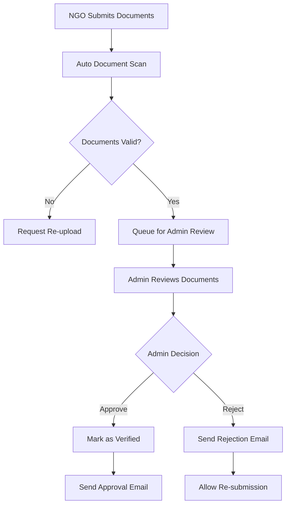

# User Verification Flow

## 🔐 Overview

Navdrishti implements a comprehensive verification system to ensure trust and authenticity across the platform. Different user types have different verification requirements based on their roles and responsibilities.

## 👥 User Type Verification Matrix

| User Type | Email | Phone | Document | Admin Review | Auto-Approval |
|-----------|-------|-------|----------|--------------|---------------|
| Individual | ✅ Required | ⚠️ Optional | ❌ Not Required | ❌ No | ✅ Yes |
| Company | ✅ Required | ✅ Required | ✅ Required | ✅ Yes | ❌ No |
| NGO | ✅ Required | ✅ Required | ✅ Required | ✅ Yes | ❌ No |
| Admin | ✅ Required | ✅ Required | ✅ Manual | ✅ Super Admin | ❌ No |

## 📧 Email Verification Process

### Step 1: Email Verification Request
```javascript
// Triggered during signup or profile update
POST /api/auth/verify-email
{
  "email": "user@example.com",
  "user_id": 123
}
```

### Step 2: Verification Email Sent
- **Template**: Welcome + verification link
- **Expiry**: 24 hours
- **Token**: Secure random token stored in database
- **Link Format**: `{APP_URL}/verify-email?token={verification_token}`

### Step 3: User Clicks Verification Link
```javascript
GET /verify-email?token={verification_token}
// Validates token, marks email as verified, redirects to success page
```

### Step 4: Database Update
```sql
UPDATE users 
SET email_verified = true, 
    email_verified_at = CURRENT_TIMESTAMP 
WHERE id = {user_id};

DELETE FROM email_verifications 
WHERE user_id = {user_id};
```

## 📱 Phone Verification Process

### Step 1: Phone Number Submission
```javascript
POST /api/auth/verify-phone
{
  "phone": "+91XXXXXXXXXX",
  "country_code": "+91"
}
```

### Step 2: OTP Generation & SMS
- **OTP Length**: 6 digits
- **Expiry**: 10 minutes
- **Rate Limit**: 3 attempts per 5 minutes
- **SMS Template**: "Your Navdrishti verification code is: {OTP_CODE}"

### Step 3: OTP Verification
```javascript
POST /api/auth/verify-otp
{
  "phone": "+91XXXXXXXXXX",
  "otp": "123456"
}
```

### Step 4: Phone Verification Complete
```sql
UPDATE users 
SET phone_verified = true, 
    phone_verified_at = CURRENT_TIMESTAMP 
WHERE id = {user_id};
```

## 📋 Document Verification (NGOs & Companies)

### NGO Verification Requirements

#### Required Documents
1. **NGO Registration Certificate**
   - Format: PDF, JPG, PNG
   - Max Size: 5MB
   - Must show: Organization name, registration number, date

2. **PAN Card**
   - Format: PDF, JPG, PNG
   - Must be clear and readable
   - Name should match organization details

3. **Address Proof**
   - Utility bill, lease agreement, or bank statement
   - Should be recent (within 3 months)
   - Address should match registration

#### Verification Process Flow


### Company Verification Requirements

#### Required Documents
1. **Certificate of Incorporation**
   - Company registration certificate
   - Must show company name, CIN, date of incorporation

2. **GST Registration Certificate**
   - Valid GST certificate
   - GSTIN should match company details

3. **Business Address Proof**
   - Official business address verification
   - Bank statement or utility bill in company name

#### Verification Data Structure
```sql
CREATE TABLE ngo_verifications (
    id SERIAL PRIMARY KEY,
    user_id INTEGER NOT NULL REFERENCES users(id),
    organization_name VARCHAR(255),
    registration_number VARCHAR(100),
    registration_document TEXT, -- Cloudinary URL
    pan_document TEXT,          -- Cloudinary URL
    address_proof TEXT,         -- Cloudinary URL
    verification_status VARCHAR(20) DEFAULT 'pending',
    verification_date TIMESTAMP,
    verifier_id INTEGER REFERENCES users(id),
    verifier_notes TEXT,
    rejection_reason TEXT,
    created_at TIMESTAMP DEFAULT CURRENT_TIMESTAMP,
    updated_at TIMESTAMP DEFAULT CURRENT_TIMESTAMP
);
```

## 👑 Admin Review Process

### Admin Dashboard Workflow

#### 1. Pending Verifications Queue
```javascript
GET /api/admin/verifications
// Returns list of pending verifications with user details and documents
```

#### 2. Document Review Interface
- **Document Viewer**: In-browser PDF/image viewer
- **User Information**: Complete profile details
- **Verification History**: Previous attempts and notes
- **Action Buttons**: Approve, Reject, Request More Info

#### 3. Verification Decision
```javascript
POST /api/admin/verifications/{id}/review
{
  "action": "approve|reject|request_info",
  "notes": "Admin review notes",
  "rejection_reason": "Specific reason for rejection"
}
```

#### 4. Notification System
```javascript
// Approval notification
{
  "type": "verification_approved",
  "title": "Account Verified Successfully",
  "message": "Your NGO account has been verified and approved.",
  "user_id": 123,
  "email_notification": true,
  "sms_notification": true
}

// Rejection notification
{
  "type": "verification_rejected",
  "title": "Additional Documents Required",
  "message": "Please upload clear, valid documents.",
  "rejection_reason": "Documents are not clear",
  "user_id": 123,
  "email_notification": true
}
```

## 🔄 Verification Status Management

### Status Definitions
- **unverified**: Initial state after signup
- **pending**: Documents submitted, awaiting review
- **verified**: Successfully verified by admin
- **rejected**: Verification rejected, can resubmit
- **suspended**: Verification suspended due to policy violation

### Status Update Workflow
```javascript
// User verification status check
GET /api/users/verification-status
Response: {
  "email_verified": true,
  "phone_verified": false,
  "document_verification": {
    "status": "pending",
    "submitted_at": "2024-01-01T00:00:00Z",
    "documents": [
      {
        "type": "registration_certificate",
        "status": "uploaded",
        "url": "https://cloudinary.com/doc1.pdf"
      }
    ]
  }
}
```

## 🚀 Auto-Verification Features

### Individual Users
- **Email + Phone**: Auto-verified upon successful verification
- **No Document Required**: Immediate platform access
- **Trust Score**: Builds through platform activity

### Automated Checks
```javascript
// Auto-verification triggers
function checkAutoVerification(user) {
  if (user.user_type === 'individual') {
    if (user.email_verified && user.phone_verified) {
      return updateVerificationStatus(user.id, 'verified');
    }
  }
  
  // Companies and NGOs require manual review
  if (['company', 'ngo'].includes(user.user_type)) {
    return 'manual_review_required';
  }
}
```

## 📊 Verification Analytics

### Metrics Tracked
- **Verification Completion Rate**: % of users completing verification
- **Average Review Time**: Time from submission to decision
- **Rejection Rate**: % of verifications rejected
- **Document Quality Score**: AI-based document quality assessment

### Admin Dashboard Stats
```sql
-- Verification statistics query
SELECT 
  user_type,
  COUNT(*) as total_users,
  COUNT(CASE WHEN verification_status = 'verified' THEN 1 END) as verified_users,
  COUNT(CASE WHEN verification_status = 'pending' THEN 1 END) as pending_reviews,
  AVG(EXTRACT(EPOCH FROM (verified_at - created_at))/3600) as avg_review_hours
FROM users 
WHERE user_type IN ('ngo', 'company')
GROUP BY user_type;
```

## 🔒 Security Measures

### Document Security
- **Encrypted Storage**: All documents encrypted at rest
- **Access Logging**: All document access logged with admin ID
- **Secure URLs**: Time-limited signed URLs for document access
- **Data Retention**: Documents deleted after verification completion (configurable)

### Anti-Fraud Protection
- **Duplicate Detection**: Image hash comparison to detect duplicate documents
- **OCR Validation**: Extract and validate text from documents
- **Cross-Reference**: Check registration numbers against government databases
- **IP Tracking**: Monitor for suspicious submission patterns

## 📧 Email Templates

### Verification Success Email
```html
Subject: 🎉 Your Navdrishti Account is Now Verified!

Dear {user_name},

Great news! Your {user_type} account has been successfully verified.

What's Next:
- Access all platform features
- Create service offers/requests
- Join the community marketplace
- Build your organization profile

Get Started: [Login to Dashboard]

Best regards,
The Navdrishti Team
```

### Verification Rejection Email
```html
Subject: 📋 Additional Information Required for Verification

Dear {user_name},

We've reviewed your verification submission and need some additional information.

Reason: {rejection_reason}

Next Steps:
1. Upload clear, readable documents
2. Ensure all information matches your registration
3. Resubmit for review

Upload Documents: [Verification Portal]

Need help? Contact our support team.

Best regards,
The Navdrishti Team
```

## 🔄 Re-verification Process

### Triggers for Re-verification
- **Profile Information Changes**: Name, address, or key details modified
- **Suspicious Activity**: Flagged by automated systems
- **Compliance Requirements**: Annual re-verification for certain user types
- **Document Expiry**: Time-sensitive documents need renewal

### Re-verification Workflow
1. **System Detection**: Automated trigger or admin flag
2. **User Notification**: Email/SMS about re-verification requirement
3. **Grace Period**: 30 days to complete re-verification
4. **Account Limitation**: Limited access until re-verification complete
5. **Account Suspension**: If not completed within grace period