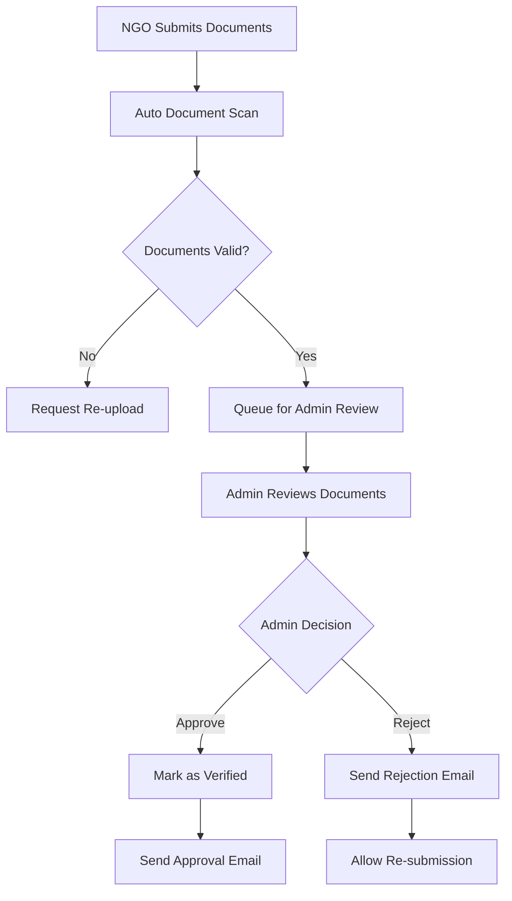
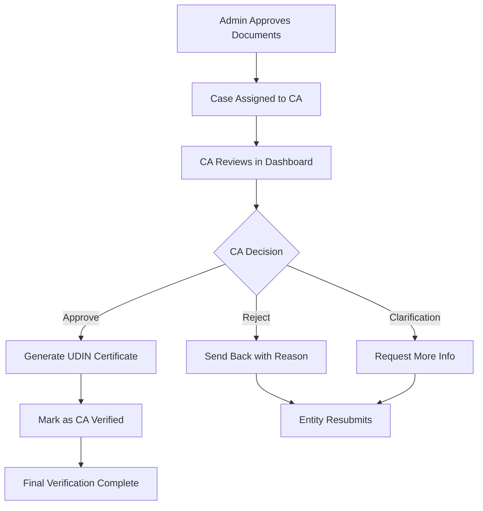

# User Verification Flow

## 🔐 Overview

Navdrishti implements a comprehensive verification system to ensure trust and authenticity across the platform. Different user types have different verification requirements based on their roles and responsibilities.

## 👥 User Type Verification Matrix

| User Type | Email | Phone | Document | Admin Review | Auto-Approval |
|-----------|-------|-------|----------|--------------|---------------|
| Individual | ✅ Required | ⚠️ Optional | ❌ Not Required | ❌ No | ✅ Yes |
| Company | ✅ Required | ✅ Required | ✅ Required | ✅ Yes | ❌ No |
| NGO | ✅ Required | ✅ Required | ✅ Required | ✅ Yes | ❌ No |
| Admin | ✅ Required | ✅ Required | ✅ Manual | ✅ Super Admin | ❌ No |

## 📧 Email Verification Process

### Step 1: Email Verification Request
```javascript
// Triggered during signup or profile update
POST /api/auth/verify-email
{
  "email": "user@example.com",
  "user_id": 123
}
```

### Step 2: Verification Email Sent
- **Template**: Welcome + verification link
- **Expiry**: 24 hours
- **Token**: Secure random token stored in database
- **Link Format**: `{APP_URL}/verify-email?token={verification_token}`

### Step 3: User Clicks Verification Link
```javascript
GET /verify-email?token={verification_token}
// Validates token, marks email as verified, redirects to success page
```

### Step 4: Database Update
```sql
UPDATE users 
SET email_verified = true, 
    email_verified_at = CURRENT_TIMESTAMP 
WHERE id = {user_id};

DELETE FROM email_verifications 
WHERE user_id = {user_id};
```

## 📱 Phone Verification Process

### Step 1: Phone Number Submission
```javascript
POST /api/auth/verify-phone
{
  "phone": "+91XXXXXXXXXX",
  "country_code": "+91"
}
```

### Step 2: OTP Generation & SMS
- **OTP Length**: 6 digits
- **Expiry**: 10 minutes
- **Rate Limit**: 3 attempts per 5 minutes
- **SMS Template**: "Your Navdrishti verification code is: {OTP_CODE}"

### Step 3: OTP Verification
```javascript
POST /api/auth/verify-otp
{
  "phone": "+91XXXXXXXXXX",
  "otp": "123456"
}
```

### Step 4: Phone Verification Complete
```sql
UPDATE users 
SET phone_verified = true, 
    phone_verified_at = CURRENT_TIMESTAMP 
WHERE id = {user_id};
```

## 📋 Document Verification (NGOs & Companies)

### NGO Verification Requirements

#### Required Documents
1. **NGO Registration Certificate**
   - Format: PDF, JPG, PNG
   - Max Size: 5MB
   - Must show: Organization name, registration number, date

2. **PAN Card**
   - Format: PDF, JPG, PNG
   - Must be clear and readable
   - Name should match organization details

3. **Address Proof**
   - Utility bill, lease agreement, or bank statement
   - Should be recent (within 3 months)
   - Address should match registration

#### Verification Process Flow

```mermaid
graph TD
    A[NGO Submits Documents] --> B[Auto Document Scan]
    B --> C{Documents Valid?}
    C -->|No| D[Request Re-upload]
    C -->|Yes| E[Queue for Admin Review]
    E --> F[Admin Reviews Documents]
    F --> G{Admin Decision}
    G -->|Approve| H[Mark as Verified]
    G -->|Reject| I[Send Rejection Email]
    I --> J[Allow Re-submission]
    H --> K[Send Approval Email]
```

### Company Verification Requirements

#### Required Documents
1. **Certificate of Incorporation**
   - Company registration certificate
   - Must show company name, CIN, date of incorporation

2. **GST Registration Certificate**
   - Valid GST certificate
   - GSTIN should match company details

3. **Business Address Proof**
   - Official business address verification
   - Bank statement or utility bill in company name

#### Verification Data Structure
```sql
CREATE TABLE ngo_verifications (
    id SERIAL PRIMARY KEY,
    user_id INTEGER NOT NULL REFERENCES users(id),
    organization_name VARCHAR(255),
    registration_number VARCHAR(100),
    registration_document TEXT, -- Cloudinary URL
    pan_document TEXT,          -- Cloudinary URL
    address_proof TEXT,         -- Cloudinary URL
    verification_status VARCHAR(20) DEFAULT 'pending',
    verification_date TIMESTAMP,
    verifier_id INTEGER REFERENCES users(id),
    verifier_notes TEXT,
    rejection_reason TEXT,
    created_at TIMESTAMP DEFAULT CURRENT_TIMESTAMP,
    updated_at TIMESTAMP DEFAULT CURRENT_TIMESTAMP
);
```

## 👑 Admin Review Process

### Admin Dashboard Workflow

#### 1. Pending Verifications Queue
```javascript
GET /api/admin/verifications
// Returns list of pending verifications with user details and documents
```

#### 2. Document Review Interface
- **Document Viewer**: In-browser PDF/image viewer
- **User Information**: Complete profile details
- **Verification History**: Previous attempts and notes
- **Action Buttons**: Approve, Reject, Request More Info

#### 3. Verification Decision
```javascript
POST /api/admin/verifications/{id}/review
{
  "action": "approve|reject|request_info",
  "notes": "Admin review notes",
  "rejection_reason": "Specific reason for rejection"
}
```

#### 4. Notification System
```javascript
// Approval notification
{
  "type": "verification_approved",
  "title": "Account Verified Successfully",
  "message": "Your NGO account has been verified and approved.",
  "user_id": 123,
  "email_notification": true,
  "sms_notification": true
}

// Rejection notification
{
  "type": "verification_rejected",
  "title": "Additional Documents Required",
  "message": "Please upload clear, valid documents.",
  "rejection_reason": "Documents are not clear",
  "user_id": 123,
  "email_notification": true
}
```

## 🧾 CA (Chartered Accountant) Verification Console

### Overview

The CA Console is a specialized interface for empanelled Chartered Accountants to provide professional verification services for NGOs and Companies. This adds an additional layer of trust and compliance to the platform's verification process.

**Access:** `/ca` (Chartered Accountants only)  
**Design:** Blue and orange theme with clean, icon-free interface optimized for professional workflow

### CA Verification Workflow


```mermaid
graph TD
    A[Admin Approves Documents] --> B[Case Assigned to CA]
    B --> C[CA Reviews in Dashboard]
    C --> D{CA Decision}
    D -->|Approve| E[Generate UDIN Certificate]
    D -->|Reject| F[Send Back with Reason]
    D -->|Clarification| G[Request More Info]
    E --> H[Mark as CA Verified]
    F --> I[Entity Resubmits]
    G --> I
    H --> J[Final Verification Complete]
```

### CA Dashboard Features

#### 1. **Dashboard** (`/ca`)
Shows pending cases requiring CA review:
- **Stats Cards**: Total assigned, pending review, under review, completed today
- **Pending Cases List**: All cases awaiting CA action
- **Status Indicators**: New assignment, in review, clarification needed
- **Priority Badges**: Urgent, high, medium, low
- **Skeleton Loaders**: Smooth loading experience

```javascript
// Dashboard Stats
{
  total_assigned: 24,
  pending_review: 8,
  under_review: 3,
  completed_today: 2,
  avg_review_time_hours: 18.5,
  pending_urgent: 1
}
```

#### 2. **History Page** (`/ca/cases`)
Shows completed verifications only:
- **Completed Cases**: All approved/rejected cases
- **Filters**: Status, priority, entity type, search
- **Read-only Access**: View case details without review panel
- **Final Status Display**: Shows only approved or rejected status

#### 3. **Case Detail Page** (`/ca/cases/[id]`)
Detailed case review interface:
- **Entity Information**: Name, type, registration details
- **Document Viewer**: View uploaded PDFs/images with zoom/download
- **OCR Results**: Extracted text and structured data
- **Validation Flags**: Format checks, name matching, expiry validation
- **CA Review Panel**: Approve/reject/clarification actions (pending cases only)
- **Conditional Display**: Review panel hidden for completed cases

### CA Verification Types

#### Verification Case Statuses
- `assigned_to_ca` - New case assigned to CA
- `under_ca_review` - CA is actively reviewing
- `clarification_needed` - CA requested additional information
- `ca_approved` - CA approved with UDIN certificate
- `ca_rejected` - CA rejected verification

### CA Actions

#### 1. Approve Verification
```javascript
POST /api/ca/cases/{id}/approve
{
  "udin": "20241234567890123456", // Unique Document Identification Number
  "notes": "All documents verified and compliant",
  "certificate_validity_days": 365
}

Response: {
  "success": true,
  "certificate_id": "CERT-2024-001",
  "signed_certificate_url": "https://cloudinary.com/certificates/cert-001.pdf"
}
```

**UDIN (Unique Document Identification Number)**:
- Required for all CA-signed certifications
- 20-digit alphanumeric identifier
- Validated against ICAI database
- Provides legal authenticity

#### 2. Reject Verification  
```javascript
POST /api/ca/cases/{id}/reject
{
  "rejection_reason": "Document mismatch",
  "detailed_notes": "PAN card name doesn't match registration certificate",
  "allow_resubmission": true
}
```

**Common Rejection Reasons**:
- Document mismatch or inconsistencies
- Expired or invalid documents
- Unclear or tampered documents
- Non-compliance with legal requirements
- Missing mandatory information

#### 3. Request Clarification
```javascript
POST /api/ca/cases/{id}/clarification
{
  "clarification_type": "document_quality|additional_document|information_mismatch",
  "specific_requirements": [
    "Please provide clear scan of PAN card",
    "Submit updated address proof (within 3 months)"
  ],
  "deadline_days": 7
}
```

### TypeScript Types

Complete type definitions in `lib/types/verification.ts`:

```typescript
// Main verification case
interface VerificationCase {
  id: string;
  entity_name: string;
  entity_type: 'ngo' | 'company';
  status: VerificationStatus;
  priority: 'urgent' | 'high' | 'medium' | 'low';
  assigned_ca_id: string;
  documents: VerificationDocument[];
  ocr_results: OCRResult[];
  created_at: string;
  updated_at: string;
}

// CA-signed certification
interface CACertification {
  id: string;
  case_id: string;
  ca_id: string;
  udin: string;
  certificate_url: string;
  validity_start: string;
  validity_end: string;
  digital_signature: string;
  issued_at: string;
}

// OCR extraction results
interface OCRResult {
  document_id: string;
  extracted_text: string;
  structured_data: Record<string, any>;
  confidence_score: number;
  validation_flags: {
    format_valid: boolean;
    name_match: boolean;
    expiry_check: boolean;
    mandatory_fields_present: boolean;
  };
}
```

### CA Authentication & Authorization

```javascript
// CA Login (Currently Mock)
POST /api/ca/auth/login
{
  "email": "ca@example.com",
  "password": "secure_password",
  "icai_membership_number": "123456"
}

Response: {
  "token": "jwt_token_here",
  "ca_user": {
    "id": "CA-001",
    "name": "CA Name",
    "email": "ca@example.com",
    "icai_number": "123456",
    "empanelment_status": "active"
  }
}
```

**Security Requirements** (To be implemented):
- JWT with CA-specific claims
- Verify ICAI membership number
- Check empanelment status
- Rate limiting on API endpoints
- Audit logging for all actions
- IP-based access restrictions

### CA Console File Structure

```
app/
  ca/
    layout.tsx           # Blue header with orange logout button
    page.tsx            # Dashboard (pending cases only)
    login/page.tsx      # CA authentication
    cases/
      page.tsx          # History (completed cases only)
      [id]/page.tsx     # Case detail with conditional review panel

  api/ca/
    dashboard/route.ts         # Dashboard stats and cases
    cases/
      route.ts                 # Cases list API
      [id]/
        route.ts               # Case detail API
        approve/route.ts       # Approval action
        reject/route.ts        # Rejection action
        clarification/route.ts # Clarification request

lib/types/verification.ts     # Complete type definitions
components/ui/skeleton.tsx    # Skeleton loader component
```

### CA Performance Metrics

```sql
-- CA productivity dashboard
SELECT 
  ca_id,
  COUNT(*) as total_cases_reviewed,
  COUNT(CASE WHEN status = 'ca_approved' THEN 1 END) as approved_count,
  COUNT(CASE WHEN status = 'ca_rejected' THEN 1 END) as rejected_count,
  AVG(EXTRACT(EPOCH FROM (completed_at - assigned_at))/3600) as avg_review_hours,
  COUNT(CASE WHEN priority = 'urgent' AND completed_at <= deadline THEN 1 END) as urgent_on_time
FROM verification_cases
WHERE assigned_ca_id IS NOT NULL
  AND completed_at IS NOT NULL
GROUP BY ca_id;
```

### Integration Checklist

When integrating with production backend:

**1. Database Schema**
- Create `ca_users` table for CA authentication
- Create `ca_certifications` table for UDIN certificates
- Create `verification_audit_log` for audit trail
- Add CA-specific columns to `verification_cases`

**2. Authentication**
- Replace mock login with ICAI verification
- Implement JWT with CA claims
- Add empanelment status checks
- Set up session management

**3. OCR Integration**
- Connect to OCR microservice
- Process documents asynchronously
- Store results in database
- Update validation flags

**4. Document Security**
- Use signed, time-limited URLs
- Log all document access
- Encrypt documents at rest
- Implement access controls

**5. Notifications**
- Email notifications for case assignments
- SMS alerts for urgent cases  
- Status update notifications to entities
- Certificate delivery emails

### Current Implementation Status

**✅ Completed:**
- Full UI/UX with blue/orange theme
- TypeScript type definitions
- Mock API endpoints
- Skeleton loaders for smooth UX
- Separated Dashboard and History views
- Conditional review panel
- Icon-free, content-focused design
- Status-based rendering

**🔄 Mock Data (To Replace):**
- Dashboard: 5 pending cases (VC-2026-001 to 005)
- History: 6 completed cases (VC-2026-006 to 011)
- CA authentication bypassed
- Sample documents use placeholders
- No actual database operations

**🚀 Ready for Integration:**
- API endpoint structure defined
- TypeScript interfaces complete
- UI ready for real data
- Workflow tested with mock data

## 🔄 Verification Status Management


### Status Definitions
- **unverified**: Initial state after signup
- **pending**: Documents submitted, awaiting review
- **verified**: Successfully verified by admin
- **rejected**: Verification rejected, can resubmit
- **suspended**: Verification suspended due to policy violation

### Status Update Workflow
```javascript
// User verification status check
GET /api/users/verification-status
Response: {
  "email_verified": true,
  "phone_verified": false,
  "document_verification": {
    "status": "pending",
    "submitted_at": "2024-01-01T00:00:00Z",
    "documents": [
      {
        "type": "registration_certificate",
        "status": "uploaded",
        "url": "https://cloudinary.com/doc1.pdf"
      }
    ]
  }
}
```

## 🚀 Auto-Verification Features

### Individual Users
- **Email + Phone**: Auto-verified upon successful verification
- **No Document Required**: Immediate platform access
- **Trust Score**: Builds through platform activity

### Automated Checks
```javascript
// Auto-verification triggers
function checkAutoVerification(user) {
  if (user.user_type === 'individual') {
    if (user.email_verified && user.phone_verified) {
      return updateVerificationStatus(user.id, 'verified');
    }
  }
  
  // Companies and NGOs require manual review
  if (['company', 'ngo'].includes(user.user_type)) {
    return 'manual_review_required';
  }
}
```

## 📊 Verification Analytics

### Metrics Tracked
- **Verification Completion Rate**: % of users completing verification
- **Average Review Time**: Time from submission to decision
- **Rejection Rate**: % of verifications rejected
- **Document Quality Score**: AI-based document quality assessment

### Admin Dashboard Stats
```sql
-- Verification statistics query
SELECT 
  user_type,
  COUNT(*) as total_users,
  COUNT(CASE WHEN verification_status = 'verified' THEN 1 END) as verified_users,
  COUNT(CASE WHEN verification_status = 'pending' THEN 1 END) as pending_reviews,
  AVG(EXTRACT(EPOCH FROM (verified_at - created_at))/3600) as avg_review_hours
FROM users 
WHERE user_type IN ('ngo', 'company')
GROUP BY user_type;
```

## 🔒 Security Measures

### Document Security
- **Encrypted Storage**: All documents encrypted at rest
- **Access Logging**: All document access logged with admin ID
- **Secure URLs**: Time-limited signed URLs for document access
- **Data Retention**: Documents deleted after verification completion (configurable)

### Anti-Fraud Protection
- **Duplicate Detection**: Image hash comparison to detect duplicate documents
- **OCR Validation**: Extract and validate text from documents
- **Cross-Reference**: Check registration numbers against government databases
- **IP Tracking**: Monitor for suspicious submission patterns

## 📧 Email Templates

### Verification Success Email
```html
Subject: 🎉 Your Navdrishti Account is Now Verified!

Dear {user_name},

Great news! Your {user_type} account has been successfully verified.

What's Next:
- Access all platform features
- Create service offers/requests
- Join the verified community network
- Build your organization profile

Get Started: [Login to Dashboard]

Best regards,
The Navdrishti Team
```

### Verification Rejection Email
```html
Subject: 📋 Additional Information Required for Verification

Dear {user_name},

We've reviewed your verification submission and need some additional information.

Reason: {rejection_reason}

Next Steps:
1. Upload clear, readable documents
2. Ensure all information matches your registration
3. Resubmit for review

Upload Documents: [Verification Portal]

Need help? Contact our support team.

Best regards,
The Navdrishti Team
```

## 🔄 Re-verification Process

### Triggers for Re-verification
- **Profile Information Changes**: Name, address, or key details modified
- **Suspicious Activity**: Flagged by automated systems
- **Compliance Requirements**: Annual re-verification for certain user types
- **Document Expiry**: Time-sensitive documents need renewal

### Re-verification Workflow
1. **System Detection**: Automated trigger or admin flag
2. **User Notification**: Email/SMS about re-verification requirement
3. **Grace Period**: 30 days to complete re-verification
4. **Account Limitation**: Limited access until re-verification complete
5. **Account Suspension**: If not completed within grace period